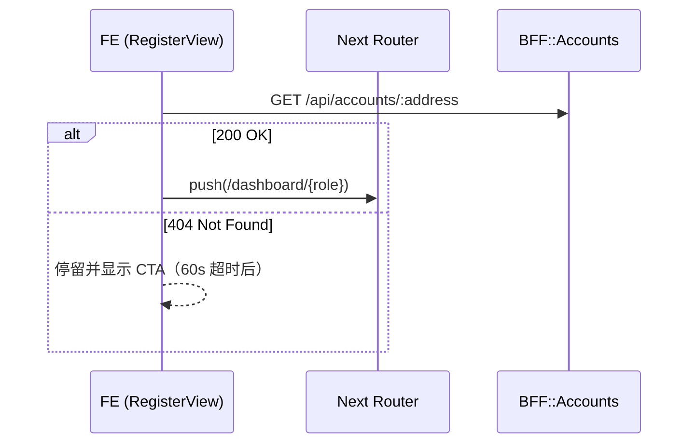
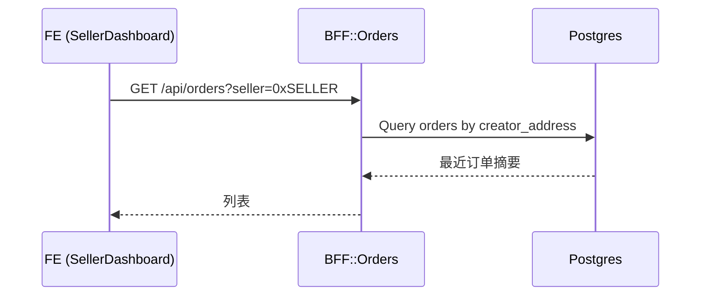
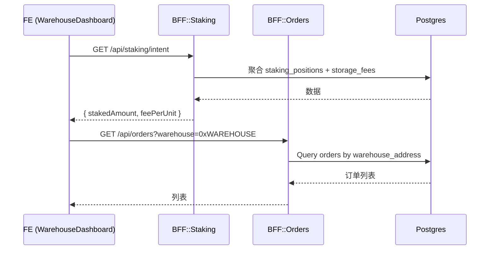

# Dashboard（Seller / Warehouse）— 数据流与时序图

> 结合注册成功后的重定向（R1）与各自仪表盘的数据读取（O1/W1/W2）。

## 1. Post-Registration → Dashboard

```mermaid
sequenceDiagram
  participant FE as FE (RegisterView)
  participant Router as Next Router
  participant BFF as BFF::Accounts

  FE->>BFF: GET /api/accounts/:address
  alt 200 OK
    FE->>Router: push(/dashboard/{role})
  else 404 Not Found
    FE-->>FE: 停留并显示 CTA（60s 超时后）
  end
```

## 2. Seller Dashboard 加载

```mermaid
sequenceDiagram
  participant FE as FE (SellerDashboard)
  participant BFF as BFF::Orders
  participant DB as Postgres

  FE->>BFF: GET /api/orders?seller=0xSELLER
  BFF->>DB: Query orders by creator_address
  DB-->>BFF: 最近订单摘要
  BFF-->>FE: 列表
```

## 3. Warehouse Dashboard 加载

```mermaid
sequenceDiagram
  participant FE as FE (WarehouseDashboard)
  participant BFF1 as BFF::Staking
  participant BFF2 as BFF::Orders
  participant DB as Postgres

  FE->>BFF1: GET /api/staking/intent
  BFF1->>DB: 聚合 staking_positions + storage_fees
  DB-->>BFF1: 数据
  BFF1-->>FE: { stakedAmount, feePerUnit }

  FE->>BFF2: GET /api/orders?warehouse=0xWAREHOUSE
  BFF2->>DB: Query orders by warehouse_address
  DB-->>BFF2: 订单列表
  BFF2-->>FE: 列表
```

