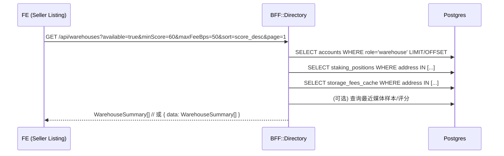
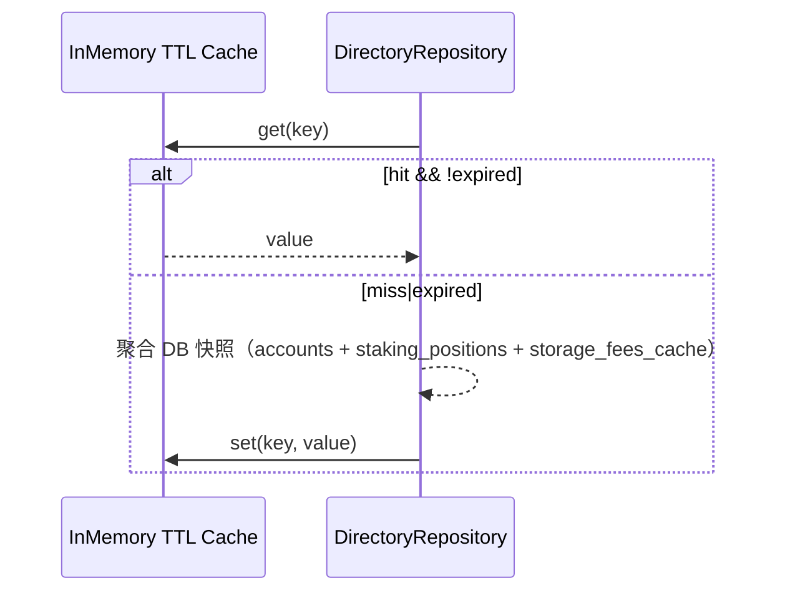

# L1 数据流（家庭仓 Listing 选择 / Directory）

> 面向实现与联调的数据流说明，覆盖：目录查询、聚合路径、筛选/排序、缓存逻辑与异常回退。

## 1. 目录查询（FE → BFF）

请求参数（示例）
- `available=true|false`：是否仅返回可用仓（PoC 以占位逻辑映射）
- `minScore`：最小评分（质押/信用快照）
- `maxFeeBps`：费率上限（后续由 W1 写库或视图提供）
- `area`：服务区域过滤
- `q`：自由文本搜索（名称/地址前缀）
- `sort`：score_desc|fee_asc|capacity_desc|recent
- `page`/`pageSize`

响应（WarehouseSummary 片段）
- id/address/name/stakingScore/creditCapacity
- availability/mediaSamples
- 可选：feePerUnit（存储费，万分比），用于筛选/展示

## 2. 缓存与回退（BFF 内部）

## 3. 错误/异常路径
- DB 查询失败：返回 500 并记录错误日志。
- 过滤参数非法：使用默认值或忽略。

## 4. 验收与联调清单
1) 无任何参数 → 返回第一页仓库摘要（默认 pageSize=20）
2) minScore=60 且 sort=score_desc → 列表按分数降序
3) maxFeeBps=50 → 仅返回 feePerUnit<=50 的仓库（若缺失 feePerUnit 不过滤）
4) q=0xabc → 匹配名称/地址前缀的仓库
5) 响应结构为数组或 { data: [] }，与 FE 兼容

## 5. 指标与配置
- 指标：directory_cache_hit_total、directory_request_total、directory_request_latency_ms
- 配置：目录缓存 TTL（环境变量 DIRECTORY_CACHE_TTL_MS，可选）

参考
- 10-场景化端到端数据流.md:10.5（L1）
- .agent-context/W1/data-stream.md：W1 产出的缓存表作为数据源
- 5-前端体验.md：Listing 页面与 Hook Anchor（计划）
