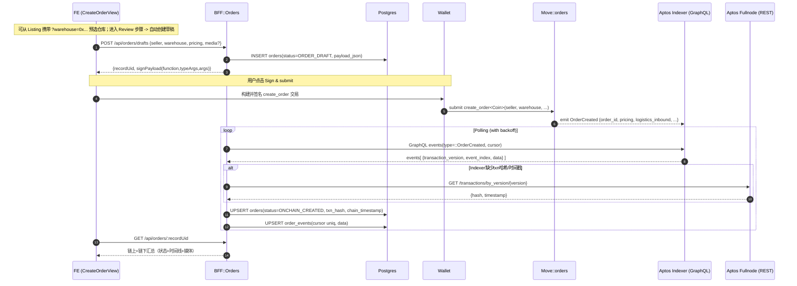
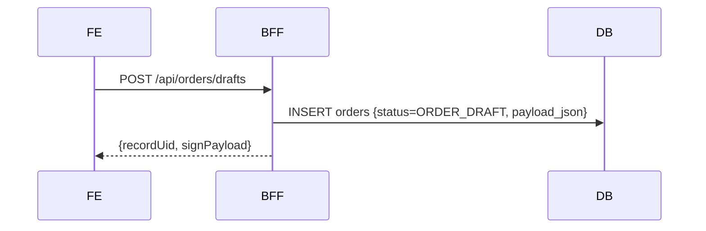
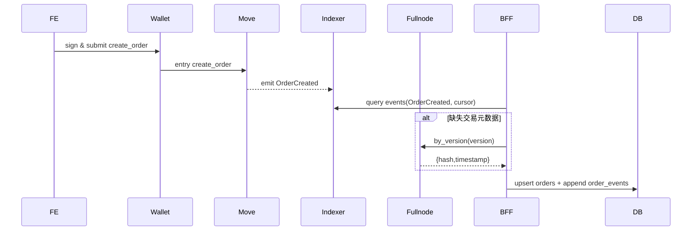
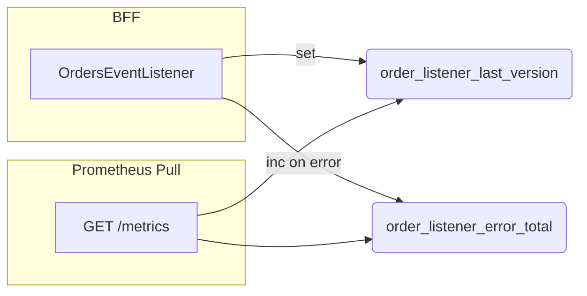

# O1 订单创建与链上签署 — 数据流与时序图

> 本文作为 O1 的数据流“图片”说明，聚焦从前端发起、到链上签署、到链下监听与回写的端到端路径。包含：总体时序、分阶段数据流、锚点映射、字段映射与兜底/回退逻辑。

## 1. 总体时序（E2E）


## 2. 分阶段图

### 2.1 草稿保存（Draft）


### 2.2 链上签署与事件回放（Create + Ingest）


### 2.3 监控与可观测


## 3. 锚点映射（Anchors）
- 后端
  - `apps/bff/src/modules/orders/orders.controller.ts:1`
  - `apps/bff/src/modules/orders/orders.service.ts:1`
  - `apps/bff/src/modules/orders/orders.repository.ts:1`
  - `apps/bff/src/modules/orders/orders-event-listener.service.ts:1`
  - `apps/bff/src/modules/metrics/metrics.module.ts:1`
  - `apps/bff/src/modules/metrics/metrics.service.ts:1`
  - `apps/bff/src/modules/metrics/metrics.controller.ts:1`
  - `apps/bff/prisma/schema.prisma:1`（Order/OrderEvent 模型）
- 前端
  - `apps/web/features/orders/create/CreateOrderView.tsx:1`（Review 步骤自动创建草稿、签名提交）
  - `apps/web/features/orders/useOrderDraft.ts:1`（POST /api/orders/drafts 钩子）
- 链上
  - `move/sources/orders.move:1`（create_order、OrderCreated/CheckedIn/SetInStorage/CheckedOut）

## 4. 字段与映射
- 订单主表 orders（关键列）：
  - record_uid、creator_address、warehouse_address、status、order_id、txn_version、event_index、txn_hash、chain_timestamp、created_at、updated_at
- 事件表 order_events（关键列）：
  - record_uid、order_id、type（OrderCreated）、txn_version、event_index、txn_hash、chain_timestamp、data(jsonb)
- 事件 payload → DB 映射（OrderCreated）：
  - data.order_id → orders.order_id / order_events.order_id
  - data.pricing(amount/insurance_fee/platform_fee/total) → order_events.data.pricing（主表可按需冗余）
  - data.logistics_inbound → order_events.data.logistics_inbound
  - seller/warehouse 地址 → orders.creator_address / orders.warehouse_address

## 5. 兜底与退避策略
- Indexer 缺失交易元数据时：
  - Fullnode 兜底：`GET /transactions/by_version/{version}` → {hash,timestamp}
  - 请求头：若配置 `APTOS_NODE_API_KEY`，同时发送 `x-aptos-api-key` 与 `Authorization: Bearer <key>`
- 退避（部分实现）：
  - 捕获 429/timeout 等错误 → 增加 cooldown；`ORDER_INGESTOR_*` 控制 pageSize/interval/maxPagesPerTick

## 6. 端到端验收路径（摘要）
- FE：CreateOrderView → 选择仓库/费用 → Review 步骤显示 Draft record UID → 点击签名提交
- 来自 L1 的联动：从 Listing 卡片跳转至 `/(merchant)/orders/new?warehouse=0x...` 时，页面初始化后应显示预选仓库
- BFF：
  - /api/orders/drafts 返回 recordUid + signPayload
  - 监听 OrderCreated → 更新 orders.status=ONCHAIN_CREATED & txn_hash
  - /api/orders/:recordUid 返回链上+链下汇总（含时间线）
- 监控：GET /metrics → order_listener_last_version、order_listener_error_total

```text
提示：本文件仅针对 O1（OrderCreated）。后续 O2 (CheckedIn/SetInStorage/CheckedOut) 补充时间线与媒体对账数据流图。
```
