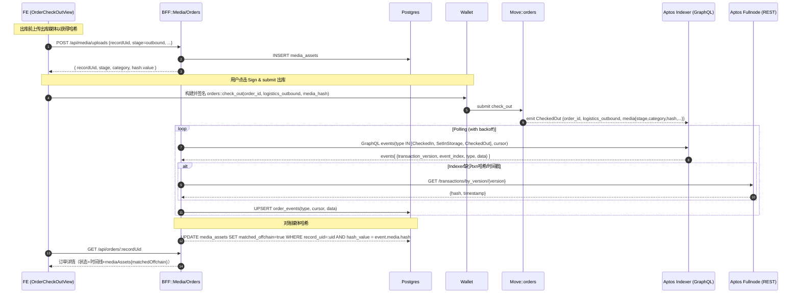

# O2 仓储出库与媒体上传 — 数据流与时序图

> 描述仓库在处理订单出库时的端到端数据流：媒体上传 → 签署出库 → 事件回放 → 时间线与媒体对账。

## 1. 总体时序（E2E）


## 2. 锚点与契约
- BFF
  - media.controller.ts / media.service.ts：媒体上传接口及入库（含 BLAKE3 计算）
  - orders-event-listener.service.ts：监听 `CheckedIn|SetInStorage|CheckedOut` 并落表
  - orders.repository.ts：`getDetail` 汇总 `timeline` 与 `mediaAssets`，并可设置 matchedOffchain
- 前端
  - features/orders/inbound/OrderCheckInView.tsx（已存在）
  - features/orders/outbound/OrderCheckOutView.tsx（planned）
  - 路由：`/(warehouse)/orders/[recordUid]/check-in` 与 `/(warehouse)/orders/[recordUid]/check-out`
- 链上
  - move/sources/orders.move：`check_in/set_in_storage/check_out` 与 `CheckedIn/SetInStorage/CheckedOut`

## 3. 字段映射
- order_events.data（按事件）：
  - CheckedIn: { logistics_inbound, media: { stage, category, hash } }
  - SetInStorage: { media: { stage, category, hash } }
  - CheckedOut: { logistics_outbound, media: { stage, category, hash } }
- media_assets：{ record_uid, stage, category, hash_value, uploaded_at, ... }
- 对账规则：`media_assets.hash_value`（hex） == `event.media.hash`（hex） → matchedOffchain=true

## 4. 兜底与退避
- Indexer → Fullnode by_version 兜底 txn hash/timestamp；请求头同时携带 `x-aptos-api-key` 与 `Authorization: Bearer <key>`（若配置）
- 429/timeout/backoff：与 O1/W1 监听器一致

## 5. 验收要点
- 上传媒体 → 出库签署 → ≤30s 内时间线出现 CheckedOut 条目
- 媒体对账标记 matchedOffchain=true；当缺少 media 或 hash 不一致时记录告警
- /api/orders/:recordUid 返回 timeline+mediaAssets，可作为 W2 收件箱详情的来源

```text
备注：若未来拆分 /api/orders/:recordUid/timeline 端点，仅为视图按需拆分，非功能依赖。
```

