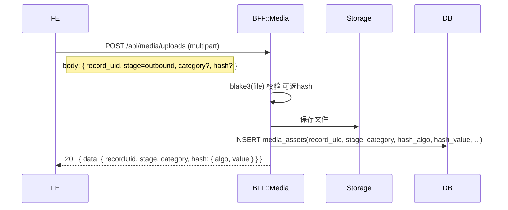
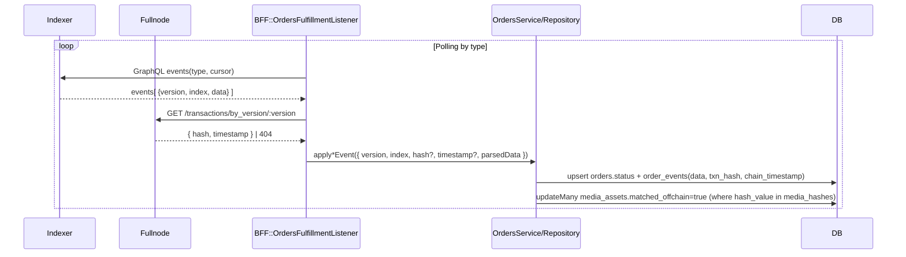
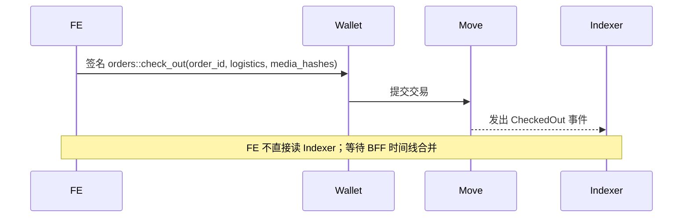
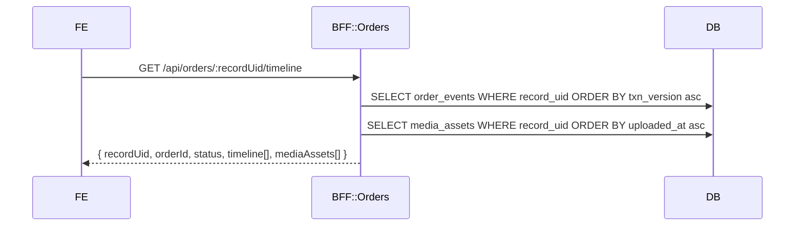

# O2 数据流详解（仓储出库与媒体上传）

> 面向实现与联调的端到端数据流拆解。覆盖：媒体上传、CheckedIn/SetInStorage/CheckedOut 事件回放、监听器兜底、时间线聚合、异常与补偿、指标与配置。与 10/3/4/5/6 章保持锚点一致。

## 1. 角色与术语
- FE：`apps/web` 前端应用
- Wallet：Aptos 钱包（Petra/Martian）
- Move：`haigo::orders` 模块
- Indexer：Aptos Indexer GraphQL
- Fullnode：Aptos REST `/v1`
- BFF：`apps/bff` 服务
- DB：Postgres（Prisma 模型：`orders` / `order_events` / `media_assets`）
- Storage：对象存储/本地媒体目录（由 `MediaStorageService` 抽象）
- recordUid：订单唯一标识，约定 `deriveRecordUid(orderId, txnHash?)`，示例：`order-123-abcdef12`

哈希规范
- 算法：BLAKE3
- 字符串：小写十六进制，去除 `0x` 前缀
- 长度：32 字节（64 hex chars）

## 2. 媒体上传（链下）

请求体（multipart/form-data）字段
- file/media（二选一）：文件内容
- record_uid：`order-<id>` 或草稿 UID（PoC 接受 order-*）
- stage：`outbound`（默认 inbound，出库请显式传 outbound）
- category（可选）：如 `outbound_photo/outbound_video`
- hash（可选）：客户端预计算哈希用于对比

服务端校验
- MIME 白名单：`packages/shared/src/config/orders.ts` 中定义
- 计算哈希：blake3(buffer) → hex(lowercase)
- 不一致时报 400 { code: HASH_MISMATCH }

落库字段（media_assets）
- record_uid, stage, category, storage_path, public_path, hash_algo=blake3, hash_value, mime_type, size_bytes, uploaded_by, uploaded_at

## 3. 出入库事件（链上→链下）
事件源（Move）与 Indexer 映射（简化）
- CheckedIn.data: { order_id: u64, warehouse_address: address, media_hashes: vector<vector<u8>> }
- SetInStorage.data: { order_id: u64 }
- CheckedOut.data: { order_id: u64, logistics: { carrier?, trackingNumber?, notes? }, media_hashes: vector<vector<u8>> }

监听与入库

游标与幂等
- 内存游标：`lastTxnVersion/lastEventIndex`（PoC）。生产需持久化到 `ingestion_cursors`（后续 Story）。
- 幂等条件：`order_events (txn_version, event_index)` 唯一约束；重复事件只更新主表状态，不重复插入。

字段转换
- `order_id` → number（`deriveRecordUid(orderId, txnHash?)` 生成 recordUid）
- `media_hashes`: bytes[] → hex(lower) with no 0x（监听器统一 normalize）

失败/异常路径
- Indexer 失败：中断本轮，记录错误并在下次轮询重试
- Fullnode 404：允许落库但 txn_hash/timestamp 为空，进入补偿清单（后续 Story）
- 媒体对账未命中：保留 false，后续补偿任务扫描媒体孤儿

## 4. 出库签名（FE→链上）

签名参数
- logistics: { carrier?: string; trackingNumber?: string; notes?: string }
- media_hashes: string[]（hex lowercase, 无 0x）

## 5. 时间线查询与聚合（链下）

时间线映射
- OrderCreated → CREATED
- CheckedIn → WAREHOUSE_IN
- SetInStorage → IN_STORAGE
- CheckedOut → WAREHOUSE_OUT

响应片段示例
```json
{
  "recordUid": "order-123-abcdef12",
  "orderId": 123,
  "status": "IN_STORAGE",
  "timeline": [
    { "stage": "CREATED", "label": "OrderCreated", "occurredAt": "2025-09-19T10:00:00Z" },
    { "stage": "WAREHOUSE_IN", "label": "CheckedIn", "occurredAt": "2025-09-19T10:02:10Z", "details": "{\"media_hashes\":[\"…\"]}" }
  ],
  "mediaAssets": [
    { "stage": "outbound", "category": "outbound_photo", "hashValue": "…", "matchedOffchain": true }
  ]
}
```

## 6. 异常、补偿与安全
- 异常与重试
  - Indexer GraphQL 非 2xx：记录错误并按 `ORDER_INGESTOR_INTERVAL_MS` 重试
  - Fullnode by_version 失败：warn 并保留空 txn_hash，后续补偿
  - 媒体对账：未命中不报错，异步补偿
- 安全与限制
  - 上传 MIME 与尺寸白名单，拒绝未知类型
  - 签名调用在 FE 端由钱包完成；BFF 仅只读与存储
  - 速率限制（后续）：上传与时间线查询应加入 IP+地址限流

## 7. 指标与日志
- 指标
  - order_listener_last_version/order_listener_last_index
  - order_listener_fullnode_fallback_total
  - order_media_upload_total / hash_mismatch_total
  - timeline_request_total / latency_ms
- 日志
  - 事件批量大小、游标推进、异常堆栈、Fullnode 兜底耗时

## 8. 配置与约束
- 环境变量
  - APTOS_INDEXER_URL, APTOS_NODE_API_URL, APTOS_NODE_API_KEY
  - ORDER_INGESTOR_PAGE_SIZE, ORDER_INGESTOR_INTERVAL_MS
- 头部兼容：同时发送 `x-aptos-api-key` 与 `Authorization: Bearer <key>` 适配不同网关
- 分页与顺序：按 (transaction_version asc, event_index asc)

## 9. 端到端校验（联调清单）
1) 上传 2 张图片（stage=outbound）→ 返回 2 个哈希
2) check_out 含这 2 个哈希 → Indexer 出现 CheckedOut
3) 监听器在 30s 内入库订单事件并标记两条媒体 matched_offchain=true
4) /timeline 返回阶段顺序正确，mediaAssets 包含两条且 matched_offchain=true

参考
- 10-场景化端到端数据流.md:96（O2）
- 3-链上合约设计.md:167（O2）
- 4-链下服务与数据流.md:169（O2），:143（Fullnode 兜底）
- 5-前端体验.md:166（O2 Anchor）
- 6-部署与环境.md:184, :245, :252
