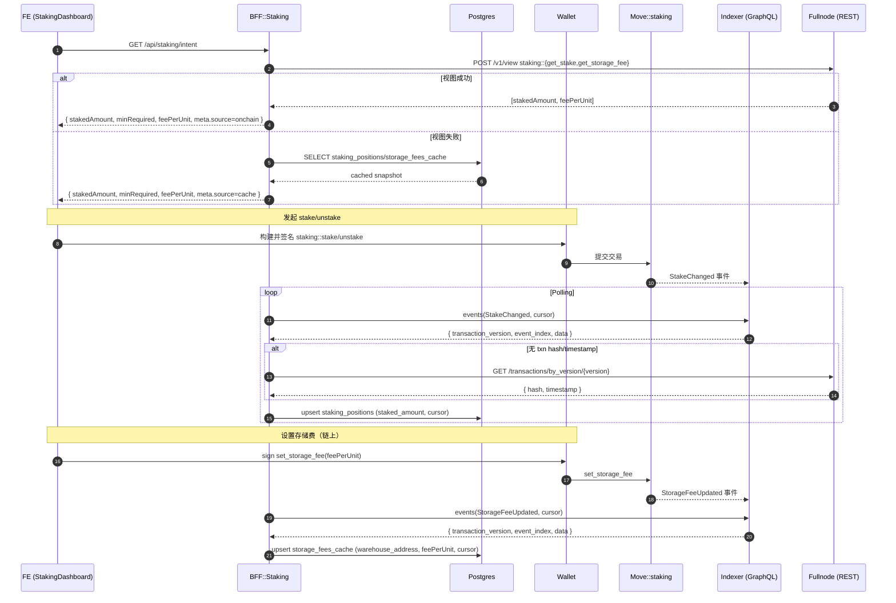

# W1 家庭仓质押与存储费设置 — 数据流与时序图

> 对应 docs/architecture/10-场景化端到端数据流.md:10.4。本图描述仓库角色在面板完成质押（或解押），BFF 监听 StakeChanged 并聚合仓位，仓库方设置存储费（链下配置）。

## 1. 总体时序（含视图优先 + 缓存回退）

## 2. 锚点与契约
- BFF（planned）
  - staking.controller.ts：GET /api/staking/intent；GET /api/staking/:warehouseAddress
  - staking.service.ts：调用 Fullnode `/v1/view` 读取 `${MODULE}::staking::{get_stake,get_storage_fee}`，失败回落缓存
  - staking.listener.ts：StakeChanged 监听 + Fullnode 兜底
  - staking.repository.ts：staking_positions/storage_fees 持久化
- FE（planned）
  - StakingDashboard.tsx / useStakingIntent.ts：面板与意图 Hook
- Move（现有）
  - move/sources/staking.move

## 3. 字段映射
- staking_positions：
  - warehouse_address、staked_amount、last_txn_version、last_event_index、updated_at
- storage_fees：
  - warehouse_address、fee_per_unit、updated_at

## 4. 兜底与退避
- 缺失交易元数据：Fullnode /transactions/by_version/{version} 兜底；API Key 双头部（x-aptos-api-key + Authorization）
- 视图调用失败：回退读取缓存表；视图请求同样附带 API Key 双头部
- 退避：429/timeout 进入 cooldown；环境变量控制 pageSize/interval

## 5. 验收路径
- FE 端显示 stakedAmount/feePerUnit；当 Fullnode 视图可用时 `meta.source=onchain`，否则 `meta.source=cache`
- 点击 stake 后 ≤30s 反映最新仓位；设置存储费后 Listing 能读取更新的费率（经 W1 缓存表 → L1 查询）
