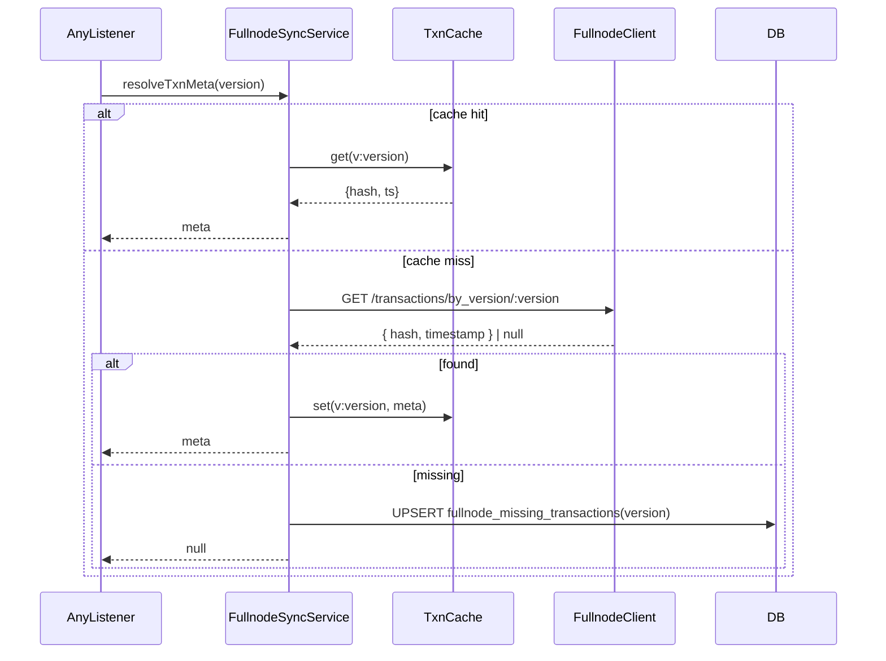
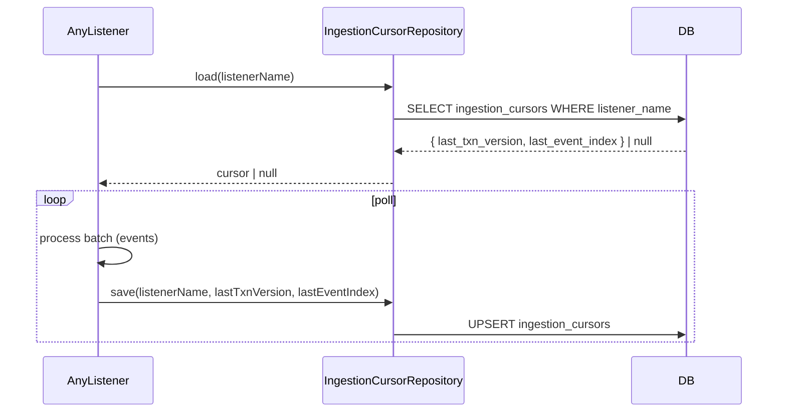
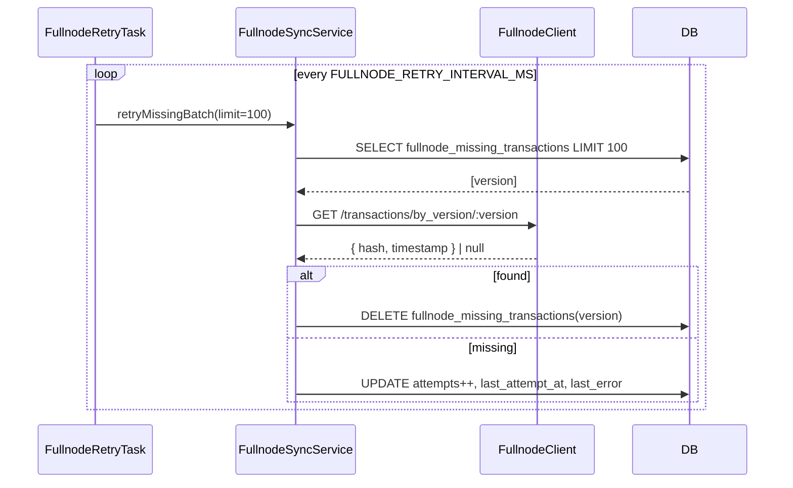

# W2 数据流（Fullnode 兜底中心化 + 游标持久化 + 补偿）

> 本文补充 W2 的主要数据流与时序图，涵盖：监听器获取事务元数据的统一流程、游标提交、缺失事务补偿循环，以及指标观测。

## 1. Listener → FullnodeSyncService → FullnodeClient

## 2. Listener 游标持久化（commit 语义）

## 3. 缺失事务补偿循环（后台任务）

## 4. 观测与指标
- fullnode_client_requests_total：按 2xx/非 2xx 统计
- fullnode_cache_hit_total：缓存命中次数
- ingestion_cursor_commit_total：游标持久化次数
- fullnode_retry_total：重试成功/失败次数

## 5. 配置项
- APTOS_NODE_API_URL / APTOS_NODE_API_KEY
- FULLNODE_RETRY_INTERVAL_MS（默认 60000）
- FULLNODE_CACHE_SIZE（默认 1000）
- ORDER_INGESTOR_PAGE_SIZE / ORDER_INGESTOR_INTERVAL_MS（监听器分页/频率）

## 6. 测试与验收（简表）
- 单元：Client/Cache/Sync/Cursor 的核心路径与异常路径
- 集成：注入 Mock Fullnode，验证游标恢复与补偿清空缺失事务
- 验收：三类监听器改造完成；指标可见；重启后续读正确

参考：
- 4-链下服务与数据流.md:143（Fullnode 兜底设计）
- 10-场景化端到端数据流.md:189（补偿与监控）
- 6-部署与环境.md:209（Epic 2 运行参数）
