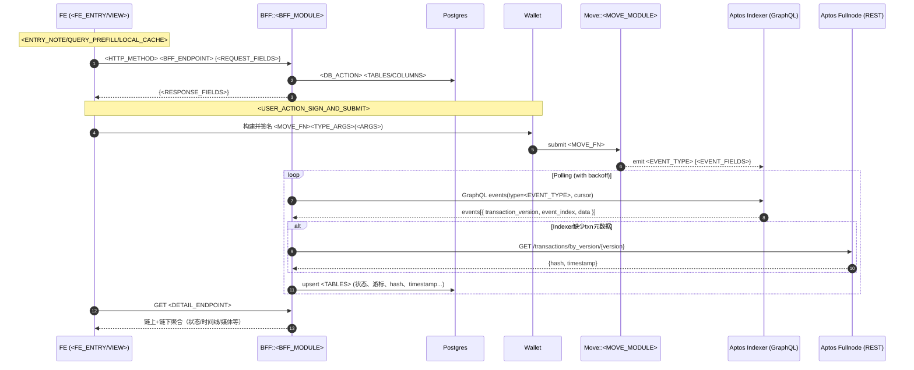
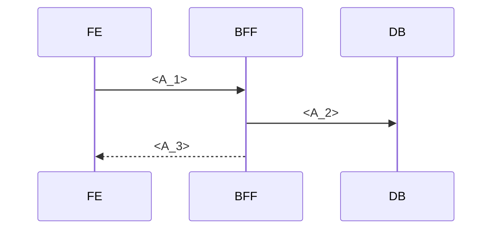
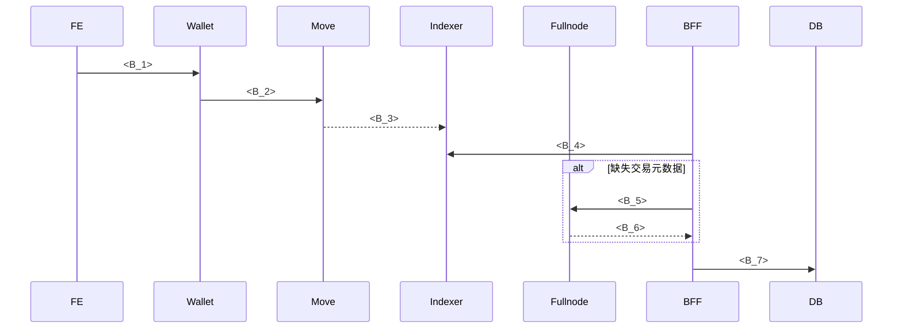
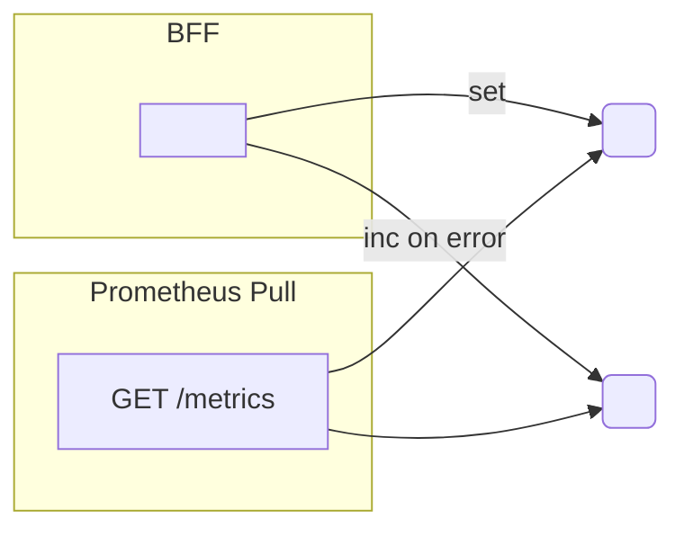

# <SCENARIO_ID> 数据流模板 — 模块/子模块端到端时序与映射

> 用途：为任意场景（如 O1 订单创建、O2 出库、W1 质押等）生成一致、可维护的数据流说明。请按占位符替换具体模块、事件与锚点。

元信息
- 场景：<SCENARIO_ID> — <SCENARIO_NAME>
- 触发角色：<ACTOR>
- 相关模块：FE / BFF::<BFF_MODULES> / DB / Move::<MOVE_MODULE> / Indexer(GraphQL) / Fullnode(REST) / Storage(可选) / Ops(可选)
- 实施状态：<STATUS>

1. 总体时序（E2E）

2. 分阶段图

2.1 阶段 A — <PHASE_A_NAME>

2.2 阶段 B — <PHASE_B_NAME>

2.3 监控与可观测

3. 锚点映射（Anchors）
- 后端
  - <PATH_BFF_CONTROLLER>
  - <PATH_BFF_SERVICE>
  - <PATH_BFF_REPOSITORY>
  - <PATH_BFF_LISTENER>
  - <PATH_METRICS_MODULES>
  - <PATH_PRISMA_SCHEMA>
- 前端
  - <PATH_FE_VIEW/Hooks>
- 链上
  - <PATH_MOVE_MODULE>（<MOVE_FN>、<EVENT_TYPES>）

4. 字段映射（Contracts）
- 主表 <TABLE_A> 关键列：<COLS>
- 事件表 <TABLE_B> 关键列：<COLS>
- 事件 payload → DB 映射（<EVENT_TYPE>）：
  - data.<FIELD_A> → <TABLE_A/B>.<COL>
  - data.<FIELD_B> → <TABLE_A/B>.<COL>
  - 地址标准化：0x 前缀、小写、必要时左零填充
- DTO 映射：
  - <DTO_IN> ↔ <DTO_OUT> 字段与单位（如 subunits、precision）

5. 兜底与退避策略
- Indexer 缺失/限流 → Fullnode by_version 兜底 txn_hash/timestamp
- 请求头：若配置 API Key，同时发送 `x-aptos-api-key` 与 `Authorization: Bearer <key>`
- 退避：指数退避（含抖动）、`*_MAX_PAGES_PER_TICK` 限速、冷却时间 `cooldown`
- 游标：持久化 `event_cursors(stream_name, last_txn_version, last_event_index, updated_at)`

6. 配置（Envs）
- Upstream：`APTOS_INDEXER_URL`、`APTOS_NODE_API_URL`、`APTOS_NODE_API_KEY`
- Listener：`<SCENARIO>_INGESTOR_INTERVAL_MS`、`<SCENARIO>_INGESTOR_PAGE_SIZE`、`<SCENARIO>_INGESTOR_MAX_PAGES_PER_TICK`、`<SCENARIO>_INGESTOR_START_FROM_LATEST`、`<SCENARIO>_INGESTOR_BACKFILL_OFFSET_VERSIONS`
- Flags：`ENABLE_<SCENARIO>_LISTENER`

7. 安全（Security）
- 入参校验：地址格式、长度、类型
- 速率限制：关键写入接口（如草稿/上传）
- Nonce/签名：如需后续接入，预留载荷与验证位

8. 测试（Tests）
- 单元：事件解析/标准化、仓储映射、状态变换
- 集成：控制器路由、监听器游标推进与幂等、兜底路径
- 端到端：FE 交互 → 钱包签名 → 事件入库 → 详情聚合

9. 验收（Acceptance）
- <WITHIN_X_S> 内完成 <STATE_CHANGE>，详情返回 `transactionHash`；列表包含最新状态；时间线出现 <EVENT_TYPE>
- `/metrics` 指标推进且错误率在可接受范围
- 文档锚点与实现路径一致

10. 版本化与演进（Evolution）
- 后续事件（如 <NEXT_EVENT_TYPES>）如何扩展时间线与聚合
- 回填与补偿任务策略（失配/漏写/重试）

11. 替换清单（替换这些占位符）
- <SCENARIO_ID>、<SCENARIO_NAME>、<ACTOR>
- <BFF_MODULES>、<BFF_MODULE>、<FE_ENTRY/VIEW>
- <MOVE_MODULE>、<MOVE_FN>、<EVENT_TYPE>/<EVENT_TYPES>
- <BFF_ENDPOINT>/<DETAIL_ENDPOINT>
- <EVENT_FIELDS>/<REQUEST_FIELDS>/<RESPONSE_FIELDS>
- <TABLES>/<TABLE_A>/<TABLE_B>、<COLS>/<COL>
- <LISTENER_NAME>、<GAUGE_NAME>、<COUNTER_NAME>
- <PATH_*> 锚点文件路径

备注
- 采用统一的 Mermaid 语法（sequenceDiagram / flowchart）便于渲染与评审。
- 字段单位（如 APT 子单位 OCTA）与地址规范需在“字段映射”中明确，避免前后端不一致。

