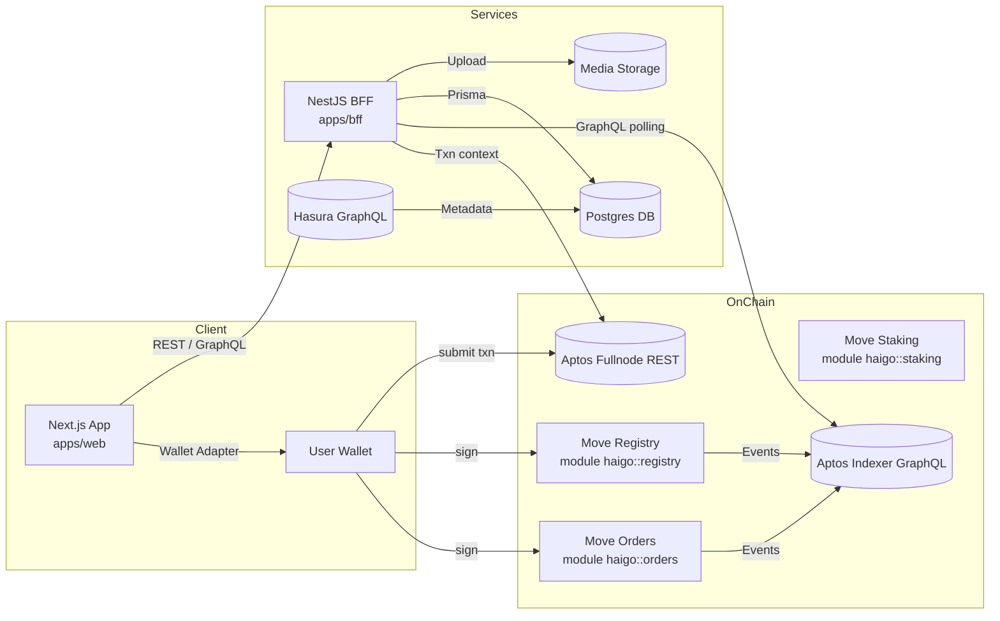

# Global Architecture Diagram

## Component Anchors
| 区域 | 职责 | Anchor |
|------|------|--------|
| WebApp | Next.js 入口 & Provider 链接钱包 | `apps/web/app/page.tsx:3`, `apps/web/app/providers.tsx:6` |
| Wallet Adapter | Aptos network/session 管理 | `apps/web/lib/wallet/context.tsx:71`, `apps/web/lib/wallet/network-guard.tsx:16` |
| BFF Entry | NestFactory 启动、模块组合 | `apps/bff/src/main.ts:6`, `apps/bff/src/modules/app.module.ts:9` |
| Accounts Module | REST 控制器、服务、事件轮询 | `apps/bff/src/modules/accounts/accounts.controller.ts:24`, `apps/bff/src/modules/accounts/accounts.service.ts:26`, `apps/bff/src/modules/accounts/event-listener.service.ts:125` |
| Media Module | 文件上传、哈希验证、存储策略 | `apps/bff/src/modules/media/media.controller.ts:24`, `apps/bff/src/modules/media/media.service.ts:33`, `apps/bff/src/modules/media/media.storage.ts:36` |
| Prisma Models | Accounts / MediaAsset 表设计 | `apps/bff/prisma/schema.prisma:15`, `apps/bff/prisma/schema.prisma:34` |
| Move Registry | 身份注册入口函数与事件 | `move/sources/registry.move:112`, `move/sources/registry.move:155` |
| Move Orders | 订单状态机 + 媒体校验 | `move/sources/orders.move:196`, `move/sources/orders.move:269` |
| Move Staking | 信用最小值校验 | `move/sources/staking.move:12` |
| Shared Types | 前后端统一 DTO/配置 | `packages/shared/src/dto/registry.ts:6`, `packages/shared/src/config/aptos.ts:16`, `packages/shared/src/config/orders.ts:12` |

## Interaction Notes
- BFF 轮询 Indexer GraphQL 获取链上事件（`apps/bff/src/modules/accounts/event-listener.service.ts:145`），同时在需要时补充 Fullnode 交易细节。
- 媒体上传后立即写入 Prisma，并通过共享常量返回 hash 与 stage（`apps/bff/src/modules/media/media.service.ts:84`）。
- 前端所有链上交易均通过钱包上下文完成签名提交（`apps/web/features/registration/RegisterView.tsx:562`）。
- 规划中的订单 API 将占位于 `apps/bff/src/modules/orders/* (planned)` 目录，事件回放后写入 `orders` 表，供前端订单 UI 使用。
