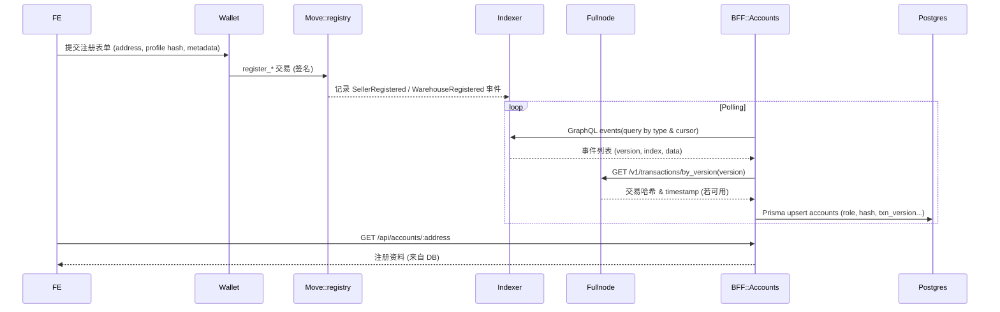
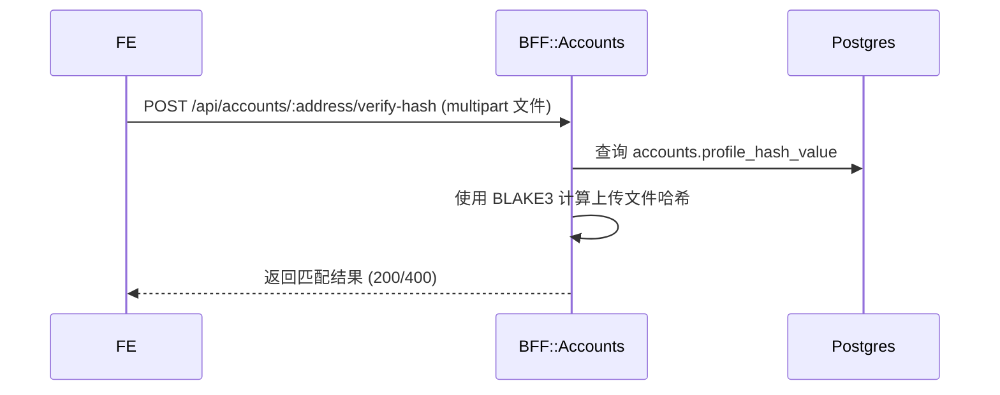
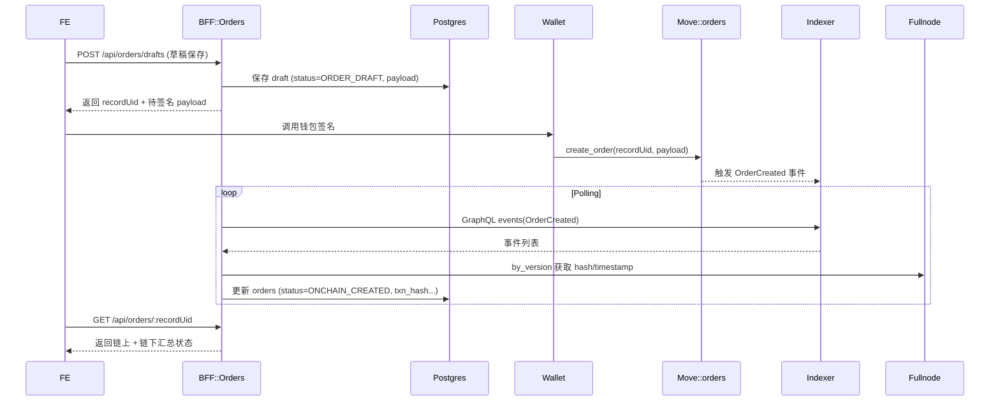
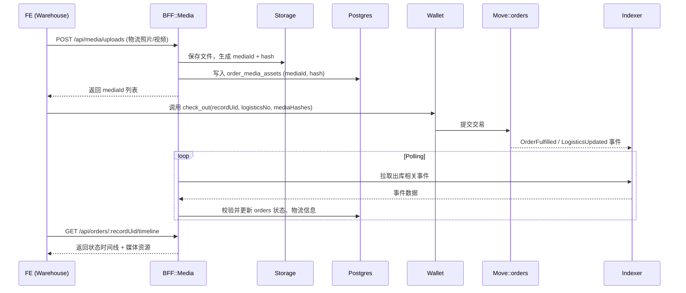
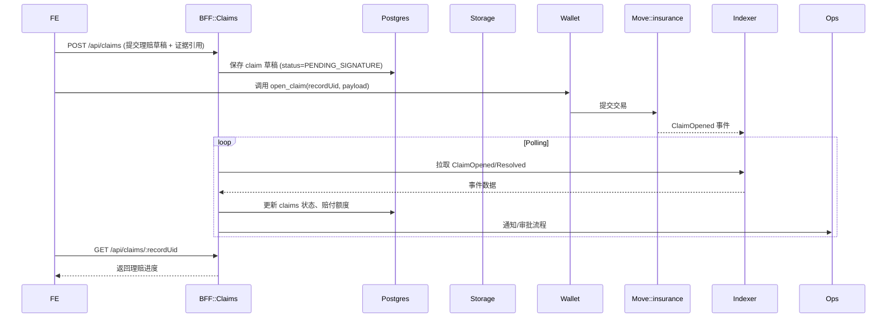
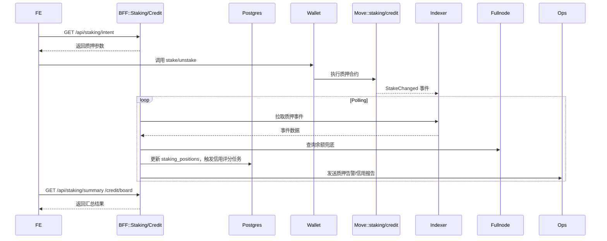

# Data Flows

| 场景 | 状态 | 涉及锚点 | 说明 |
|------|------|----------|------|
| R1 注册事件同步 | ✅ 已实现 | `move/sources/registry.move:112`, `apps/bff/src/modules/accounts/event-listener.service.ts:125`, `apps/bff/src/modules/accounts/accounts.repository.ts:23`, `apps/web/features/registration/RegisterView.tsx:562` | 链上注册事件经 Indexer 轮询写入 Prisma，再由前端查询。 |
| R2 档案哈希校验 | ✅ 已实现 | `apps/bff/src/modules/accounts/accounts.controller.ts:41`, `apps/bff/src/modules/accounts/accounts.service.ts:61`, `apps/web/lib/api/registration.ts:90`, `apps/web/lib/crypto/blake3.ts:9` | 前端上传文件，BFF 计算 BLAKE3 与数据库 hash 对比。 |
| O1 订单创建与签署 | ⏳ 规划中 | `move/sources/orders.move:196`, `packages/shared/src/dto/orders.ts:43`, `apps/bff/src/modules/orders/orders.controller.ts (planned)`, `apps/web/features/orders/utils.ts:7`, `apps/web/features/orders/CreateOrderView.tsx (planned)` | 订单草稿经 BFF 缓存，钱包签名 `create_order` 后由事件回放更新状态。 |
| O2 仓储出库与媒体上传 | ⏳ 规划中 | `apps/bff/src/modules/media/media.controller.ts:24`, `apps/bff/src/modules/media/media.service.ts:33`, `packages/shared/src/config/orders.ts:12`, `apps/bff/src/modules/orders/orders.timeline.service.ts (planned)`, `apps/web/lib/api/media.ts:38` | 上传媒体获取哈希，随后签署 `check_out` 并同步订单时间线。 |
| C1 理赔开启与结案 | ⏳ 规划中 | `move/sources/insurance.move (planned)`, `apps/bff/src/modules/claims/claims.controller.ts (planned)`, `packages/shared/src/dto/claims.ts (planned)`, `apps/web/features/claims/ClaimWorkflow.tsx (planned)` | BFF 持久化理赔草稿，链上事件驱动状态更新与运营通知。 |
| S1 质押与信用评分 | ⏳ 规划中 | `move/sources/staking.move:12`, `apps/bff/src/modules/staking/staking.service.ts (planned)`, `apps/web/features/staking/hooks/useStakingSummary.ts (planned)` | 前端展示信用数据，BFF 汇总 staking 余额与评分，链上继续作为守卫。 |

# 10. 场景化端到端数据流

> 本章为跨团队协作基线，描述不同业务场景下前端 (FE)、Move 合约、BFF 以及周边服务之间的数据流。所有图均使用同一图例：
>
> - `FE`：apps/web 前端应用
> - `Wallet`：Aptos 钱包（Petra/Martian 等）
> - `Move`：链上合约模块
> - `Indexer`：Aptos Indexer GraphQL
> - `Fullnode`：Aptos REST Fullnode API
> - `BFF`：apps/bff 服务
> - `DB`：Postgres（经 Prisma）
> - `Storage`：对象存储 / 本地媒体目录
> - `Ops`：运营/后台工具

## 10.1 场景总览

| 场景编号 | 名称 | 触发角色 | 覆盖模块 | 现状 |
|----------|------|----------|----------|------|
| R1 | 商家/仓库注册事件同步 | 商家、仓库 | registry | ✅ 已实现 |
| R2 | 档案哈希校验 | 商家、仓库 | registry | ✅ 已实现 |
| O1 | 订单创建与链上签署 | 商家 | orders | 🚧 规划中 |
| O2 | 仓储出库与媒体上传 | 仓库 | orders + media | 🚧 规划中 |
| C1 | 理赔开启与结案 | 商家、仓库、运营 | insurance | 🚧 规划中 |
| S1 | 质押与信用评分 | 仓库、运营 | staking + credit | 🚧 规划中 |

---

## 10.2 R1 — 商家/仓库注册事件同步（现网）

## 10.3 R2 — 档案哈希校验（现网）

## 10.4 O1 — 订单创建与链上签署（规划）

## 10.5 O2 — 仓储出库与媒体上传（规划）

## 10.6 C1 — 理赔开启与结案（规划）

## 10.7 S1 — 质押与信用评分（规划）

## 10.8 补偿与监控

- 所有监听器必须维护 `transaction_version + event_index` 游标，支持幂等重放。
- 当 Indexer 缺失哈希或时间戳时，统一使用 Fullnode REST `by_version` 兜底。
- 建立后台任务清理孤儿媒体、补齐缺失哈希、对账链上链下差异。
- 监控指标：事件延迟、REST 重试次数、API 错误率、存储容量、补偿队列积压。
- 新增场景需同步更新本文件及相关架构/流程文档，保持三端一致。

## 10.9 场景化 Anchor 设计与任务拆分

为确保代码锚点 (Anchor) 与数据流保持一致，后续开发将以本章各场景为单位拆分任务。每个场景包含三类 Anchor：

- **FE Anchor**：前端页面、Hook、状态或 UI 组件锚点
- **BFF Anchor**：NestJS 模块、服务、监听器、DTO/Schema
- **Move Anchor**：合约函数、事件、存储结构

| 场景 | FE Anchors | BFF Anchors | Move Anchors | 数据存储/外部依赖 |
|------|------------|-------------|--------------|-------------------|
| **R1 注册事件同步** | `apps/web/features/registration/RegisterView.tsx` 注册流程 / `useRegistrationForm` | `AccountsEventListener`、`AccountsService`、`AccountsRepository`、`@haigo/bff` 配置 (`indexerUrl`, `nodeApiUrl`) | `registry::register_seller` / `registry::register_warehouse` 交易 & `SellerRegistered`/`WarehouseRegistered` 事件 | Postgres `accounts` 表；Fullnode REST by_version |
| **R2 档案哈希校验** | `RegistrationHashVerifier` 组件 / `useVerifyHash` Hook | `/api/accounts/:address/verify-hash` 控制器、`HashVerifierService` | （无新合约；使用链上已有哈希作为对照） | Postgres `accounts.profile_hash_value`; 临时文件内存存储 |
| **O1 订单创建签署** | 订单草稿页 `CreateOrderView`、`useOrderDraft` Hook、下单确认模态 | `OrdersDraftController`、`OrdersEventListener`、`OrdersService`、Prisma `Order` Model | `orders::create_order` 函数、`OrderCreated` 事件 | Postgres `orders` 表；Fullnode REST by_version |
| **O2 仓储出库 + 媒体上传** | 仓储出库页 `OrderCheckOutView`、`useOutboundForm`、媒体上传组件 | `MediaUploadController`、`MediaStorageService`、`OrderFulfillmentListener`、`OrdersTimelineService` | `orders::check_out` / `orders::update_logistics`、`OrderFulfilled`/`LogisticsUpdated` 事件 | Postgres `order_media_assets`、`orders` 表；对象存储/本地磁盘 |
| **C1 理赔开启/结案** | 理赔页面 `ClaimWorkflow`、`ClaimForm`, `ClaimTimeline` | `ClaimsController`、`ClaimsService`、`ClaimEventListener`、赔付风控任务 | `insurance::open_claim` / `insurance::resolve_claim`、`ClaimOpened`/`ClaimResolved` 事件 | Postgres `claims`（含 evidences）、媒体存储；运营通知渠道 |
| **S1 质押与信用评分** | 质押面板 `StakingDashboard`、`useStakingSummary`、信用榜 `CreditLeaderboard` | `StakingController`、`StakingEventListener`、`CreditScoreService`、批处理任务 | `staking::stake` / `staking::unstake`、`StakeChanged` 事件；信用合约事件 | Postgres `staking_positions`、`credit_scores`；Fullnode REST 余额查询；分析任务/消息队列 |

> **任务拆分规则**：
> - 后续开发按场景拆分 Story，如 “R1.2 支持 Fullnode 哈希补齐”、“O2.1 媒体上传 API” 等。
> - 每个 Story 在完成时需更新本表中对应 Anchor 的实现状态，并补充测试/监控。
> - 若引入新的场景或 Anchor，须先更新本列表再开始开发。
