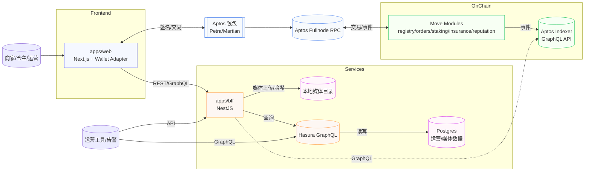

# HaiGo 架构说明（PoC v0）

本文档基于 `docs/prd.md` 的需求，结合近期讨论结果整理 HaiGo 海行在 PoC 阶段的整体架构。目标是指导 Move 合约、链下服务、前端和数据管道的协同实现，同时为后续向生产级演化预留路径。

## Introduction

### Starter Template or Existing Project
- 项目类型：Greenfield。当前无既有代码库可复用。
- 不采用通用 Monorepo 模板（如 NX/Turborepo）。通过自定义 npm workspaces 搭建 `move/`、`apps/`、`packages/` 目录，贴合 Aptos Move + TypeScript 组合需求。
- 若未来需要加速接入，可评估 Aptos 官方示例仓库或第三方模板，但目前保持轻量定制，便于 PoC 快速演进。

### Change Log
| Date       | Version | Description                       | Author |
|------------|---------|-----------------------------------|--------|
| 2025-09-18 | v0.2    | 补充模板前置章节、技术总结、平台决策 | Sarah  |
| 2025-09-17 | v0.1    | 初版 PoC 架构草案                   | Sarah  |

## High Level Architecture

### Technical Summary
- 架构风格：前后端一体的 Monorepo，链上 Move 模块负责可信状态，链下 BFF 聚合官方 Aptos Indexer 与自有元数据，前端直接面向钱包交互。
- 前端：Next.js + `@aptos-labs/wallet-adapter-react`，结合 i18next/Day.js 支撑多语言多时区。
- 后端：NestJS BFF 负责只读聚合、媒体上传、Hash 校验；本地 Postgres/Hasura 存放媒体、运营衍生数据。
- 数据与集成：核心链上数据全部从 Aptos 官方 Indexer GraphQL 获取，链下媒体暂存在服务器磁盘并定期备份。
- 基础设施：PoC 部署在测试网与云主机（阿里云 ECS 或等效服务），CI 以 GitHub Actions 为主，输出 Move 编译/测试 + 前后端构建。
- PRD 目标达成：满足 FR1–FR10 的链上身份、订单状态机、质押/理赔事件；NFR1–NFR8 通过钱包签名、媒体哈希、本地备份、监控告警策略逐步落实。

### Platform and Infrastructure Choice
| 选项 | 优点 | 局限 |
|------|------|------|
| 阿里云（ECS + RDS + OSS） | 中国团队运维熟悉、区域覆盖、便于未来迁移 OSS | PoC 阶段成本略高，需要额外配置基础设施 | 
| Vercel + Supabase | 快速部署 Next.js、内建 Postgres 存储 | 对 Aptos Move/BFF 自定义服务支持不足，媒体上传有限制 |
| AWS（EC2 + RDS + S3） | 全球可用、配套完善 | 成本相对高、合规审计需额外工作 |

**推荐方案**：阿里云测试网部署。利用 ECS 运行 BFF/Hasura，RDS/Postgres 托管链下数据；后续迁移 OSS 替代本地磁盘。正式化阶段可再评估多云或托管方案。

### Repository Structure
- 采用 npm workspaces + custom tooling：
  - `move/`：Aptos Move 合约与脚本。
  - `apps/web`：Next.js 前端应用。
  - `apps/bff`：NestJS BFF 服务。
  - `packages/shared`：共享 TypeScript 类型、配置、GraphQL 查询封装。
  - `docs/`：需求、架构、Runbook 文档。
- 根目录维护统一的 lint/test 脚本；CI 按 workspace 区分任务。

```text
haigo/
├─ move/
│  ├─ sources/                 # Move 模块源文件
│  ├─ scripts/                 # 部署与运维脚本
│  └─ Move.toml
├─ apps/
│  ├─ web/                     # 前端 Next.js 应用
│  │  ├─ app/                  # App Router 页面与布局
│  │  ├─ components/           # UI 组件（含 shadcn 封装）
│  │  ├─ features/             # 领域模块（订单、理赔等）
│  │  └─ lib/                  # 钱包、i18n、API 客户端
│  └─ bff/                     # NestJS BFF 服务
│     ├─ src/
│     │  ├─ modules/           # 领域模块（orders、claims 等）
│     │  ├─ infrastructure/    # 数据访问层（Hasura/Indexer/存储）
│     │  ├─ common/            # DTO、拦截器、中间件
│     │  └─ main.ts
│     └─ test/
├─ packages/
│  └─ shared/
│     ├─ src/
│     │  ├─ dto/               # 共享 DTO/类型定义
│     │  ├─ gql/               # GraphQL 查询与 Hook 封装
│     │  └─ config/            # 合约地址、环境配置
│     └─ index.ts
├─ docs/                       # PRD、架构、故事等
└─ tooling/                    # Lint、CI、Terraform/Ansible 模板（PoC 可选）
```


## 1. 架构目标与范围
- **核心目标**：验证订单生命周期的链上可信记录、档案/媒体哈希对照、质押与理赔流程的可行性，并向商家/仓主提供端到端体验。
- **范围约束**：
  - PoC 阶段采用本地磁盘存储媒体文件，保留抽象接口以便迁移至对象存储（阿里云 OSS）。
- 复用 Aptos 官方 Indexer GraphQL API 获取链上事件，必要时在 BFF 层做缓存与聚合；Hasura/Postgres 主要服务于我们自有媒体与运营数据。
  - 部署环境以测试网为主，CI 只覆盖编译/单测/基础集成。

## 2. 系统分层概览
```
┌──────────────────────────────────────────────────────┐
│                       前端层 apps/web               │
│  Next.js + @aptos-labs/wallet-adapter-react          │
│  角色仪表盘、订单时间线、媒体上传、质押/理赔面板        │
└──────────────────────────────────────────────────────┘
            │ 直接调用 Aptos 钱包签名 + BFF API
┌──────────────────────────────────────────────────────┐
│               BFF / 服务层 apps/bff (NestJS)         │
│  - 钱包签名辅助、费用计算                           │
│  - 媒体上传 + 本地磁盘存储 + blake3 哈希              │
│  - 对接 Hasura/Indexer 聚合链上只读数据                │
└──────────────────────────────────────────────────────┘
            │                                  │
            ▼                                  ▼
┌────────────────────────┐    ┌────────────────────────┐
│  Aptos Move 模块        │    │ Hasura + Postgres       │
│  registry / orders /   │    │  自有媒体/运营数据与缓存     │
│  staking / insurance   │    │  （可选）                 │
└────────────────────────┘    └────────────────────────┘
            │                                  ▲
            ▼                                  │
      Aptos 节点 & RPC                 Aptos Indexer GraphQL API
```

### 2.1 全栈交互示意图


## 3. 链上合约设计
| 模块 | 功能要点 | 主要事件 |
|------|----------|----------|
| `hai_go::registry` | 商家/仓主注册、档案哈希存储；重复注册和权限校验 | `SellerRegistered`, `WarehouseRegistered` |
| `hai_go::orders` | 订单状态机（`ORDER_CREATED → WAREHOUSE_IN → IN_STORAGE → WAREHOUSE_OUT`）、费用记录、物流单号、媒体哈希 | `OrderCreated`, `CheckedIn`, `SetInStorage`, `CheckedOut` |
| `hai_go::staking` | APT/稳定币质押与信用权重；多次变更生成快照 | `StakeChanged` |
| `hai_go::insurance` | 理赔开启、审批/拒绝及赔付金额记录 | `ClaimOpened`, `ClaimResolved` |
| `hai_go::reputation` | 仓主评分与链下评价哈希记录 | `RatingSubmitted` |

Move 单元测试覆盖：正常流程、权限/状态机异常、重复调用、事件字段校验。部署通过脚本输出模块地址，供前端和 BFF 使用。

## 4. 链下服务与数据流
### 4.1 BFF / Media Ingestor
- 技术栈：NestJS/Fastify + TypeScript。
- 责任：
  1. 生成订单、质押等前端需要的派生数据端点（聚合 Aptos Indexer API 与本地 Postgres/Hasura 数据）。
  2. 处理媒体上传：
     - 验证 MIME/大小（图片 ≤15 MB，视频 ≤200 MB）。
     - 计算 `blake3` 哈希并写入 Postgres `media_assets`（PoC 可用 JSON 存储）。
     - 保存到本地路径 `media://{record_uid}/{filename}`，对外通过 Nginx/静态服务公开。
  3. 提供链下哈希复核接口，允许运营或用户重新校验媒体。

- 直接复用 Aptos Labs 托管的 Indexer GraphQL API（`https://api.<network>.aptoslabs.com/v1/graphql`）获取基础链上数据：账户信息、可替代资产余额、通用交易历史等。借助 `where` 子句即可筛选 HaiGo 自定义 Move 事件，例如按 `type = "0xHAIGO::orders::CheckedIn"` 获取订单时间线。
- `apps/bff` 基于该 GraphQL API 封装常用查询（订单事件、质押快照、理赔记录、评分列表），并负责与本地媒体元数据合并，向前端提供统一的 REST/GraphQL 接口。
- 仅当需要长期保留快照或复杂聚合（运营报表、离线分析）时，再引入 Aptos Build No-Code Indexer Processor，将事件落地到 `docs/architecture/indexer-schema.md` 中定义的表结构。PoC 阶段可暂缓自建 Processor，专注官方 Indexer + BFF 聚合，实现最小可行链上数据闭环。

### 4.2 数据模型定义
- **总体原则**：链下数据全部集中在 Postgres，Hasura 作为 GraphQL BFF 暴露结构化查询；所有链上事件均以 `txn_version + event_index` 去重，并保留 `chain_timestamp` 便于回放。
- **核心实体（PoC 范围）**：

  | 表名 | 主键/索引 | 关键字段 | 说明 |
  |------|-----------|----------|------|
  | `accounts` | PK: `account_address`；唯一索引 `(txn_version, event_index)` | `role`, `profile_hash_algo`, `profile_hash_value`, `profile_uri` | 映射注册事件，区分商家/仓主身份，后续可追加 KYC 元数据。 |
  | `orders` | PK: `record_uid`；索引 `creator_address`, `warehouse_address`, `status` | `status`, `storage_fee`, `insurance_fee`, `last_media_hash_*`, `logistics_*` | 代表订单主视图，`last_*` 字段跟踪最新链上状态与媒体哈希。 |
  | `order_events` | PK: `id`（序列）；唯一索引 `(txn_version, event_index)`；索引 `record_uid` | `event_type`, `media_hash_*`, `logistics_no`, `payload` | 保存订单时间线的每一次状态变更，`payload` 存储事件原始 JSON。 |
  | `staking_positions` | PK: `id`；唯一索引 `(txn_version, event_index)`；索引 `owner_address` | `asset_type`, `total_amount`, `credit_weight` | 质押事件快照，BFF 通过 `ORDER BY txn_version DESC` 获取最新值。 |
  | `claims` | PK: `claim_id`；唯一索引 `(last_event_version, last_event_index)`；索引 `record_uid` | `status`, `payout_amount`, `payout_currency`, `evidence_hash_*`, `resolution_hash_*` | 理赔流程主表，支持按订单维度聚合查询。 |
  | `ratings` | PK: `id`；唯一索引 `(txn_version, event_index)`；索引 `warehouse_address` | `score`, `review_hash_*`, `record_uid` | 仓主评分记录，支撑信用榜单与反馈抽样。 |
  | `media_assets` | PK: `id`；唯一索引 `(record_uid, storage_path)`；索引 `hash_value`, `owner_address` | `storage_path`, `hash_algo`, `hash_value`, `mime_type`, `size_bytes`, `uploaded_by` | 链下媒体元数据，与本地磁盘路径或未来 OSS 对象一一映射，`hash_value` 支撑查重与重新校验。 |

- **关系约束**：
  - `orders.record_uid` ↔ `order_events.record_uid`（1:N）、`claims.record_uid`、`ratings.record_uid`，用于订单详情聚合。
  - `accounts.account_address` 与 `orders.creator_address`、`orders.warehouse_address` 建立 Hasura 手动关系，便于查询身份信息。
  - `media_assets.record_uid` 可选外键到 `orders.record_uid`，PoC 阶段通过应用层校验以避免硬依赖。

- **Hasura 配置要点**：追踪上述表后，将 `orders.status`、`claims.status`、`order_events.event_type` 以 enum mapping 暴露，更利于前端消费；匿名角色仅开放 `select` 查询，运营角色开放 `aggregate` 与媒体检索。
- **扩展指引**：如需引入自建 Indexer Processor，请复用 `docs/detail/indexer-schema.md` 中的完整 DDL；未来引入 OSS 时，在 `media_assets` 增加 `storage_provider`, `bucket`, `object_key`。数据保留策略初期以 90 天回溯为界，后续结合监管要求调整。

### 4.3 媒体存储策略
- PoC：本地磁盘 + 定期 rsync 备份。
- 预留接口 `StorageProvider`：未来切换到阿里云 OSS（SSE-KMS、生命周期管理、访问日志）。

### 4.4 BFF API 接口规范
| Method | Path | 说明 | 请求参数 | 响应示例 |
|--------|------|------|----------|----------|
| `GET` | `/api/accounts/:address` | 返回地址对应的商家/仓主档案、注册哈希及订单统计 | `address`：Aptos 地址 | `{ "address": "0x...", "role": "seller", "profileHash": { "algo": "blake3", "value": "..." }, "registeredAt": "2025-09-15T12:30:00Z", "orderCount": 4 }` |
| `POST` | `/api/media/uploads` | 处理媒体上传；PoC 直接写本地磁盘，返回存储路径与哈希 | `multipart/form-data`：`record_uid`, `media` | `{ "recordUid": "HG-202509-0001", "path": "/media/HG-202509-0001/inbound-1.jpg", "hash": { "algo": "blake3", "value": "..." } }` |
| `GET` | `/api/orders/:record_uid` | 聚合订单当前状态、时间线、媒体哈希验证结果 | `record_uid` | `{ "recordUid": "HG-202509-0001", "status": "WAREHOUSE_IN", "timeline": [...], "hashVerified": true }` |
| `GET` | `/api/orders` | 支持分页与筛选的订单列表，供运营/商家看板使用 | Query：`role`, `warehouseAddress`, `status`, `limit`, `cursor` | `{ "data": [...], "nextCursor": "..." }` |
| `GET` | `/api/staking/:address` | 返回仓主质押额度与信用权重快照 | `address` | `{ "owner": "0x...", "assetType": "0x1::aptos_coin::AptosCoin", "totalAmount": "1200", "creditWeight": "0.85", "updatedAt": "2025-09-16T02:20:00Z" }` |
| `GET` | `/api/claims/:record_uid` | 订单关联的理赔状态列表 | `record_uid` | `{ "recordUid": "HG-202509-0001", "claims": [{ "claimId": "CLM-01", "status": "OPEN", "evidenceHash": "..." }] }` |

接口统一返回 `meta.requestId`、`meta.timestamp` 字段，错误响应遵循 `code/message/details` 格式，并在响应头附带 `x-haigo-trace-id` 以便前端追踪。

### 4.5 Hasura GraphQL 摘要
- `query accountByAddress($address: String!)`：从 `accounts` 表读取角色与档案哈希。
- `query ordersByCreator($creator: String!, $limit: Int)`：基于 `orders` + `order_events` 关系返回订单及时间线。
- `query stakingHistory($owner: String!, $limit: Int = 20)`：分页查询 `staking_positions` 快照。
- `query claimsByRecord($recordUid: String!)`：拉取 `claims` 表及最新状态字段。

Hasura Metadata 设置：
1. 为上述查询定义 `Query Collection`，供前端与 BFF 重用。
2. `anonymous` 角色开放只读查询（可通过 `allow_aggregations=false` 限制聚合）。
3. `operations` 角色允许 `aggregate` 与复杂过滤，用于运营看板。

### 4.6 核心接口与类设计
- **共享类型（`packages/shared/src/dto`）**：以 TypeScript interface 表达链上/链下统一数据模型，供前端与 BFF 复用。

```ts
export type OrderStatus = 'ORDER_CREATED' | 'WAREHOUSE_IN' | 'IN_STORAGE' | 'WAREHOUSE_OUT';

export interface AccountProfile {
  address: string;
  role: 'seller' | 'warehouse';
  profileHash: { algo: 'blake3'; value: string };
  profileUri?: string;
  registeredAt: string; // ISO timestamp
}

export interface OrderTimelineEvent {
  recordUid: string;
  type: OrderStatus;
  chainVersion: number;
  chainIndex: number;
  occurredAt: string;
  mediaHash?: { algo: 'blake3'; value: string };
  logisticsNo?: string;
  payload?: Record<string, unknown>;
}

export interface OrderSummary {
  recordUid: string;
  creator: string;
  warehouse: string;
  status: OrderStatus;
  storageFee: string;
  insuranceFee: string;
  lastMediaHash?: { algo: string; value: string };
  logisticsInboundNo?: string;
  logisticsOutboundNo?: string;
  timeline: OrderTimelineEvent[];
}

export interface StakingSnapshot {
  owner: string;
  assetType: string;
  totalAmount: string;
  creditWeight?: string;
  updatedAt: string;
}

export interface ClaimRecord {
  claimId: string;
  recordUid: string;
  status: 'OPEN' | 'RESOLVED' | 'REJECTED';
  payoutAmount?: string;
  payoutCurrency?: string;
  evidenceHash?: { algo: string; value: string };
  resolutionHash?: { algo: string; value: string };
  updatedAt: string;
}

export interface RatingRecord {
  id: string;
  warehouse: string;
  rater: string;
  recordUid: string;
  score: 1 | 2 | 3 | 4 | 5;
  reviewHash?: { algo: string; value: string };
  submittedAt: string;
}

export interface MediaAssetMeta {
  id: string;
  recordUid: string;
  storagePath: string;
  hash: { algo: string; value: string };
  mimeType: string;
  sizeBytes: number;
  uploadedBy: string;
  uploadedAt: string;
}
```

- **BFF 服务分层（`apps/bff/src/modules`）**：每个领域模块暴露 Controller（HTTP GraphQL）、Service（业务组合）与 Repository（数据访问）三层。

```ts
// apps/bff/src/modules/orders/orders.service.ts
@Injectable()
export class OrdersService {
  constructor(
    private readonly indexerRepo: OrdersIndexerRepository,
    private readonly hasuraRepo: OrdersHasuraRepository,
    private readonly mediaRepo: MediaRepository,
  ) {}

  async getOrder(recordUid: string): Promise<OrderSummary> {
    const [order, events, media] = await Promise.all([
      this.indexerRepo.fetchOrder(recordUid),
      this.indexerRepo.fetchTimeline(recordUid),
      this.mediaRepo.listByRecord(recordUid),
    ]);
    return mapOrderAggregate(order, events, media);
  }

  async listOrders(filter: ListOrdersFilter): Promise<Paginated<OrderSummary>> {
    return this.hasuraRepo.queryOrders(filter);
  }
}

// apps/bff/src/modules/media/media.repository.ts
@Injectable()
export class MediaRepository {
  constructor(private readonly prisma: PrismaService) {}

  async listByRecord(recordUid: string): Promise<MediaAssetMeta[]> {
    return this.prisma.mediaAsset.findMany({ where: { recordUid } });
  }
}
```

- **前端特性模块（`apps/web/features`）**：以“页面入口 + hooks + 组件”组织，每个特性依赖共享 DTO 与轻量查询客户端。
  - `features/orders`：订单详情页 `OrderDetailPage.tsx`，调用 `useOrder(recordUid)` Hook（封装自 BFF REST/GraphQL + DTO 类型）。
  - `features/staking`：质押榜单组件 `StakingLeaderboard.tsx`，消耗 `StakingSnapshot[]`。
  - `features/claims`：理赔状态面板，复用 `ClaimRecord`。

- **Move 脚本接口**：`move/scripts/deploy.mjs` 暴露 `deployModules(env): Promise<DeployedAddresses>`，将模块地址写回 `packages/shared/src/config/aptos.ts`，供前后端统一引用。

## 5. 前端体验
- Next.js + `@aptos-labs/wallet-adapter-react`，支持 Petra/Martian 自动连接；钱包网络需校验与合约部署环境一致。
- 核心页面：
  1. 注册与档案上传：展示链上身份状态、触发 `register_*` 交易、同步哈希。
  2. 仓库市场与信用分榜单：消费 BFF 的筛选接口。
  3. 订单创建/时间线：调用合约后监听事件，展示媒体哈希验证按钮和区块浏览器链接。
  4. 理赔/质押面板：结合链上数据与 BFF 从 `claims`/`staking_positions` 提供的快照。
- 国际化：使用 i18next/Day.js，默认中文，可切换英文，时间根据用户时区渲染。

## 6. 部署与环境
- **本地开发**：
- 使用 Docker Compose 启动 Postgres、Hasura、BFF；本地调试时直接指向 Aptos 官方 Indexer GraphQL。若需验证自建 Processor，可额外在 Aptos Build 控制台创建 No-Code Indexer 并连接本地 Postgres。
  - 本地媒体目录挂载至 `./storage/media`，通过 `.env.local` 配置 `MEDIA_STORAGE_DIR`（可选 `MEDIA_PUBLIC_PREFIX=/media`）。
  - `apps/web` 通过 `NEXT_PUBLIC_HASURA_URL`、`NEXT_PUBLIC_BFF_URL` 连接后端。
- **测试网环境**：
  - Aptos 合约部署到测试网，模块地址写入 `packages/shared/config/aptos.ts`。
  - BFF 与 Hasura 部署在单台云主机或 Kubernetes 节点（阿里云 ECS/ACK），开启 HTTPS。
  - 媒体目录挂载云盘（ESSD），每日利用 OSS 同步脚本备份。
- **CI/CD**：
  1. GitHub Actions（或阿里云流水线）三阶段：`move-test`、`backend-test`、`frontend-build`。
  2. 构建产物：Move 模块 `build/`、BFF Docker 镜像、Next.js 静态资源。
  3. 通过环境变量控制部署目标（`ENV=dev/testnet`）。合约部署需人工审批。
- **基础设施即代码**：
  - Terraform 管理 ECS、RDS（Postgres）、OSS Bucket（预留）、安全组；若暂未接入 Terraform，可用阿里云 ROS 模板起步。
  - Ansible/Shell 脚本负责 BFF/Hasura 服务的容器化部署与环境变量注入。

## 7. 安全、合规与运维
- **链上**：模块部署在资源账户，理赔决议等敏感操作使用多签能力。对金额相关函数执行链下预校验，避免错误支付。
- **链下**：上传接口启用身份校验（签名 + nonce 或短期 JWT），防止未经授权的媒体写入。日志记录上传者、哈希、IP。
- **备份与监控**：
  - 每日备份本地媒体目录及 Postgres 数据。
  - Prometheus/Grafana（或最简日志告警）监控 Indexer 延迟、BFF 错误率、媒体哈希检测结果。
  - Hasura/Indexer 提供 `/health` 端点，CI 监测可用性。
- **合规**：PoC 阶段所有媒体视为公开；若后续引入敏感信息，需要启用 OSS + KMS、访问控制与对象锁。

## 8. 演进路线
| 里程碑 | 目标 | 关键动作 |
|--------|------|----------|
| M0 | PoC 基座 | 完成 Move 模块骨架、Indexing Pipeline、前端钱包接入、媒体本地存储闭环 |
| M1 | PoC 增强 | 引入哈希抽检、质押信用榜、理赔流程端到端演示 |
| M2 | 准生产 | 迁移 OSS、完善告警、加强访问控制、CI 覆盖 E2E 测试 |

迁移至生产时需执行：对象存储替换、Hasura 权限细化（匿名→只读子集）、索引高可用、链上合约审计。

## 9. 附件
- `docs/prd.md`：详细需求列表。
- `docs/detail/indexer-schema.md`：若未来启用自建 Processor，可参考的事件表结构。
- `docs/front-end-spec.md`：前端交互与视觉规范，指导 UI 实现。
- `docs/runbook.md`：开发与部署 Runbook，涵盖本地/测试网流程与操作手册。
- 未来将补充：部署说明、API 规格、测试策略。
