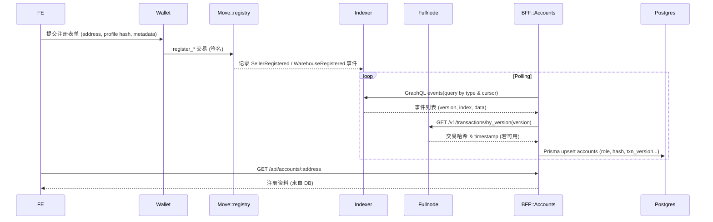
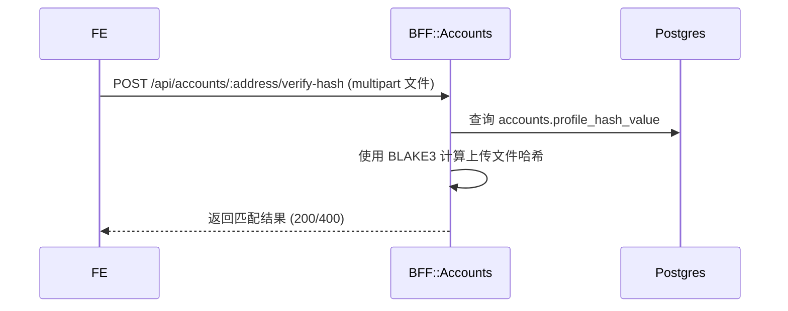
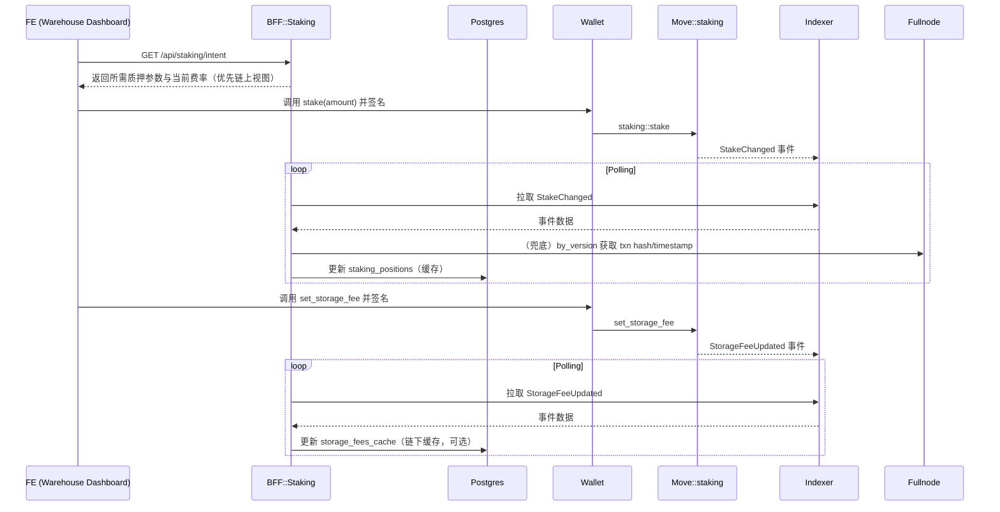
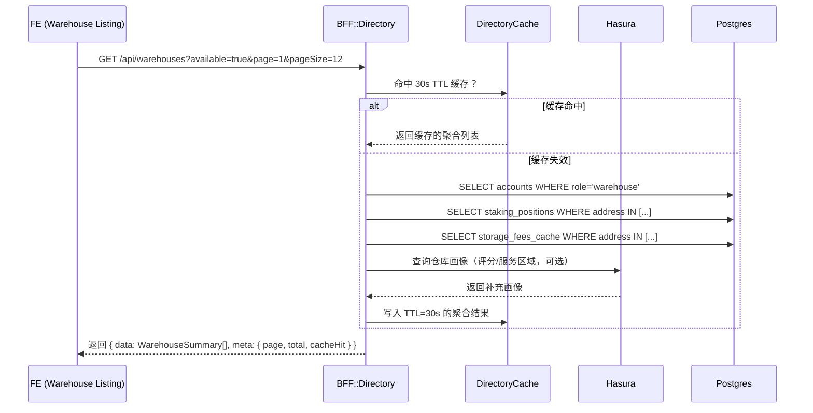
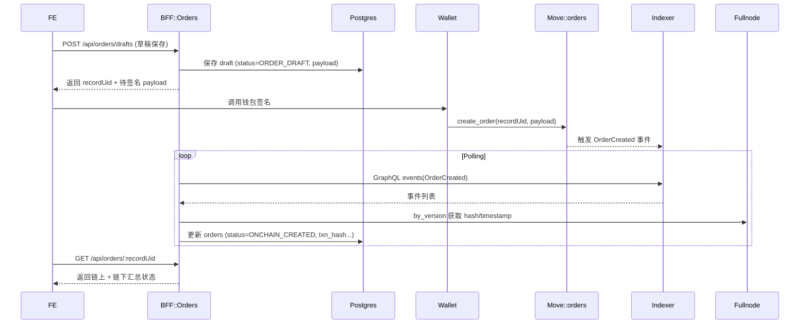
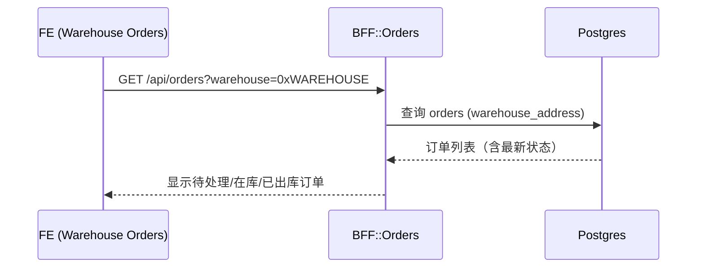
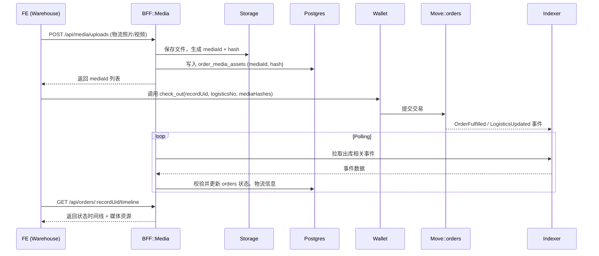
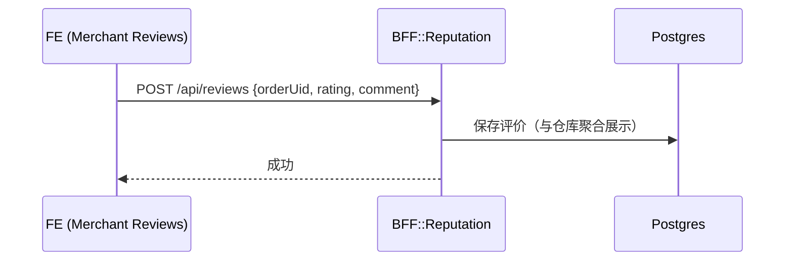
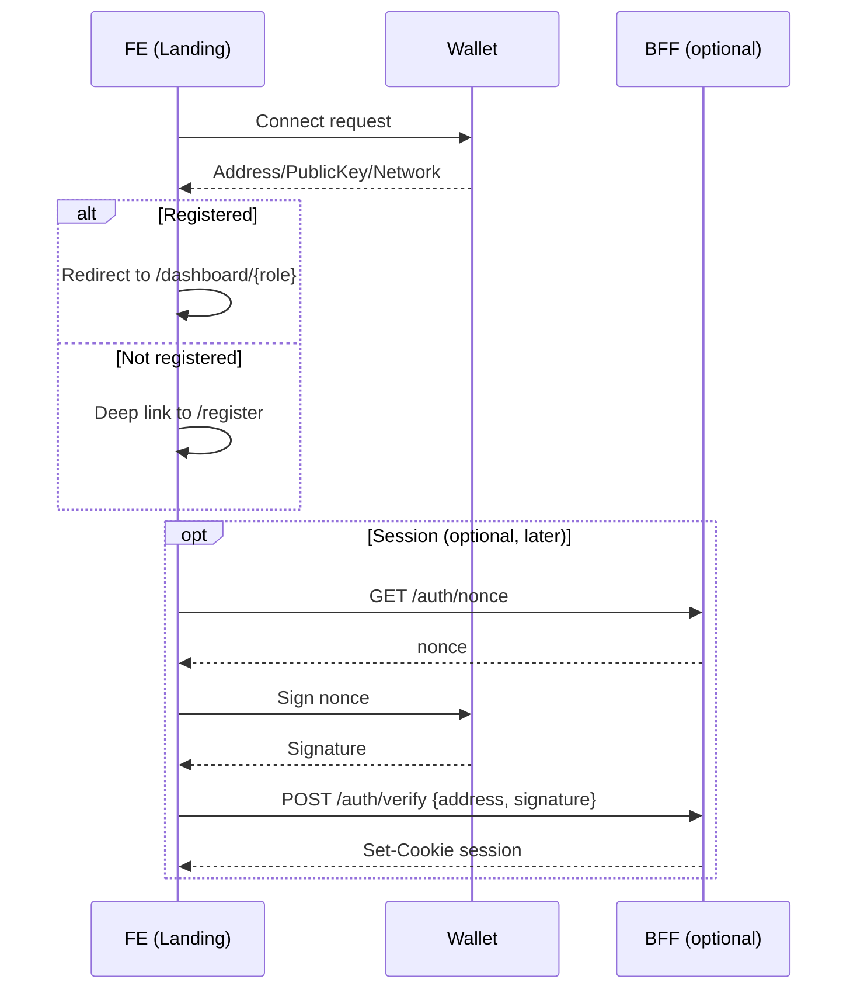

# 10. 场景化端到端数据流

> 本章为跨团队协作基线，描述不同业务场景下前端 (FE)、Move 合约、BFF 以及周边服务之间的数据流。所有图均使用同一图例：
>
> - `FE`：apps/web 前端应用
> - `Wallet`：Aptos 钱包（Petra/Martian 等）
> - `Move`：链上合约模块
> - `Indexer`：Aptos Indexer GraphQL
> - `Fullnode`：Aptos REST Fullnode API
> - `BFF`：apps/bff 服务
> - `DB`：Postgres（经 Prisma）
> - `Storage`：对象存储 / 本地媒体目录
> - `Ops`：运营/后台工具

## 10.1 场景总览

| 场景编号 | 名称 | 触发角色 | 覆盖模块 | 现状 |
|----------|------|----------|----------|------|
| R1 | 商家/仓库注册事件同步 | 商家、仓库 | registry | ✅ 已实现 |
| R2 | 档案哈希校验 | 商家、仓库 | registry | ✅ 已实现 |
| W1 | 家庭仓质押与存储费设置 | 仓库 | staking | 🚧 规划中 |
| L1 | 家庭仓 Listing 选择 | 商家 | directory | ✅ 已实现 |
| O1 | 订单创建与链上签署 | 商家 | orders | ✅ 初版 |
| W2 | 家庭仓订单收件箱（可见性） | 仓库 | orders | 🚧 规划中 |
| O2 | 仓储出库与媒体上传 | 仓库 | orders + media | 🚧 规划中 |
| A1 | 连接钱包登录（直连） | 商家、仓库 | FE/Wallet (+可选 BFF) | ✅ PoC |
| M1 | 商家评价 | 商家 | reputation | 🚧 规划中 |

---

## 10.2 R1 — 商家/仓库注册事件同步（现网）



### R1 实施前置与常见坑位（重要）
- 环境变量必须一致且指向 Aptos Labs 网关（避免匿名 429）：
  - `APTOS_INDEXER_URL=https://api.testnet.aptoslabs.com/v1/graphql`
  - `APTOS_NODE_API_URL=https://api.testnet.aptoslabs.com/v1`
  - 可选：`APTOS_NODE_API_KEY=aptoslabs_...`（BFF 会同时附带 `Authorization: Bearer` 与 `x-aptos-api-key`）
- 模块地址必须正确：
  - 前端/后端统一从`.env.local`读取 `NEXT_PUBLIC_APTOS_MODULE=0x<部署地址>`；BFF 将用该地址拼接事件类型 `${MODULE}::registry::SellerRegistered`/`WarehouseRegistered`。
- 监听游标与速率：
  - 若仅需要从最新开始监听：`ACCOUNT_INGESTOR_START_FROM_LATEST=true`（默认），`ACCOUNT_INGESTOR_BACKFILL_OFFSET_VERSIONS=0`。
  - 若需要回填一小段历史：把 `BACKFILL_OFFSET_VERSIONS` 设为 1e4 之类小值，并适当降速：
    - `ACCOUNT_INGESTOR_INTERVAL_MS=60000`、`ACCOUNT_INGESTOR_PAGE_SIZE=10`、`ACCOUNT_INGESTOR_MAX_PAGES_PER_TICK=1`。
- 旧产物与入口：
  - BFF 启动脚本已指向 `dist/apps/bff/src/main.js`，避免加载过时 `dist/main.js`。
- GraphQL 变量类型：
  - Indexer 对 cursor 使用 `bigint!`；BFF 已按字符串传参规避类型不匹配。

### R1 成功后重定向（新增约定）
- 当链上交易确认且 `/api/accounts/:address` 返回 200，前端应：
  - 立刻以本地数据乐观更新注册状态（已实现），并在随后一次拉取中用真实数据覆盖（已实现）。
  - 自动根据角色跳转到各自工作台：
    - 商家：`/dashboard/seller`
    - 仓库：`/dashboard/warehouse`
  - 若 60 秒内仍未从 BFF 读到资料（监听延迟），保持当前页面并给出“稍后刷新”的提示按钮。

## 10.3 R2 — 档案哈希校验（现网）



## 10.4 W1 家庭仓质押与存储费设置（规划）



## 10.5 L1 商家浏览家庭仓 Listing（选择仓）（已实现）



## 10.6 O1 — 订单创建与链上签署（初版）



实现状态（初版）与 Anchors：
- BFF（Directory）：`apps/bff/src/modules/directory/directory.module.ts`、`directory.controller.ts`、`directory.service.ts`、`directory.repository.ts`、`hasura.client.ts`（TTL 缓存、Prisma＋Hasura 聚合、指标 `directory_request_total`/`directory_cache_hit_total`）。
- FE（目录体验）：`apps/web/features/directory/useWarehouseDirectory.ts`、`WarehouseFilters.tsx`、`WarehouseCard.tsx`、`app/(seller)/warehouses/page.tsx`。
- Dashboard 入口：`apps/web/app/dashboard/seller/page.tsx` 新增 “Browse directory” 卡片串联 L1→O1。
- 与 O1 集成：`CreateOrderView`（`apps/web/features/orders/create/CreateOrderView.tsx`）支持 `?warehouse=0x...` 预选 CTA 来源。

实现状态（O1 初版）与 Anchors：
- BFF：`apps/bff/src/modules/orders/orders.controller.ts`（POST /api/orders/drafts, GET /api/orders, GET /api/orders/:recordUid）、`orders.service.ts`、`orders.repository.ts`、`orders-event-listener.service.ts`（Indexer 轮询 + Fullnode by_version 兜底）。
- FE：`apps/web/features/orders/useOrderDraft.ts`；`CreateOrderView` 在 Review 步骤创建草稿并显示 `recordUid`。
- 监控：`GET /metrics` 暴露 `order_listener_last_version`（gauge）、`order_listener_error_total`（counter）以及目录相关指标。

## 10.7 家庭仓订单收件箱（可见性）（规划）



## 10.8 O2 — 仓储出库与媒体上传（规划）



### 10.5.1 目标与交付物
- FE 仓储出库页面：支持多媒体上传（图片/视频）、物流信息填写，签名提交 `orders::check_out`，并展示“订单时间线 + 媒体”聚合视图。
- BFF 媒体上传沿用现有 `MediaService`；新增出入库事件监听器，落库时间线与状态；提供 `/timeline` 聚合接口；Fullnode by_version 兜底事务哈希与时间戳。
- DB 复用 `orders`、`order_events`、`media_assets` 三表，通过 `record_uid` 与媒体哈希进行对账；物流信息存入 `order_events.data`（避免额外迁移）。
- 测试覆盖：媒体哈希一致性、事件→时间线映射、Fullnode 兜底、接口契约、前端交互。

### 10.5.2 跨层设计（契约与流程）
- FE
  - 上传：`POST /api/media/uploads` 返回 `{ recordUid, stage, category, hash.value }`；FE 将返回的 `hash.value` 收集为 `mediaHashes`。
  - 出库签名：调用钱包执行 `orders::check_out(order_id, logistics, media_hashes)`；随后轮询 `GET /api/orders/:recordUid` 或 `GET /api/orders/:recordUid/timeline` 刷新状态。
- BFF
  - 监听 Indexer 事件：`CheckedIn`、`SetInStorage`、`CheckedOut`，每条事件在写入 `order_events` 前调用 Fullnode `by_version` 兜底 `txn_hash/timestamp`。
  - 事件入库后，`OrdersRepository` 更新 `orders.status` 与时间线；按 `media_hashes[]` 关联 `media_assets.hash_value`，标记 `matched_offchain=true`。
  - 提供 `GET /api/orders/:recordUid`（详情含时间线摘要）与 `GET /api/orders/:recordUid/timeline`（仅时间线 + 媒体）。
- Move（参考 3.4）
  - `orders::check_in` → `CheckedIn` 事件；`orders::set_in_storage` → `SetInStorage`；`orders::check_out` → `CheckedOut`。
  - 内部 `assert_hash_valid` 限制 32 字节 BLAKE3（与链下 `MediaService` 计算一致）。

### 10.5.3 核心 Anchor 与代码骨架

1) 事件监听器（BFF）

文件：`apps/bff/src/modules/orders/orders-fulfillment-listener.service.ts`（未来目标路径）
```ts
import { Injectable, Logger, OnModuleDestroy, OnModuleInit } from '@nestjs/common';
import { ConfigService } from '@nestjs/config';
import { OrdersService } from './orders.service.js';
import { ORDERS_MODULE_ADDRESS, ORDERS_MODULE_NAME } from '@haigo/shared/config/aptos';

type EventRow = { transaction_version: string; event_index: number; type: string; data: any };

const QUERY = /* GraphQL */ `
  query Events($eventType: String!, $limit: Int!, $cursorVersion: bigint!, $cursorEventIndex: bigint!) {
    events(
      where: {
        type: { _eq: $eventType }
        _or: [
          { transaction_version: { _gt: $cursorVersion } },
          { transaction_version: { _eq: $cursorVersion }, event_index: { _gt: $cursorEventIndex } }
        ]
      }
      order_by: [{ transaction_version: asc }, { event_index: asc }]
      limit: $limit
    ) { transaction_version event_index type data }
  }
`;

@Injectable()
export class OrdersFulfillmentListener implements OnModuleInit, OnModuleDestroy {
  private readonly logger = new Logger(OrdersFulfillmentListener.name);
  private poll?: NodeJS.Timeout;
  private lastV = BigInt(-1);
  private lastI = BigInt(-1);
  constructor(private cfg: ConfigService, private orders: OrdersService) {}
  async onModuleInit() { await this.pollOnce(); this.poll = setInterval(() => void this.pollOnce(), Number(this.cfg.get('ingestion.pollingIntervalMs', 30_000))); }
  async onModuleDestroy() { if (this.poll) clearInterval(this.poll); }

  private async pollOnce() {
    const types = ['CheckedIn', 'SetInStorage', 'CheckedOut'] as const;
    for (const t of types) await this.pullType(t);
  }

  private async pullType(kind: (typeof ORDER_EVENT_TYPES)[number]) {
    const eventType = `${ORDERS_MODULE_ADDRESS}::${ORDERS_MODULE_NAME}::${kind}`;
    const rows = await this.fetch(eventType);
    for (const e of rows) await this.process(kind, e);
  }

  private async fetch(eventType: string): Promise<EventRow[]> { /* 同 O1：POST Indexer GraphQL，携带 API key，可复用工具 */ return []; }

  private async process(kind: 'CheckedIn'|'SetInStorage'|'CheckedOut', evt: EventRow) {
    const meta = await this.resolveTxnMetaByVersion(evt.transaction_version);
    const d = evt.data ?? {};
    const orderId = Number.parseInt(d.order_id ?? d.orderId ?? '0', 10);
    if (kind === 'CheckedIn') {
      await this.orders.applyCheckedInEvent({
        txnVersion: BigInt(evt.transaction_version), eventIndex: BigInt(evt.event_index),
        txnHash: meta?.hash, chainTimestamp: meta?.timestamp,
        orderId, warehouse: String(d.warehouse ?? ''), mediaHashes: (d.media_hashes ?? d.mediaHashes ?? []) as string[]
      });
    } else if (kind === 'SetInStorage') {
      await this.orders.applySetInStorageEvent({
        txnVersion: BigInt(evt.transaction_version), eventIndex: BigInt(evt.event_index),
        txnHash: meta?.hash, chainTimestamp: meta?.timestamp, orderId
      });
    } else if (kind === 'CheckedOut') {
      await this.orders.applyCheckedOutEvent({
        txnVersion: BigInt(evt.transaction_version), eventIndex: BigInt(evt.event_index),
        txnHash: meta?.hash, chainTimestamp: meta?.timestamp,
        orderId, logistics: d.logistics ?? d.logistics_outbound ?? {}, mediaHashes: (d.media_hashes ?? d.mediaHashes ?? []) as string[]
      });
    }
    this.lastV = BigInt(evt.transaction_version); this.lastI = BigInt(evt.event_index);
  }

  private async resolveTxnMetaByVersion(version: string) {/* 参考 O1: by_version 兜底 */ return null; }
}
```

2) 订单仓储仓事件入库（BFF）

文件：`apps/bff/src/modules/orders/orders.service.ts`（追加方法）
```ts
async applyCheckedInEvent(evt: { txnVersion: bigint; eventIndex: bigint; txnHash?: string|null; chainTimestamp?: Date|null; orderId: number; warehouse: string; mediaHashes: string[]; }): Promise<void> {
  await this.repo.upsertCheckedIn(evt);
}
async applySetInStorageEvent(evt: { txnVersion: bigint; eventIndex: bigint; txnHash?: string|null; chainTimestamp?: Date|null; orderId: number; }): Promise<void> {
  await this.repo.upsertSetInStorage(evt);
}
async applyCheckedOutEvent(evt: { txnVersion: bigint; eventIndex: bigint; txnHash?: string|null; chainTimestamp?: Date|null; orderId: number; logistics?: any; mediaHashes: string[]; }): Promise<void> {
  await this.repo.upsertCheckedOut(evt);
}
```

文件：`apps/bff/src/modules/orders/orders.repository.ts`（追加方法骨架）
```ts
async upsertCheckedIn(evt: { txnVersion: bigint; eventIndex: bigint; txnHash?: string|null; chainTimestamp?: Date|null; orderId: number; warehouse?: string; mediaHashes: string[]; }) {
  const recordUid = deriveRecordUid(evt.orderId, evt.txnHash ?? undefined);
  // 1) 订单状态
  await this.prisma.order.upsert({
    where: { recordUid },
    create: { recordUid, status: 'WAREHOUSE_IN' as any, orderId: evt.orderId, txnVersion: evt.txnVersion as any, eventIndex: evt.eventIndex as any, txnHash: evt.txnHash ?? null, chainTimestamp: evt.chainTimestamp ?? null },
    update: { status: 'WAREHOUSE_IN' as any, txnVersion: evt.txnVersion as any, eventIndex: evt.eventIndex as any, txnHash: evt.txnHash ?? null, chainTimestamp: evt.chainTimestamp ?? null }
  });
  // 2) 事件表
  await this.prisma.orderEvent.upsert({
    where: { txnVersion_eventIndex: { txnVersion: evt.txnVersion as any, eventIndex: evt.eventIndex as any } },
    create: { recordUid, orderId: evt.orderId, type: 'CheckedIn', txnVersion: evt.txnVersion as any, eventIndex: evt.eventIndex as any, txnHash: evt.txnHash ?? null, chainTimestamp: evt.chainTimestamp ?? null, data: { media_hashes: evt.mediaHashes } },
    update: {}
  });
  // 3) 媒体对账：按 hash_value 匹配并标记 matched_offchain=true
  if (evt.mediaHashes?.length) {
    await this.prisma.mediaAsset.updateMany({ where: { recordUid, hashValue: { in: evt.mediaHashes.map((h) => h.replace(/^0x/, '').toLowerCase()) } }, data: { matchedOffchain: true } });
  }
}

async upsertSetInStorage(evt: { txnVersion: bigint; eventIndex: bigint; txnHash?: string|null; chainTimestamp?: Date|null; orderId: number; }) {
  const recordUid = deriveRecordUid(evt.orderId, evt.txnHash ?? undefined);
  await this.prisma.order.update({ where: { recordUid }, data: { status: 'IN_STORAGE' as any, txnVersion: evt.txnVersion as any, eventIndex: evt.eventIndex as any, txnHash: evt.txnHash ?? null, chainTimestamp: evt.chainTimestamp ?? null } });
  await this.prisma.orderEvent.upsert({ where: { txnVersion_eventIndex: { txnVersion: evt.txnVersion as any, eventIndex: evt.eventIndex as any } }, create: { recordUid, orderId: evt.orderId, type: 'SetInStorage', txnVersion: evt.txnVersion as any, eventIndex: evt.eventIndex as any, txnHash: evt.txnHash ?? null, chainTimestamp: evt.chainTimestamp ?? null }, update: {} });
}

async upsertCheckedOut(evt: { txnVersion: bigint; eventIndex: bigint; txnHash?: string|null; chainTimestamp?: Date|null; orderId: number; logistics?: any; mediaHashes: string[]; }) {
  const recordUid = deriveRecordUid(evt.orderId, evt.txnHash ?? undefined);
  await this.prisma.order.update({ where: { recordUid }, data: { status: 'WAREHOUSE_OUT' as any, txnVersion: evt.txnVersion as any, eventIndex: evt.eventIndex as any, txnHash: evt.txnHash ?? null, chainTimestamp: evt.chainTimestamp ?? null } });
  await this.prisma.orderEvent.upsert({ where: { txnVersion_eventIndex: { txnVersion: evt.txnVersion as any, eventIndex: evt.eventIndex as any } }, create: { recordUid, orderId: evt.orderId, type: 'CheckedOut', txnVersion: evt.txnVersion as any, eventIndex: evt.eventIndex as any, txnHash: evt.txnHash ?? null, chainTimestamp: evt.chainTimestamp ?? null, data: { logistics: evt.logistics ?? null, media_hashes: evt.mediaHashes } }, update: {} });
  if (evt.mediaHashes?.length) {
    await this.prisma.mediaAsset.updateMany({ where: { recordUid, hashValue: { in: evt.mediaHashes.map((h) => h.replace(/^0x/, '').toLowerCase()) } }, data: { matchedOffchain: true } });
  }
}
```

3) 时间线聚合（BFF）

文件：`apps/bff/src/modules/orders/orders.service.ts`（或 `orders.timeline.service.ts` 未来目标路径）
```ts
async getTimeline(recordUid: string) {
  // 汇总 order_events 与 media_assets，按 txnVersion/occurredAt 升序
  // 映射类型 → 阶段：OrderCreated→CREATED, CheckedIn→WAREHOUSE_IN, SetInStorage→IN_STORAGE, CheckedOut→WAREHOUSE_OUT
}
```

控制器追加：`apps/bff/src/modules/orders/orders.controller.ts`
```ts
@Get(':recordUid/timeline')
async timeline(@Param('recordUid') recordUid: string) { return this.orders.getTimeline(recordUid); }
```

4) FE 出库页面与 Hook（未来目标路径）

- 页面入口：`apps/web/app/(warehouse)/orders/[recordUid]/outbound/page.tsx`
- Hook：`apps/web/features/orders/outbound/useOutboundForm.ts`
```ts
'use client';
import { useState, useCallback } from 'react';
import { uploadOrderMedia } from '@/app/lib/api/media';
import { useWalletContext } from '@/app/lib/wallet/context';

export function useOutboundForm(recordUid: string) {
  const { signAndSubmitTransaction, networkStatus } = useWalletContext();
  const [mediaHashes, setMediaHashes] = useState<string[]>([]);
  const [logistics, setLogistics] = useState<{ carrier?: string; trackingNumber?: string; notes?: string }>({});

  const uploadFiles = useCallback(async (files: File[]) => {
    const hashes: string[] = [];
    for (const file of files) {
      const { data } = await uploadOrderMedia({ file, recordUid, stage: 'outbound' });
      hashes.push(data.hash.value);
    }
    setMediaHashes((prev) => Array.from(new Set([...prev, ...hashes])));
  }, [recordUid]);

  const signCheckOut = useCallback(async (orderId: number) => {
    const tx = { /* 构建 orders::check_out 输入（按网络） */ };
    return signAndSubmitTransaction(tx);
  }, [signAndSubmitTransaction, networkStatus.expected, logistics, mediaHashes]);

  return { mediaHashes, logistics, setLogistics, uploadFiles, signCheckOut };
}
```

注意：`MediaService.resolveCategory` 需按 `stage` 前缀生成 `outbound_photo/video/document`（现实现默认为 inbound_*，后续改造时一并提交）。

### 10.5.4 实施步骤
1. BFF 监听
   - 新增 `OrdersFulfillmentListener` 并挂载到 `OrdersModule`，按 O1 监听器实现 GraphQL 调用与 Fullnode 兜底。
2. Repository/Service
   - 在 `OrdersRepository/OrdersService` 中补齐 `CheckedIn/SetInStorage/CheckedOut` 三个 upsert 方法与聚合 `getTimeline`。
3. 接口与前端
   - 新增 `GET /api/orders/:recordUid/timeline`；前端 Outbound 页对接上传与签名逻辑，时间线消费该接口。
4. 观测与补偿
   - 继承 O1 指标与补偿策略：事件游标、Fullnode 失败计数、媒体对账失败重试队列。

### 10.5.5 测试计划
- 单元测试
  - `orders.repository.spec.ts`：三类事件 upsert 幂等；媒体哈希对账（matched_offchain 标识）。
  - `orders-fulfillment-listener.spec.ts`：三类事件按游标推进；Fullnode by_version 404 分支记录告警但不阻塞。
- 集成测试
  - `GET /api/orders/:recordUid/timeline` 返回阶段映射与媒体列表；签名后 30s 内出现 `CheckedOut` 节点。
- 前端测试
  - `useOutboundForm.test.tsx`：多文件上传 → 收集媒体哈希；签名调用参数构造正确；出错提示（网络/拒签/哈希不匹配）。

### 10.5.6 验收标准（Acceptance）
- 仓库可在页面完成媒体上传与 `check_out` 签名；
- BFF 在 30s 内将 `CheckedIn/SetInStorage/CheckedOut` 映射为时间线节点并更新 `orders.status`；
- `media_assets.hash_value` 与链上 `media_hashes[]` 对账一致，并标记 `matched_offchain`；
- Fullnode 缺失事务元数据时，通过 `by_version` 兜底；
- 日志、指标、告警完备，接口契约与文档一致。

### 10.5.7 相关文档阅读清单（必读）
- 系统分层概览：`docs/architecture/2-系统分层概览.md:1`
- 链上合约 O2：`docs/architecture/3-链上合约设计.md:167`
- 链下服务 O2：`docs/architecture/4-链下服务与数据流.md:169`
- Fullnode 兜底设计：`docs/architecture/4-链下服务与数据流.md:143`
- 前端 Anchor（O2）：`docs/architecture/5-前端体验.md:166`
- 部署与运行（Epic 2 组件）：`docs/architecture/6-部署与环境.md:184`
- 媒体存储（Story 2.3）：`docs/architecture/6-部署与环境.md:245`
- 订单索引与监控（Story 2.4）：`docs/architecture/6-部署与环境.md:252`

<!-- 10.12 / 10.13 暂时移除（按讨论） -->

## 10.9 商家评价（规划）



> 说明：暂不考虑 slash 相关的惩罚逻辑，后续在声誉/质押模块演进时再补充链上/链下联动。

## 10.10 补偿与监控

- 所有监听器必须维护 `transaction_version + event_index` 游标，支持幂等重放。
- 当 Indexer 缺失哈希或时间戳时，统一使用 Fullnode REST `by_version` 兜底。
- 建立后台任务清理孤儿媒体、补齐缺失哈希、对账链上链下差异。
- 监控指标：事件延迟、REST 重试次数、API 错误率、存储容量、补偿队列积压。
- 新增场景需同步更新本文件及相关架构/流程文档，保持三端一致。

## 10.11 场景化 Anchor 设计与任务拆分

为确保代码锚点 (Anchor) 与数据流保持一致，后续开发将以本章各场景为单位拆分任务。每个场景包含三类 Anchor：

- **FE Anchor**：前端页面、Hook、状态或 UI 组件锚点
- **BFF Anchor**：NestJS 模块、服务、监听器、DTO/Schema
- **Move Anchor**：合约函数、事件、存储结构

| 场景 | FE Anchors | BFF Anchors | Move Anchors | 数据存储/外部依赖 |
|------|------------|-------------|--------------|-------------------|
| **R1 注册事件同步** | `apps/web/features/registration/RegisterView.tsx` 注册流程 / `useRegistrationForm` | `AccountsEventListener`、`AccountsService`、`AccountsRepository`、`@haigo/bff` 配置 (`indexerUrl`, `nodeApiUrl`) | `registry::register_seller` / `registry::register_warehouse` 交易 & `SellerRegistered`/`WarehouseRegistered` 事件 | Postgres `accounts` 表；Fullnode REST by_version |
| **R2 档案哈希校验** | `RegistrationHashVerifier` 组件 / `useVerifyHash` Hook | `/api/accounts/:address/verify-hash` 控制器、`HashVerifierService` | （无新合约；使用链上已有哈希作为对照） | Postgres `accounts.profile_hash_value`; 临时文件内存存储 |
| **O1 订单创建签署** | 订单草稿页 `CreateOrderView`、`useOrderDraft` Hook、下单确认模态 | `OrdersDraftController`、`OrdersEventListener`、`OrdersService`、Prisma `Order` Model | `orders::create_order` 函数、`OrderCreated` 事件 | Postgres `orders` 表；Fullnode REST by_version |
| **O2 仓储出库 + 媒体上传** | 仓储出库页 `OrderCheckOutView`、`useOutboundForm`、媒体上传组件 | `MediaUploadController`、`MediaStorageService`、`OrderFulfillmentListener`、`OrdersTimelineService` | `orders::check_out` / `orders::update_logistics`、`OrderFulfilled`/`LogisticsUpdated` 事件 | Postgres `order_media_assets`、`orders` 表；对象存储/本地磁盘 |
| **C1 理赔开启/结案** | 理赔页面 `ClaimWorkflow`、`ClaimForm`, `ClaimTimeline` | `ClaimsController`、`ClaimsService`、`ClaimEventListener`、赔付风控任务 | `insurance::open_claim` / `insurance::resolve_claim`、`ClaimOpened`/`ClaimResolved` 事件 | Postgres `claims`（含 evidences）、媒体存储；运营通知渠道 |
| **S1 质押与信用评分** | 质押面板 `StakingDashboard`、`useStakingSummary`、信用榜 `CreditLeaderboard` | `StakingController`、`StakingEventListener`、`CreditScoreService`、批处理任务 | `staking::stake` / `staking::unstake`、`StakeChanged` 事件；信用合约事件 | Postgres `staking_positions`、`credit_scores`；Fullnode REST 余额查询；分析任务/消息队列 |

> **任务拆分规则**：
> - 后续开发按场景拆分 Story，如 “R1.2 支持 Fullnode 哈希补齐”、“O2.1 媒体上传 API” 等。
> - 每个 Story 在完成时需更新本表中对应 Anchor 的实现状态，并补充测试/监控。
> - 若引入新的场景或 Anchor，须先更新本列表再开始开发。
## 10.0 A1 — 连接钱包登录（PoC）



说明：
- 当前 PoC 不依赖后端会话，按连接钱包即可进入（受网络/角色判断约束）。
- 后续（A2）可按“挑战-签名-换会话”模式接入最小后端登录。
