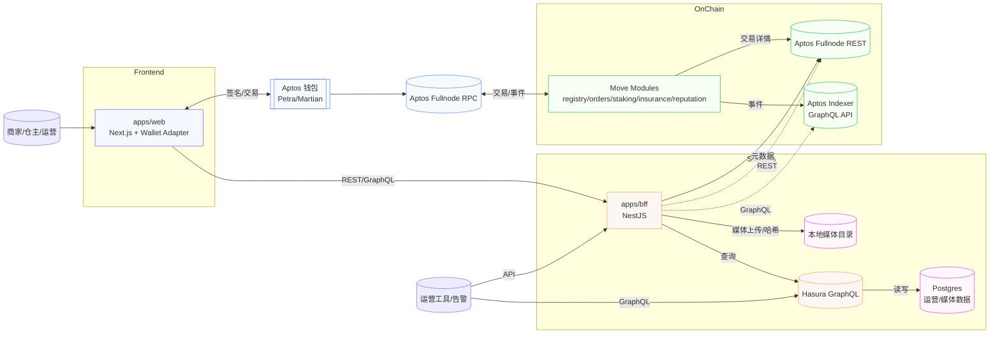

# 2. 系统分层概览
```
┌──────────────────────────────────────────────────────┐
│                       前端层 apps/web               │
│  Next.js + @aptos-labs/wallet-adapter-react          │
│  角色仪表盘、订单时间线、媒体上传、质押/理赔面板        │
└──────────────────────────────────────────────────────┘
            │ 直接调用 Aptos 钱包签名 + BFF API
┌──────────────────────────────────────────────────────┐
│               BFF / 服务层 apps/bff (NestJS)         │
│  - 钱包签名辅助、费用计算                           │
│  - 媒体上传 + 本地磁盘存储 + blake3 哈希              │
│  - 对接 Hasura/Indexer 聚合链上只读数据                │
│  - 通过 Indexer GraphQL + Fullnode REST 补齐交易元数据 │
└──────────────────────────────────────────────────────┘
            │                                  │
            ▼                                  ▼
┌────────────────────────┐    ┌────────────────────────┐
│  Aptos Move 模块        │    │ Hasura + Postgres       │
│  registry / orders /   │    │  自有媒体/运营数据与缓存     │
│  staking / insurance   │    │  （可选）                 │
└────────────────────────┘    └────────────────────────┘
            │                                  ▲
            ▼                                  │
      Aptos 节点 & RPC                 Aptos Indexer GraphQL API
```

## 2.1 全栈交互示意图

