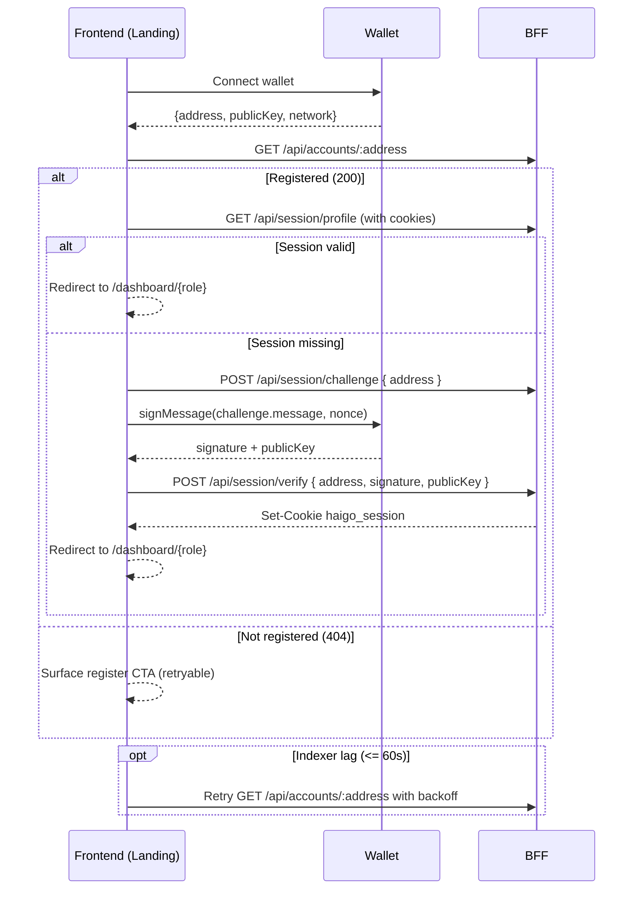

# Data Stream – Wallet Connect Login (A1)

## Flow (A3)

## Contracts
- FE requires `NEXT_PUBLIC_APTOS_NETWORK` and `NEXT_PUBLIC_BFF_URL` for API calls.
- All BFF requests must set `credentials: 'include'` to receive/send the `haigo_session` cookie (HttpOnly, SameSite=Lax).
- Session endpoints (Nest BFF):
  - `POST /api/session/challenge` → `{ address, nonce, message }`
  - `POST /api/session/verify` → sets `haigo_session`, returns canonical `AccountProfile`
  - `GET /api/session/profile` → returns `{ data: AccountProfile | null }`, 401 when absent/expired

## Acceptance
- Landing page wraps wallet CTAs with `NetworkGuard`, showing mismatch guidance when networks differ.
- Registration probe retries 3× (1s → 3s → 9s) before surfacing "register" guidance, with aria-live announcements for each state.
- Successful wallet owners obtain a session cookie and are redirected to their role dashboard; dashboards are server-guarded via Next layout.
- Already registered users visiting `/register` are redirected to their dashboard by the server layout guard.
