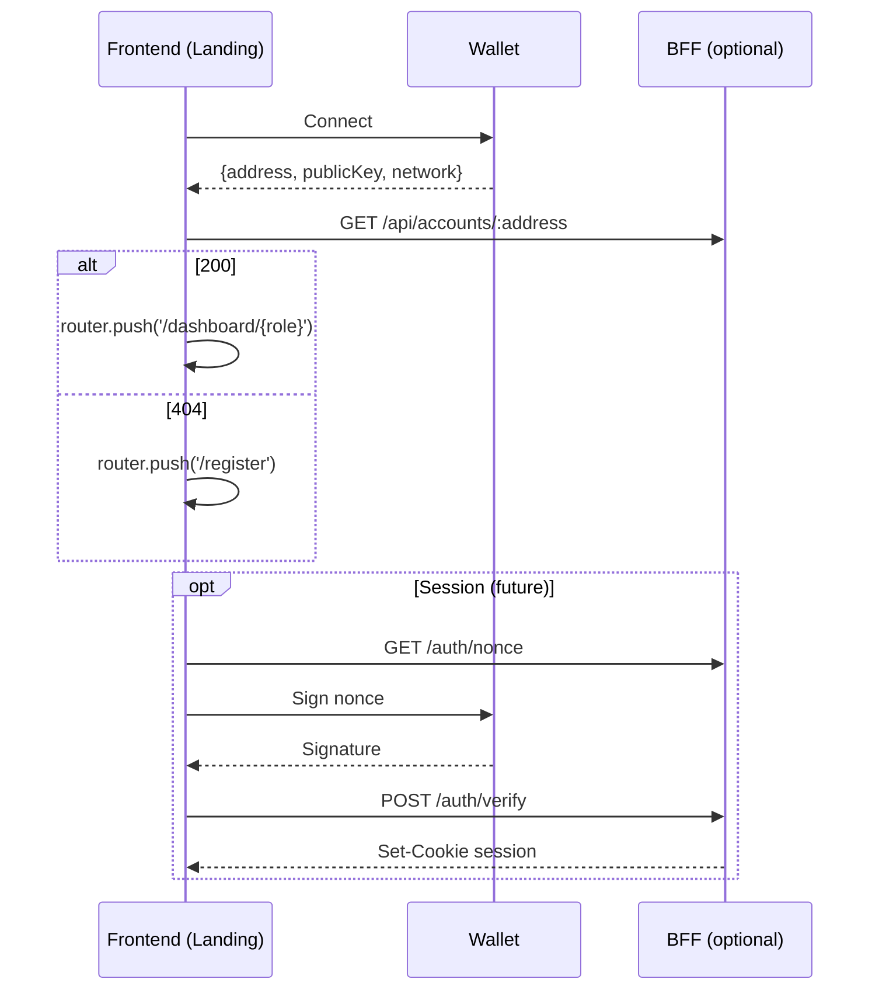

# Data Stream – Wallet Connect Login (A1)

## Flow (PoC)

## Contracts
- FE requires `NEXT_PUBLIC_APTOS_NETWORK`, `NEXT_PUBLIC_BFF_URL` and wallet adapters configured.
- Optional session endpoints for future iterations.

## Acceptance
- Connect succeeds (address visible), navigation follows registration state.
- Graceful handling of network mismatch and errors.

