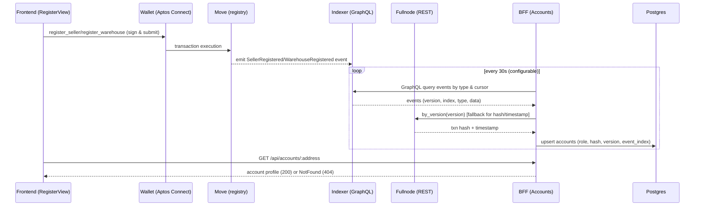

# Data Stream – Registration (R1) End-to-End

This document summarizes the primary data flows, integration points, and validation criteria for the registration scenario (R1) across FE, Wallet, Move, Indexer, BFF, and DB.

## 1. High-Level Flow



## 2. Component Contracts

- FE → Wallet
  - build.register function id: `${NEXT_PUBLIC_APTOS_MODULE}::registry::register_*`
  - args: `[HASH_ALGORITHM_BLAKE3 (u8), profile_hash (string)]`

- BFF ↔ Indexer
  - URL: `APTOS_INDEXER_URL=https://api.testnet.aptoslabs.com/v1/graphql`
  - Headers: `Authorization: Bearer <APTOS_NODE_API_KEY>` + `x-aptos-api-key: <APTOS_NODE_API_KEY>` (optional key)
  - Cursor variables: `cursorVersion: bigint!` (stringified) and `cursorEventIndex: bigint!` (stringified)

- BFF ↔ Fullnode
  - URL: `APTOS_NODE_API_URL=https://api.testnet.aptoslabs.com/v1`
  - Endpoint: `/transactions/by_version/{version}`

## 3. Operational Concerns

- Rate limiting / backoff
  - 408/429 triggers cooldown with exponential backoff; `ACCOUNT_INGESTOR_*` variables allow tuning
- Cursor persistence
  - Accounts repository tracks last processed version/index; avoids duplicate upsert
- Env consistency
  - Deployment script writes `NEXT_PUBLIC_APTOS_MODULE`, `APTOS_NETWORK=testnet`

## 4. Failure Modes & Handling

- Incorrect module address → no events
  - Mitigation: script writes env; startup log prints address detection (BFF)
- Anonymous requests (429) to Indexer
  - Mitigation: use api.testnet gateway + headers as above
- Indexer lag
  - FE keeps optimistic UI; retries GET; 60s fallback CTA

## 5. Test & Acceptance Criteria

### Functional
1. FE success path
   - Submit register_* → tx confirmed → GET profile switches from 404→200 within 60s
   - Auto-redirects to role dashboard when 200 received
2. Slow ingestion
   - Within 60s no 200 → FE shows CTA buttons (Go to dashboard / Refresh status)
3. Wrong env
   - Missing `NEXT_PUBLIC_APTOS_MODULE` → shows banner; prevents function id construction
4. Wrong network
   - Network guard blocks submission; user can retry after switching wallet network

### BFF
1. Indexer backoff
   - Inject 429 in tests → BFF logs cooldown and resumes after backoff
2. Fullnode fallback
   - by_version returns hash/timestamp for versions observed; if 4xx, BFF proceeds with synthetic defaults (warn)

### Security / Config
1. No private keys in `.env.local` (user-facing); kept in `.aptos/config.yaml` only
2. Production: always use gateway + API key; print masked key presence on startup

### QA Checklist
- [ ] FE unit: role → path mapping
- [ ] FE integration: success → redirect
- [ ] BFF integration: events ingestion with correct headers
- [ ] E2E (optional): real Testnet tx observed in app within 60s

## 6. Trace Example

```text
FE submit → tx hash H
Poll BFF → 404 (t0)
BFF tick at t0+30s → fetch 25 events → sees SellerRegistered(V, I)
BFF fullnode by_version(V) → hash/timestamp
DB upsert(account)
FE poll profile → 200 → redirect to /dashboard/seller
```

