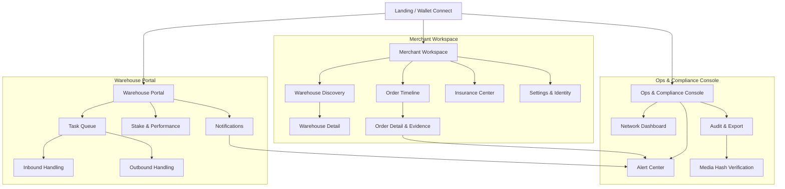
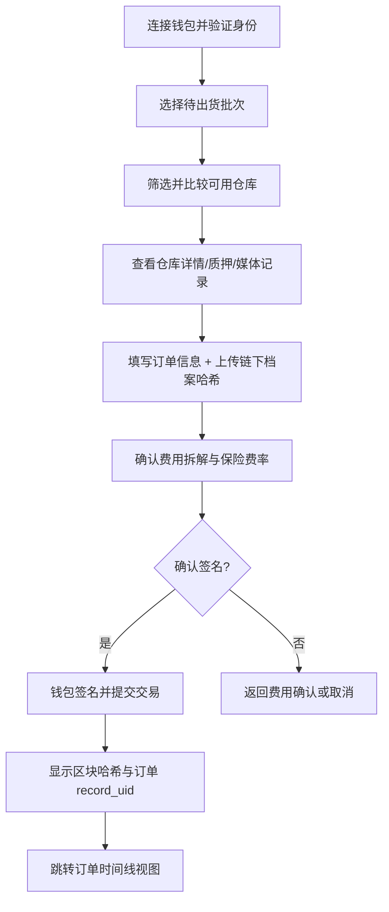
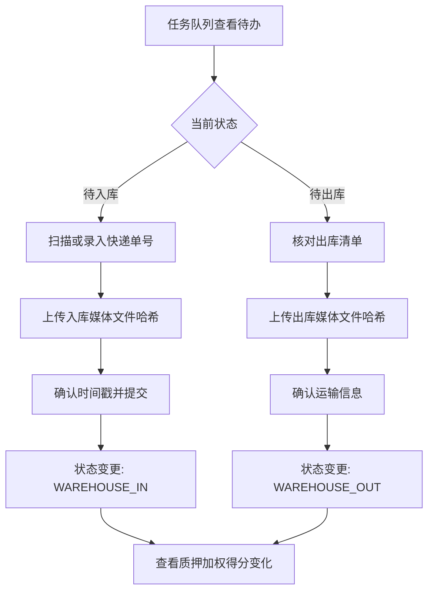
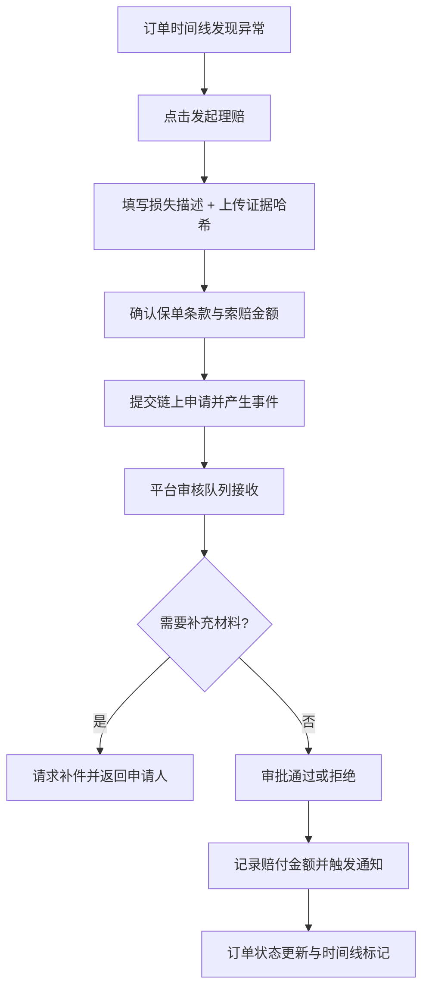

# HaiGo 海行 UI/UX Specification

## Introduction
This document defines the user experience goals, information architecture, user flows, and visual design specifications for HaiGo 海行’s user interface. It serves as the foundation for visual design and frontend development, ensuring a cohesive and user-centered experience.

### Overall UX Goals & Principles
#### Target User Personas
- **跨境商家运营经理**：需要快速上手下单、追踪仓储/理赔进度，并验证仓主信用与媒体哈希。
- **家庭仓仓主/团队**：关注待办任务、质押状态、异常告警及履约激励，偏好移动端或平板操作。
- **平台运营与合规人员**：要求对网络健康度、索引延迟、审计导出等有全局视图并可快速响应。

#### Usability Goals
- 首次下单引导：新商家在 5 分钟内完成仓库选择和费用确认。
- 订单追踪效率：订单生命周期主要状态在 2 次点击内可见，关键证据链接清晰。
- 风险反馈及时性：理赔、质押告警在 1 分钟内以通知与标记呈现，并可溯源链上哈希。
- 多语言一致性：界面与报表在语言或时区切换后无需重复学习。

#### Design Principles
1. **透明可信** — 始终暴露链上事件、媒体哈希验证与质押权重，让用户理解可信来源。
2. **流程导向** — 结合卡片时间线与分步流程，确保关键任务有清晰的下一步。
3. **操作弹性** — 支持桌面与移动场景，提供适合仓主的快速操作入口。
4. **风险先行** — 在页面顶部或关键节点突出异常警示、签名风险提示与合规须知。
5. **模块化可扩展** — UI 组件保持一致样式，方便未来扩展 KYC、更多货币等功能。

### Change Log
| Date | Version | Description | Author |
| --- | --- | --- | --- |
| 2025-09-18 | v0.2 | Epic 1 文档同步：注册流程、API 现状更新 | Winston (Architect)
| 2025-09-17 | v0.1 | 初稿：完成 UX 目标、IA、核心流程与设计规范 | Sally (UX)

## Epic 1 Context & Alignment
**Scope Snapshot:** Epic 1 覆盖故事 1.1–1.4，提供注册基线能力（Move 合约、BFF、前端钱包与 CI/CD）。

### Delivered Stories
- **Story 1.1 – Monorepo & CI/CD Foundations：** `pnpm-workspace.yaml`、通用脚本 (`package.json` / `scripts/`)、GitHub Actions 流水线确保 Move/后端/前端均执行 lint+test。
- **Story 1.2 – Core Account Move Module：** `move/sources/registry.move` 提供角色注册、哈希校验、事件发射与单元测试。
- **Story 1.3 – Frontend Wallet Connection & Identity Selection：** `apps/web/features/registration/RegisterView.tsx`、`lib/wallet/` 管理钱包上下文、哈希计算、会话缓存、Gas 模拟与交易状态。
- **Story 1.4 – Metadata Indexing & Record Verification API：** `apps/bff/src/modules/accounts` 聚合 Indexer 事件、写入 Prisma `Account` 表并暴露查询/校验 REST API。

### Key Artefacts
- `apps/web/features/registration/RegisterView.tsx`
- `apps/web/lib/wallet/context.tsx`、`apps/web/lib/wallet/network-guard.tsx`
- `apps/web/lib/crypto/blake3.ts`、`apps/web/lib/api/registration.ts`
- `apps/bff/src/modules/accounts/*.ts`、`apps/bff/prisma/schema.prisma`
- `move/sources/registry.move`、`move/sources/orders.move` 及关联单元测试

### Known Gaps / TODO
- `/api/media/uploads` 尚未在 BFF 中实现；前端会提示上传失败并保留本地缓存，完全闭环需待后端交付。
- 200MB 文档的 BLAKE3 哈希仍在主线程执行；`docs/stories/1.3.story.md` 的改进项要求后续使用 Web Worker。
- QA 指出缺少端到端与无障碍自动化测试，详见 `docs/stories/1.3.story.md#qa-results`。
- 订单、理赔等模块仍属未来迭代（Epic 2+）；下文以“Planned”标记尚未交付的流程。
- 注册成功后的角色化重定向（新增）：当交易确认且从 BFF 读到注册资料后，自动跳转到 `/dashboard/seller` 或 `/dashboard/warehouse`。

## Information Architecture (IA)
### Site Map / Screen Inventory


### Navigation Structure
**Primary Navigation:** Dashboard, Warehouses, Orders, Insurance, Analytics, Alerts

**Secondary Navigation:** Contextual tabs per module（例如 Orders：Timeline、Evidence Vault、Payments；Warehouses：List、Map、Rankings；Analytics：KPIs、Geo View、Reports）

**Breadcrumb Strategy:** Module → Sub-area → Record（示例：`Orders > 2025-Q1 Imports > ORDER-12345`），并提供快速返回状态机总览的链接。

## User Flows
### 身份注册（Epic 1 Story 1.3）
**Status:** Delivered (Epic 1).

**User Goal:** 商家或仓主通过钱包完成身份注册并缓存链下档案哈希，实现链上/链下一致。

**Entry Points:** 连接钱包后访问 `/register`（`apps/web/app/(auth)/register/page.tsx`），或从 Dashboard CTA 进入。

**Success Criteria:**
- 钱包网络与 `NEXT_PUBLIC_APTOS_NETWORK` 匹配并展示连接状态；
- 上传文档通过类型/体积校验，`hashFileBlake3` 生成 64 字符 BLAKE3 哈希；
- `uploadIdentityDocument` 成功返回（或在 BFF 缺席时提示错误并保留本地缓存）；
- Gas 模拟展示估算费用（APT + `NEXT_PUBLIC_APT_USD_RATE`），交易调用 `register_seller` / `register_warehouse` 并在区块确认后显示 Explorer 链接；
- 刷新 `GET /api/accounts/:address` 展示注册结果与档案哈希。

**Flow Summary:**
1. `useWalletContext` 初始化钱包状态 → `NetworkGuard` 校验网络，提供切换提示；
2. 拖拽或选择文档 → 校验 MIME/大小 → `hashFileBlake3` 计算哈希并回显元信息；
3. 调用 `uploadIdentityDocument`（若 BFF 未实现则显示错误、允许稍后重试），成功时写入 `sessionStorage` 缓存；
4. 构建交易（`aptos.transaction.build.simple`）→ `simulateTransaction` 估算 gas → `signAndSubmitTransaction`；
5. 轮询交易状态，展示提交→等待→成功的进度，并提供区块浏览器链接与复制哈希按钮。

**Edge Cases & Error Handling:**
- 网络不匹配时 `NetworkGuard` 渲染 fallback 并禁用表单，提供“Retry network check”。
- BFF 返回错误或缺失 `/api/media/uploads`：提示“Failed to upload documentation”，保留文件与哈希以便稍后重试。
- 哈希不一致：比较客户端与返回哈希，不一致则中断流程并提示错误。
- 已注册用户：`fetchAccountProfile` 返回值后禁用提交并展示注册信息。

**Implementation Notes:**
- 缓存键 `haigo:registration:{address}` 使用 `sessionStorage` 存储临时文档与元数据。
- Gas 估算使用钱包公开密钥模拟，失败时展示错误并保持原状态。
- 交易入口函数由 `APTOS_MODULE_ADDRESS::registry::*` 常量驱动（来源 `packages/shared/src/config/aptos.ts`）。

#### Implementation Anchors
- 表单提交流程：`apps/web/features/registration/RegisterView.tsx:361`（见下方代码片段）。
- 交易签名与区块确认：`apps/web/features/registration/RegisterView.tsx:562`。
- API 客户端与哈希工具：`apps/web/lib/api/registration.ts:58/90`、`apps/web/lib/crypto/blake3.ts:9`。
- 测试覆盖：`apps/web/lib/api/registration.test.ts:16`、`apps/web/features/registration/RegisterView.test.tsx:113`。

#### Post-Registration Redirect（新增规范）
- 触发条件：`transactionState.stage === 'success'` 且 `fetchAccountProfile` 返回非空。
- 行为：
  - 若 `accountInfo.role === 'seller'` → `router.push('/dashboard/seller')`
  - 若 `accountInfo.role === 'warehouse'` → `router.push('/dashboard/warehouse')`
  - 若 60s 内未取到资料：保留当前页面，展示“前往仪表盘”与“刷新状态”按钮。
- 可访问性：跳转前在页面上用 `aria-live=polite` 宣告“Registration succeeded, redirecting to dashboard…”。
- 容错：保留现有 “Go to dashboard” 链接作为后备。

#### Configuration（新增）
- 必填环境：
  - `NEXT_PUBLIC_APTOS_NETWORK=testnet`
  - `NEXT_PUBLIC_APTOS_MODULE=0x<部署地址>`（用于拼接 `registry::register_*` 完整函数名）
  - `NEXT_PUBLIC_BFF_URL=http://localhost:3001`
  - 可选：`NEXT_PUBLIC_HASURA_URL`

```tsx
// apps/web/features/registration/RegisterView.tsx:361
const handleFormSubmit = async (event: FormEvent<HTMLFormElement>) => {
  event.preventDefault();
  if (!accountAddress) {
    setUploadError('Connect your wallet before uploading documentation.');
    return;
  }
  if (alreadyRegistered) {
    setUploadError('This address is already registered.');
    return;
  }
  if (cachedProfile && !selectedFile) {
    setUploadResult({ recordUid: cachedProfile.recordUid, path: cachedProfile.storagePath, hash: cachedProfile.hash });
    return;
  }
  if (!selectedFile || !fileMeta?.hash) {
    setFileError('Upload a valid document before continuing.');
    return;
  }
  setUploadError(null);
  setIsUploading(true);
  try {
    const response = await uploadIdentityDocument({ file: selectedFile, address: accountAddress, role, hash: fileMeta.hash });
    if (response.hash.value.toLowerCase() !== fileMeta.hash.toLowerCase()) {
      throw new Error('Hash mismatch between client and server.');
    }
    setCachedProfile({
      role,
      hash: fileMeta.hash,
      storagePath: response.path,
      recordUid: response.recordUid,
      fileName: fileMeta.name,
      mime: fileMeta.mime,
      sizeBytes: fileMeta.sizeBytes,
      uploadedAt: new Date().toISOString(),
      profileUri: profileUri || undefined,
      notes: notes || undefined
    });
    setUploadResult({ recordUid: response.recordUid, path: response.path, hash: response.hash.value });
    setSelectedFile(null);
  } catch (error) {
    setUploadError(error instanceof Error ? error.message : 'Failed to upload documentation.');
  } finally {
    setIsUploading(false);
  }
};

// apps/web/features/registration/RegisterView.tsx:562
const submitRegistration = useCallback(async () => {
  if (!accountAddress) {
    setTransactionState({ stage: 'failed', error: 'Connect your wallet before submitting.' });
    return;
  }
  if (!activeHash) {
    setTransactionState({ stage: 'failed', error: 'Upload documentation before signing the transaction.' });
    return;
  }
  setTransactionState({ stage: 'submitting' });
  try {
    const transactionInput = buildRegisterTransactionInput(activeHash);
    const transaction = simulationState.status === 'success' ? simulationState.transaction : await buildRegisterTransaction(activeHash);
    const result = await signAndSubmitTransaction(transactionInput);
    const txnHash =
      typeof result === 'string'
        ? result
        : result?.hash ??
          (typeof (result as any)?.transactionHash === 'string' ? (result as any).transactionHash : undefined) ??
          (typeof (result as any)?.txnHash === 'string' ? (result as any).txnHash : undefined) ??
          (typeof (result as any)?.result?.hash === 'string' ? (result as any).result.hash : undefined);
    if (!txnHash) {
      throw new Error('Wallet did not return a transaction hash.');
    }
    const explorerUrl = buildExplorerUrl(txnHash, networkStatus.expected);
    setTransactionState({ stage: 'pending', hash: txnHash, explorerUrl });
    try {
      await pollTransaction(txnHash);
      setTransactionState({ stage: 'success', hash: txnHash, explorerUrl });
      setAccountInfo({
        address: accountAddress,
        role,
        profileHash: { algo: 'blake3', value: activeHash },
        profileUri: profileUri || cachedProfile?.profileUri,
        registeredAt: new Date().toISOString(),
        orderCount: accountInfo?.orderCount
      });
      void refreshAccountInfo();
    } catch (pollError) {
      setTransactionState({
        stage: 'failed',
        hash: txnHash,
        explorerUrl,
        error: pollError instanceof Error ? pollError.message : 'Failed to confirm transaction.'
      });
    }
  } catch (error) {
    setTransactionState({
      stage: 'failed',
      error: error instanceof Error ? error.message : 'Wallet submission failed.'
    });
  }
}, [accountAddress, activeHash, buildRegisterTransactionInput, cachedProfile, networkStatus.expected, pollTransaction, profileUri, refreshAccountInfo, role, signAndSubmitTransaction, simulationState.status, accountInfo?.orderCount]);
```

### 商家创建并支付订单
**Status:** Planned (Epic 2).
**User Goal:** 商家完成仓库选择并一次性支付仓储费与保险费，获取链上记录。

**Entry Points:** Dashboard CTA “创建订单”、仓库详情页“选择此仓库”、运营发起的补单链接。

**Success Criteria:** 生成唯一 `record_uid`，费用明细与交易哈希可查看，订单时间线进入 `ORDER_CREATED` 状态并提示下一步骤。



**Edge Cases & Error Handling:**
- 钱包余额不足或费率变化 → 显示更新后的费用并重新签名。
- 媒体哈希未提供 → 禁用提交按钮并提示必填。
- Aptos 交易失败 → 展示错误原因与重试入口。

**Notes:** 在费用确认步骤提前展示 Gas 预估；签名成功后提供区块浏览器链接与“复制哈希”操作。

## Anchor Code Reference（核心实现锚点）
以下代码片段描述前端关键流程（订单出库、质押、信用榜、理赔、保险费率）的核心组件与 API 调用。它们作为 Epic 2.4–3.x 的统一锚点，应与架构文档及共享 DTO 保持一致。

### 出库流程（Story 2.4）
```tsx
// apps/web/features/orders/outbound/schema.ts
export const outboundSchema = z.object({
  logisticsNo: z.string().min(1),
  mediaFiles: z.array(mediaFileSchema).min(1),
  memo: z.string().max(200).optional(),
});

// apps/web/features/orders/outbound/hash-media.ts
export async function hashMedia(files: File[]): Promise<string[]> {
  const results: string[] = [];
  for (const file of files) {
    const buffer = await file.arrayBuffer();
    const blake3 = await computeBlake3(buffer);
    const keccak = await computeKeccak256(buffer);
    results.push(`${blake3}:${keccak}`);
  }
  return results;
}

// apps/web/features/orders/outbound/api.ts
export async function checkOut(payload: CheckOutPayload) {
  await wallet.signAndSubmitTransaction({
    type: "entry_function_payload",
    function: "haigo::orders::check_out",
    arguments: [payload.recordUid, payload.logisticsNo, payload.mediaHashes, payload.memo ?? ""],
  });
}
```

### 质押控制台（Story 3.1）
```tsx
// apps/web/features/staking/api.ts
export const stakingApi = {
  getSummary: (warehouseAddress: string) => client.get<StakingSummaryDto>(`/api/staking/${warehouseAddress}`),
  stake: (input: StakePayload) => wallet.signAndSubmitTransaction({
    type: "entry_function_payload",
    function: "haigo::staking::stake",
    arguments: [input.amount, input.metadata],
    type_arguments: [input.coinType],
  }),
  unstake: (input: StakePayload) => wallet.signAndSubmitTransaction({
    type: "entry_function_payload",
    function: "haigo::staking::unstake",
    arguments: [input.amount],
    type_arguments: [input.coinType],
  }),
};

// apps/web/features/staking/components/StakeHistoryChart.tsx
export function StakeHistoryChart({ data }: { data: StakeHistoryPoint[] }) {
  return <ResponsiveLine data={formatHistory(data)} axisLeft={stakeAxis} colors={stakeColors} />;
}
```

### 信用评分与榜单（Story 3.2）
```tsx
// apps/web/features/credit/api.ts
export const creditApi = {
  list: (query: CreditBoardQuery) => client.get<Paginated<CreditScoreRow>>("/api/credit-scores", { params: query }),
  logs: (warehouse: string) => client.get<CreditScoreLogDto[]>(`/api/credit-scores/${warehouse}/logs`),
};

// apps/web/features/credit/components/CreditTrendDrawer.tsx
export function CreditTrendDrawer({ warehouse, open, onOpenChange }: Props) {
  const { data } = useCreditLogs(warehouse, { enabled: open });
  return (
    <Drawer open={open} onOpenChange={onOpenChange}>
      <DrawerContent>
        <Timeline items={data?.map(logToItem) ?? []} />
      </DrawerContent>
    </Drawer>
  );
}
```

### 理赔申请与审批（Story 3.3）
```tsx
// apps/web/features/claims/api.ts
export const claimsApi = {
  open: (dto: OpenClaimDto) => client.post<ApiResponse<ClaimSummaryDto>>("/api/claims", dto),
  resolve: (claimId: string, dto: ResolveClaimDto) => client.post<ApiResponse<ClaimSummaryDto>>(`/api/claims/${claimId}/resolve`, dto),
  timeline: (recordUid: string) => client.get<ClaimTimelineEntry[]>(`/api/orders/${recordUid}/claims/timeline`),
};

// apps/web/features/claims/components/ClaimTimeline.tsx
export function ClaimTimeline({ recordUid }: { recordUid: string }) {
  const { data } = useClaimTimeline(recordUid);
  return <Timeline items={data?.map(claimTimelineItem) ?? []} variant="claims" />;
}
```

### 保险费率与费用拆解（Story 3.4）
```tsx
// apps/web/features/orders/create/api.ts
export const insuranceApi = {
  getEffectiveRate: (warehouse: string) => client.get<InsuranceRateDto>(`/api/insurance/rates/${warehouse}`),
};

// apps/web/features/orders/create/context.tsx
export const PricingContext = createContext<PricingSummary | null>(null);

export function PricingProvider({ recordUid, children }: PropsWithChildren<{ recordUid: string }>) {
  const summary = usePricing(recordUid);
  return <PricingContext.Provider value={summary}>{children}</PricingContext.Provider>;
}
```

### 跨模块工作流
```tsx
// apps/web/lib/workflows/index.ts
export async function buildFulfilmentContext(recordUid: string): Promise<FulfilmentContext> {
  const [order, rate, credit] = await Promise.all([
    ordersApi.getDetail(recordUid),
    insuranceApi.getEffectiveRate(order.warehouseAddress),
    creditApi.logs(order.warehouseAddress),
  ]);
  if (order.insuranceBlocked) {
    throw new BlockingError("ORDER_INSURANCE_BLOCKED");
  }
  return { order, rate, credit };
}
```

### API DTO 锚点
```ts
// packages/shared/src/dto/credit.ts
export interface CreditScoreRow {
  warehouseAddress: string;
  score: number;
  stakeAmount: number;
  completionRate: number;
  lastUpdatedAt: string;
}

// packages/shared/src/dto/claims.ts
export interface ClaimSummaryDto {
  claimId: string;
  status: "PENDING" | "APPROVED" | "REJECTED";
  payoutAmount: string;
  openedAt: string;
  resolvedAt?: string;
}
```

> **实施提示**：锚点中的路径、命名与函数签名为前端实现的最低标准。开发时应围绕这些 API 和组件扩展细节，并在 Story 完成后更新本节保持对齐。

### 仓主处理入库与出库
**Status:** Planned (Epic 2).
**User Goal:** 仓主按状态机要求提交媒体证据，使订单顺利流转。

**Entry Points:** 仓主任务队列、移动端推送通知、订单详情页状态提醒。

**Success Criteria:** 入库/出库事件成功上链，订单状态进入 `WAREHOUSE_IN` 或 `WAREHOUSE_OUT`，并更新质押信用得分。



**Edge Cases & Error Handling:**
- 媒体哈希校验失败 → 标记任务为异常并引导重新上传。
- 提交签名超时或丢失网络 → 自动保存草稿并支持重新提交。
- 未按 SLA 完成 → 推送至 Alerts，影响仓主信用。

**Notes:** 移动端提供二维码/条码扫描快捷入口，并在提交前提示“将触发链上费用”。

### 理赔申请与审批
**Status:** Planned (Epic 3).
**User Goal:** 商家或平台提交理赔并跟踪审批结果。

**Entry Points:** 订单时间线异常节点、Alert Center、客服工单跳转。

**Success Criteria:** 生成理赔事件并记录审批结果，赔付金额回写至订单与索引层，相关人员收到通知。



**Edge Cases & Error Handling:**
- 证据不足 → 审核员要求补件，保留往返记录。
- 重复理赔 → Move 合约拒绝并提示已有申请编号。
- 审批延迟 → 自动升级为高优先级并通知运营主管。

**Notes:** 审核面板需显示理赔 SLA 计时与上一审批节点；支持导出理赔记录附件哈希。

## Wireframes & Mockups
**Primary Design Files:** Figma 项目 “Haigo Network UI”（Merchant / Warehouse / Ops 三个 page；Frame 命名与史诗编号对应）。

### Key Screen Layouts
#### 首屏仪表盘（Merchant Dashboard）
**Purpose:** 进入后即了解订单状态、异常告警、待办签名。

**Key Elements:**
- 订单进度时间线（突出当前步骤与下一步 CTA）
- 媒体哈希验证卡片（通过 / 待验证 / 失败）
- 费用概览与最近交易哈希

**Interaction Notes:** 顶部固定通知条；时间线卡片可展开查看证据；支持切换订单。

**Design File Reference:** Figma → Merchant page → Frame `M-Dashboard-01`。

#### 仓库详情与信用视图
**Purpose:** 帮助商家评估仓主的质押、履约记录与评分。

**Key Elements:**
- 信用分仪表与质押金额趋势
- 媒体样例预览与哈希对照
- 可筛选的历史订单列表

**Interaction Notes:** 页面主 CTA 为“创建订单”；底部提供“查看链上记录”链接。

**Design File Reference:** Figma → Merchant page → Frame `M-WarehouseDetail-02`。

#### 仓主任务队列（Warehouse Task Queue）
**Purpose:** 让仓主快速完成入库或出库操作。

**Key Elements:**
- 卡片列表按紧急程度排序
- 每卡片包含状态、截止时间、必填哈希字段
- 快捷上传控件与移动端手势支持

**Interaction Notes:** 支持批量处理；操作后出现签名提示，与任务状态联动。

**Design File Reference:** Figma → Warehouse page → Frame `W-Tasks-01`。

#### 理赔审批工作台（Ops Claims Console）
**Purpose:** 平台审核理赔、追踪处理 SLA。

**Key Elements:**
- 列表过滤器（状态、风险等级、仓库）
- 详情抽屉显示证据链与交易哈希
- 审批按钮与评论栏

**Interaction Notes:** 审批后自动触发通知卡片；需显示剩余 SLA 计时。

**Design File Reference:** Figma → Ops page → Frame `O-Claims-01`。

## Component Library / Design System
**Design System Approach:** 基于 HaiGo 品牌样式建立定制 Design System，结合 Radix 与 shadcn 组件库(使用shadCN Mcp)以缩短实施时间，并为 Move/Aptos 交互设计专用票据卡片。

### Core Components
#### 订单时间线卡片
**Purpose:** 展示状态机、签名状态与下一步动作。

**Variants:** 紧凑 / 展开、带错误状态、历史记录模式。

**States:** 默认、进行中、成功、异常、等待签名。

**Usage Guidelines:** 大屏横向排列；移动端改为纵向可滚动。

#### 哈希验证徽章
**Purpose:** 显示媒体哈希与链上事件的对应关系。

**Variants:** 已验证、待验证、验证失败、链上同步中。

**States:** 包含工具提示；失败状态需提供重试或查看详情。

**Usage Guidelines:** 放置在证据列表与仓库详情中，保持颜色对比度 ≥ 4.5:1。

#### 质押信用卡片
**Purpose:** 呈现仓库质押金额、信用权重和趋势。

**Variants:** 小卡（列表）、大卡（详情）、无数据。

**States:** 正常、风险（质押下降）、冻结。

**Usage Guidelines:** 支持 sparkline，并与风险警示组件联动。

#### 理赔审批面板
**Purpose:** 审核理赔申请并查看证据。

**Variants:** 审批中、待补件、已结案。

**States:** 编辑模式、只读（历史）、锁定（其他审核员操作中）。

**Usage Guidelines:** 采用侧边抽屉，保留上下文列表。

## Environment & Integration
### Required Frontend Environment Variables
| Variable | Example | Purpose |
| --- | --- | --- |
| `NEXT_PUBLIC_APTOS_NETWORK` | `testnet` | `NetworkGuard` 期望的钱包网络，用于阻止跨环境提交 |
| `NEXT_PUBLIC_BFF_URL` | `http://localhost:3100` | 可选，当前端需代理到 NestJS BFF 时作为 API 前缀 |
| `NEXT_PUBLIC_APT_USD_RATE` | `9.87` | Gas 模拟中显示的 APT→USD 估算（缺省为 0 表示未知） |

### Active REST Contracts
- `GET /api/accounts/:address` → 返回账户角色、档案哈希、注册时间、订单计数；由 `apps/bff/src/modules/accounts/accounts.controller.ts` 提供。
- `POST /api/accounts/:address/verify-hash` → 内存存储上传文件并比较 BLAKE3 哈希，最大 15MB。

### Pending Integrations
- `POST /api/media/uploads` 尚在规划中（`docs/architecture/4-链下服务与数据流.md`），当前前端调用会提示错误并依赖本地缓存。
- 订单与理赔相关 API、Hasura 聚合在 Epic 2+ 引入；UI 仍以占位符描述。

## Branding & Style Guide
### Visual Identity
**Brand Guidelines:** https://figma.com/file/.../HaiGo-Brand-System（DesignOps 将同步最新 v1.2，含中文与英文字体规范）。

### Color Palette
| Color Type | Hex Code | Usage |
| --- | --- | --- |
| Primary | `#0F2F5B` | 导航、主要按钮、时间线高亮，传递可信与稳健感 |
| Secondary | `#1FB6A6` | 次要操作、筛选标签，强调链上透明与成功反馈 |
| Accent | `#F4A259` | 提醒、订单状态徽章、费用拆解强调 |
| Success | `#2ECC71` | Positive feedback, confirmations |
| Warning | `#F39C12` | Cautions, important notices |
| Error | `#E74C3C` | Errors, destructive actions |
| Neutral | `#121417 / #5C6470 / #E4E8F0` | Text, borders, backgrounds |

### Typography
- **Primary:** Noto Sans SC（中文与多语言主字体）
- **Secondary:** Inter（英文字体、数据表格）
- **Monospace:** JetBrains Mono（哈希与交易号展示）

| Element | Size | Weight | Line Height |
| --- | --- | --- | --- |
| H1 | 36px | 700 | 44px |
| H2 | 28px | 600 | 36px |
| H3 | 22px | 600 | 30px |
| Body | 16px | 400 | 24px |
| Small | 13px | 500 | 18px |

### Iconography
**Icon Library:** Remix Icon + 定制链上状态图标（SVG 资源存于 `/design/icons`）。

**Usage Guidelines:** 线性风格统一，状态类图标需与颜色状态对应；哈希验证、钱包连接采用定制 pictogram；保持 24px 基准，触屏场景至少 32px。

### Spacing & Layout
**Grid System:** 12 列响应式网格（Desktop 1280px 容器，gutter 24px；Tablet 8 列；Mobile 4 列）。

**Spacing Scale:** 4px 基准（4/8/12/16/24/32/48/64）；关键卡片使用倍数增量确保可预测节奏。

## Accessibility Requirements
**Standard:** WCAG 2.1 AA（覆盖桌面与移动端；与国际合规要求一致）。

### Key Requirements
**Visual:**
- Color contrast ratios: 主要文本或背景 ≥ 4.5:1；按钮与状态徽章 ≥ 3:1。
- Focus indicators: 使用高对比描边与阴影，保障键盘可见性。
- Text sizing: 支持浏览器缩放 200%，组件不破版；关键数据 ≥ 16px。

**Interaction:**
- Keyboard navigation: 全站 Tab 顺序与焦点管理清晰；模态可 Esc 关闭且焦点陷阱。
- Screen reader support: 所有状态标签、哈希验证结果提供 ARIA 标签与 live region。
- Touch targets: 移动端交互区域 ≥ 48x48px，降低仓主误操作风险。

**Content:**
- Alternative text: 媒体证据缩略图提供描述性 alt；链上数据图表配文本摘要。
- Heading structure: H1-H3 层级遵循语义，搭配面包屑定位。
- Form labels: 所有输入含可见标签与描述，错误提示与字段联动。

### Testing Strategy
结合 axe 自动扫描、NVDA 或 VoiceOver 手动测试、键盘无鼠标巡检；每季度运行仓主移动场景专项测试。

## Responsiveness Strategy
### Breakpoints
| Breakpoint | Min Width | Max Width | Target Devices |
| --- | --- | --- | --- |
| Mobile | 0px | 767px | 仓主手机、商家随身查看 |
| Tablet | 768px | 1023px | 仓主平板、运营巡检 |
| Desktop | 1024px | 1439px | 商家或运营常规工作台 |
| Wide | 1440px | - | 多屏运营中心、数据墙 |

### Adaptation Patterns
**Layout Changes:** Mobile 采用单列卡片堆叠；Tablet 引入双列；Desktop 或 Wide 使用 12 列网格和可扩展侧栏。

**Navigation Changes:** Mobile 顶部保留简化导航与底部快捷任务条；Desktop 使用侧边主导航与顶部状态条。

**Content Priority:** 移动端优先展示状态与待办，折叠次级数据；Wide 端增加图表与地图。

**Interaction Changes:** Mobile 提供滑动操作、指纹或 FaceID 快速确认；Desktop 保留复杂表格交互与拖拽过滤器。

## Animation & Micro-interactions
### Motion Principles
优先“信息反馈型”动效，时长 ≤ 200ms，使用缓出（ease-out）或自定义 `cubic-bezier(0.2, 0.8, 0.2, 1)`；状态变更需伴随视觉与文本反馈；动画必须可被用户减少（遵循 `prefers-reduced-motion`）。

### Key Animations
- **订单状态推进：** 时间线上节点由灰变为主色，伴随轻微缩放与线条填充（Duration: 160ms, Easing: ease-out）。
- **哈希验证结果：** 徽章自底部淡入，失败状态附振动提醒（Duration: 180ms, Easing: ease-in-out）。
- **理赔审批提交：** 按钮成功后展示简短进度条与成功勾（Duration: 200ms, Easing: ease-out）。

## Epic 2 Wireframes (ASCII)
以下 ASCII 线框遵循本规范的布局、颜色语义和交互原则，为 Story 2.1–2.4 提供视觉基线。Desktop 视图采用 12 列网格，Tablet/Mobile 可按优先级顺序折叠。

### Merchant Order Creation & Fee Payment (Story 2.2)
```
┌──────────────────────────────────────────────────────────────────────────────┐
│ Top Nav │ Wallet Status │ Notifications │ Profile ▼                         │
├──────────────────────────────────────────────────────────────────────────────┤
│ Orders ▸ Create Order                                                       │
├───────────────────────────────┬───────────────────────────────────────────────┤
│ Warehouse Picker (Column L)   │ Cost & Transaction Summary (Column R)        │
│ ┌───────────────────────────┐ │ ┌──────────────────────────────────────────┐ │
│ │ Search ▒▒▒▒▒▒▒▒▒▒▒▒▒▒▒▒▒ │ │ │ Order Preview                             │ │
│ │ Region ▼  Capacity ▼      │ │ │ • Seller Wallet: 0x1234…abcd             │ │
│ │───────────────────────────│ │ │ • Warehouse: Shenzhen Bonded Hub         │ │
│ │ ▣ Warehouse Card          │ │ │ • Items: 12 Pallets                      │ │
│ │   Score ★★★★☆             │ │ │ • Insurance Plan: Standard (2.5%)        │ │
│ │   SLA 24h | Staking 5000  │ │ │ • Logistics ID: —                        │ │
│ │───────────────────────────│ │ │──────────────────────────────────────────│ │
│ │ ▫ Warehouse Card          │ │ │ Fee Breakdown                             │ │
│ │   Score ★★★☆☆             │ │ │  Base Storage      1,200 APT             │ │
│ │   SLA 48h | Staking 3200  │ │ │  Insurance (2.5%)     30 APT             │ │
│ │                           │ │ │  Platform Fee          5 APT             │ │
│ │ [View Details] [Select]   │ │ │──────────────────────────────────────────│ │
│ └───────────────────────────┘ │ │ Total Due          1,235 APT ≈ $1,560     │ │
│ ┌───────────────────────────┐ │ │──────────────────────────────────────────│ │
│ │ Order Form                │ │ │ Gas Estimate                              │ │
│ │ • Outbound Batch ▒▒▒▒▒▒▒ ▒│ │ │  Used: 12,345  Unit: 100 Octa            │ │
│ │ • Upload Document  [ ⧉ ] │ │ │  Max: 20,000   Fee: 0.024 APT             │ │
│ │ • Insurance Toggle [✓]   │ │ │  USD ≈ $0.03                              │ │
│ │ • Notes textarea ▒▒▒▒▒▒▒ │ │ │──────────────────────────────────────────│ │
│ │───────────────────────────│ │ │ CTA Buttons                                │ │
│ │ [Preview Fees] [Reset]    │ │ │ [Simulate Transaction] [Submit & Sign]   │ │
│ └───────────────────────────┘ │ └──────────────────────────────────────────┘ │
└───────────────────────────────┴───────────────────────────────────────────────┘
```

### Order Detail & Evidence Timeline (Story 2.1/2.4)
```
┌──────────────────────────────────────────────────────────────────────────────┐
│ Breadcrumb: Orders > Q1 Imports > ORDER-000045 │ Status: IN_STORAGE ████      │
├───────────────────────────────┬───────────────────────────────────────────────┤
│ Timeline & Actions (Column L) │ Evidence Vault / Hash Verification (Column R)│
│ ┌───────────────────────────┐ │ ┌──────────────────────────────────────────┐ │
│ │ ▣ ORDER_CREATED          │ │ │ Evidence Summary                           │ │
│ │  2025-03-12 09:21 CST    │ │ │ ┌───────────────────────────────────────┐ │ │
│ │  Actor: 0xSeller         │ │ │ │ Latest Hash                              │ │ │
│ │  Fees: 1,235 APT         │ │ │ │ blake3: 7fa3…c9d2 ✓ matched            │ │ │
│ │───────────────────────────│ │ │ └───────────────────────────────────────┘ │ │
│ │ ▣ WAREHOUSE_IN           │ │ │ Uploads                                   │ │ │
│ │  2025-03-13 14:10 CST    │ │ │ ▣ inbound_photo.jpg  12MB  ✓ verified    │ │ │
│ │  Actor: 0xWarehouse      │ │ │ ▫ inbound_damage.mp4 110MB ⟳ verifying   │ │ │
│ │  Media: 2 hashes         │ │ │ ▫ customs_manifest.pdf 180KB ⚠ mismatch  │ │ │
│ │───────────────────────────│ │ │──────────────────────────────────────────│ │ │
│ │ ▣ IN_STORAGE             │ │ │ Hash Tools                                 │ │ │
│ │  2025-03-14 08:05 CST    │ │ │ • Drag & Drop file ▒▒▒▒▒▒▒▒▒▒▒▒▒▒▒▒▒▒▒▒ │ │ │
│ │  Actor: 0xWarehouse      │ │ │ • Paste hash value ▒▒▒▒▒▒▒▒▒▒▒▒▒▒▒▒▒▒▒  │ │ │
│ │  Storage Code: A3-19     │ │ │ [Verify Against Chain]                    │ │ │
│ │───────────────────────────│ │ │──────────────────────────────────────────│ │ │
│ │ ▫ WAREHOUSE_OUT (pending)│ │ │ Related Modules                            │ │ │
│ │  Awaiting claim review   │ │ │ • Claims (0 open)                         │ │ │
│ │  [Request Release]       │ │ │ • Staking weight: 1.42                    │ │ │
│ └───────────────────────────┘ │ └──────────────────────────────────────────┘ │ │
└───────────────────────────────┴───────────────────────────────────────────────┘
```

### Warehouse Inbound Task (Story 2.3)
```
┌──────────────────────────────────────────────────────────────────────────────┐
│ Warehouse Portal ▸ Task Queue ▸ ORDER-000045 Inbound                         │
├───────────────────────────────┬───────────────────────────────────────────────┤
│ Task Checklist (Column L)     │ Inbound Capture Workspace (Column R)         │
│ ┌───────────────────────────┐ │ ┌──────────────────────────────────────────┐ │
│ │ Status: Awaiting Arrival  │ │ │ Camera Upload / File Drop Zone           │ │
│ │ Deadline: 02:00 remaining │ │ │ ┌───────────────┬───────────────┐       │ │
│ │ Steps                     │ │ │ │ Drag file here│  + Use Camera │       │ │
│ │ [✓] Confirm Dock          │ │ │ └───────────────┴───────────────┘       │ │
│ │ [ ] Scan Logistics ID     │ │ │ Preview                                   │ │
│ │ [ ] Capture Photos        │ │ │ ▣ IMG_2301.jpg  ✅ hash ready             │ │
│ │ [ ] Record Notes          │ │ │ ▫ VID_4430.mp4  ⟳ hashing…               │ │
│ │───────────────────────────│ │ │──────────────────────────────────────────│ │ │
│ │ Order Snapshot            │ │ │ Metadata Form                             │ │ │
│ │ • Seller: 0x123…          │ │ │ Logistics ID      ▒▒▒▒▒▒▒▒▒▒             │ │ │
│ │ • Insurance: Standard     │ │ │ Temperature Log   ▒▒▒▒▒▒▒▒▒▒             │ │ │
│ │ • Previous Claims: None   │ │ │ Notes (markdown)  ▒▒▒▒▒▒▒▒▒▒             │ │ │
│ └───────────────────────────┘ │ │──────────────────────────────────────────│ │ │
│                               │ │ Action Bar                                 │ │
│                               │ │ [Save Draft] [Hash & Review] [Submit TX]  │ │
│                               │ └──────────────────────────────────────────┘ │
└───────────────────────────────┴───────────────────────────────────────────────┘
```

### Warehouse Outbound Fulfillment (Story 2.4)
```
┌──────────────────────────────────────────────────────────────────────────────┐
│ Warehouse Portal ▸ Task Queue ▸ ORDER-000045 Outbound                        │
├───────────────────────────────┬───────────────────────────────────────────────┤
│ Release Preconditions         │ Outbound Confirmation Panel                  │
│ ┌───────────────────────────┐ │ ┌──────────────────────────────────────────┐ │
│ │ Claims Status             │ │ │ Shipment Details                          │ │
│ │ • Pending Claims: 0       │ │ │ • Outbound Carrier  ▒▒▒▒▒▒▒▒▒▒           │ │
│ │ • Insurance OK: ✓         │ │ │ • Tracking Number  ▒▒▒▒▒▒▒▒▒▒           │ │
│ │ • Staking Weight ≥ 1.0 ✓  │ │ │ • Customs Doc      [Upload ⧉]           │ │
│ │───────────────────────────│ │ │──────────────────────────────────────────│ │ │
│ │ Timeline Summary          │ │ │ Outbound Media                              │ │
│ │ • WAREHOUSE_IN  ✓        │ │ │ ▣ photo_out_01.jpg  ✓ matched             │ │
│ │ • IN_STORAGE    ✓        │ │ │ ▫ video_loading.mp4  ⟳ hash pending       │ │
│ │ • WAREHOUSE_OUT  ◻       │ │ │──────────────────────────────────────────│ │ │
│ └───────────────────────────┘ │ │ Checklist + Confirmation                   │ │
│                               │ │ [ ] Seal integrity verified                │ │ │
│                               │ │ [ ] Temperature log attached               │ │ │
│                               │ │ [ ] Driver ID confirmed                    │ │ │
│                               │ │──────────────────────────────────────────│ │ │
│                               │ │ Action Buttons                             │ │
│                               │ │ [Simulate Gas] [Submit & Sign]            │ │
│                               │ │ [Flag Issue]                               │ │
│                               │ └──────────────────────────────────────────┘ │
└───────────────────────────────┴───────────────────────────────────────────────┘
```

## Performance Considerations
### Performance Goals
- **Page Load:** 首屏 LCP ≤ 2.5s（桌面与移动）；关键数据接口并行加载。
- **Interaction Response:** 交互反馈 ≤ 150ms，签名或交易提交展示进度状态。
- **Animation FPS:** 目标 60fps，移动设备降至 30fps 时自动简化动效。

### Design Strategies
- 按需加载模块化面板（订单详情、地图等），避免一次性渲染全部内容。
- 使用骨架屏与渐进数据加载保持感知性能。
- 图表与地图在空状态下延迟渲染，优先呈现关键指标。
- 哈希验证与签名操作提供乐观 UI 与重试入口，降低等待焦虑。

## Next Steps
### Immediate Actions
1. 与 PM 与 Architect 评审 IA 与核心流程，锁定需求范围。
2. 启动 Figma 线框产出并连接组件库。
3. 规划可用性测试脚本，针对商家与仓主双角色。
4. 与前端团队对接 design tokens 与响应式实现方案。

### Design Handoff Checklist
- [ ] All user flows documented
- [ ] Component inventory complete
- [ ] Accessibility requirements defined
- [ ] Responsive strategy clear
- [ ] Brand guidelines incorporated
- [ ] Performance goals established

## Checklist Results
暂无专用 UI/UX checklist；待 Figma 初稿完成后运行团队内部评审。
## Homepage & Auth (New)

### Landing Page Design
- Hero layout with two primary CTAs:
  - Connect Wallet (Login)
  - Register Identity
- Secondary content: key value props, screenshots/cards (3-up grid)
- Footer with links to Docs/Privacy/Contact

### Components (shadcn)
- Button (primary/secondary), Card, Input, Separator, Dialog (for wallet tips), Toast (feedback)
- Suggested install (for reference):
  - `npx shadcn@latest add button card input separator dialog toast`

### Interaction Flow
- Login (Connect Wallet):
  - Invoke wallet selector → connect → display address/network status (via NetworkGuard fallback when mismatched).
  - After connect, probe `/api/accounts/:address` with exponential backoff (1s → 3s → 9s) and announce states via `aria-live`.
  - When registered, complete session bootstrap (`/api/session/challenge` → wallet `signMessage` → `/api/session/verify`) before redirecting to `/dashboard/{role}`.
  - On lookup or session failure, surface contextual copy and expose a manual “Retry lookup” action.
- Register CTA: direct link to `/register` remains available throughout.

### Accessibility
- Buttons with clear labels and aria-disabled when loading
- `aria-live=polite` feedback on connect success/failure

### Implementation Anchors
- `apps/web/app/page.tsx` (Landing)
- `apps/web/lib/wallet/context.tsx` (connect state)
- `apps/web/features/registration/RegisterView.tsx` (existing)

### Homepage V2 (A2) – Detailed Spec
- Goals: High‑conversion, product‑centric; immediate comprehension; clear CTAs.
- Sections:
  1) Hero: Headline, subcopy, primary (Connect Wallet) and secondary (Register) CTAs; trust indicators.
  2) 价值网格：3–6 张卡片（含图标、标题与描述）。
  3) How It Works: 4 steps with compact visuals.
  4) Metrics/Testimonials (optional): brief stats or quotes.
  5) Footer.

ASCII Wireframe (single CTA in Hero)
```
┌──────────────────────────────────────────────────────────────┐
│  HAI GO                              [Connect] [Register]     │
│  Verifiable storage & logistics                              │
│  Cross-border, indexer-backed proofs.                         │
│                                                              │
│  [ hero-visual / gradient ]                                   │
├──────────────────────────────────────────────────────────────┤
│  ▣ Verifiable Storage   ▣ Transparent Logistics   ▣ Insurance │
│  Short copy…            Short copy…               Short copy… │
│  ▣ Indexer Proofs       ▣ Low Friction            ▣ Analytics │
│  Short copy…            Short copy…               Short copy… │
├──────────────────────────────────────────────────────────────┤
│  ① Connect → ② Register → ③ Create Order → ④ Track & Verify  │
├──────────────────────────────────────────────────────────────┤
│  1,245 Orders • 32 Warehouses • 99.9% Uptime                 │
├──────────────────────────────────────────────────────────────┤
│  © HaiGo • Docs • Privacy • Contact                          │
└──────────────────────────────────────────────────────────────┘
```

Components (shadcn)
- Button, Card, Badge, Tabs, Table, Pagination, Skeleton, Alert, Separator, Dialog, Toast, Navbar/Sheet (mobile menu).

Responsive & Theming
- Breakpoints: sm/md/lg/xl; mobile‑first; grid stacks to single column on mobile.
- Theming via CSS vars; respect prefers‑color‑scheme.

Interaction
- Primary CTA → connect flow → session bootstrap → route by status; Secondary CTA → /register.
- Announce via aria‑live; expose retry + guidance when registration lookup or session verification fail.

Acceptance
- Visual consistency across breakpoints; CTAs functional; session cookie established prior to dashboard redirect; a11y and perf checks pass.
## Dashboard (Seller / Warehouse)

### Goals
- 为两个角色提供“开箱即用”的主页：集中展示最近任务/状态，并提供明显的下一步操作。

### Routes & Containers
- `/dashboard/seller` → SellerDashboard 容器
- `/dashboard/warehouse` → WarehouseDashboard 容器

### Seller Cards（MVP）
- 最近订单（调用 GET /api/orders?seller=…）：显示 orderId、状态、时间戳，点击进入详情/下单向导。
- 快速下单 CTA：跳转到订单创建向导（CreateOrderView）。
- 配置提示：NEXT_PUBLIC_APTOS_NETWORK / BFF URL 缺失时提示。

### Warehouse Cards（MVP）
- 质押/存储费：调用 GET `/api/staking/intent` 显示 `stakedAmount` 与 `feePerUnit`；按钮触发 stake / fee 调整流。
- 订单收件箱：调用 GET `/api/orders?warehouse=…&page=1&pageSize=5`，展示最近 5 条订单（状态 Badge + 金额 + 创建时间）并提供“查看全部订单”链接。
- 运营快照：预留 O2 相关快捷入口，当前使用说明性占位卡片。
- 状态处理：钱包未连接时显示提示文案；加载使用 Skeleton；错误以 Alert 呈现并提供重试。

### Loading/Error/Empty States
- 初始 Skeleton；错误以 role=alert 呈现并供重试；空列表展示友好占位与说明。

### Accessibility
- 所有卡片标题使用语义化元素；操作按钮具备明确 aria-label；错误提示带 role=alert。

### Implementation Anchors
- `apps/web/app/dashboard/seller/page.tsx`
- `apps/web/app/dashboard/warehouse/page.tsx`
- `apps/web/app/(warehouse)/orders/page.tsx`
- `apps/web/features/orders/inbox/*`
- `apps/web/features/dashboard/*`

### Warehouse Dashboard ASCII Wireframe（MVP）
```
┌───────────────────────────────────────────────────────────────┐
│  仓库工作台                                       [帮助] [文档] │
├───────────────────────────────────────────────────────────────┤
│  质押与存储费                                             ┌───┐│
│  ┌────────────────────────────┐  ┌──────────────────────┐ │CTA││
│  │  Staked Amount             │  │  Storage Fee (bps)   │ └───┘│
│  │  1,200 APT                 │  │  25                  │      │
│  │  [Stake] [Adjust Fee]      │  │                      │      │
│  └────────────────────────────┘  └──────────────────────┘      │
├───────────────────────────────────────────────────────────────┤
│  订单收件箱（最新 5 条）                                      │
│  ┌─────────────────────────────────────────────────────────┐  │
│  │  CREATED     #123   120.00 APT   09-19 10:31   查看详情 │  │
│  │  IN_STORAGE  #122    98.50 APT   09-18 18:04   查看详情 │  │
│  │  WAREHOUSE_IN#121    76.10 APT   09-18 16:22   查看详情 │  │
│  │  …（Skeleton / 空态 / 错误提示）                         │  │
│  └─────────────────────────────────────────────────────────┘  │
│                                              [查看全部订单]→ │
├───────────────────────────────────────────────────────────────┤
│  运营快照（占位）                                            │
│  ┌─────────────────────────────────────────────────────────┐  │
│  │  说明文案与未来指标占位。                               │  │
│  └─────────────────────────────────────────────────────────┘  │
└───────────────────────────────────────────────────────────────┘
Legend:
- Staking & Storage Fee 卡片：读取 `/api/staking/intent`，按钮触发钱包签名 stake/fee 调整。
- Orders Inbox：读取 `/api/orders?...pageSize=5`，显示最新订单并跳转列表页。
- 运营快照：占位，未来呈现库存/告警等指标。
```

### Orders Inbox Card — UX Details（仓库收件箱卡片）
- Content
  - 字段：`status` Badge（映射中文标签）、`orderId`（fallback `recordUid`）、总金额（`pricing.totalSubunits` → APT）、`createdAt`（本地时间）、可选 `transactionHash` 截断显示。
  - 行尾动作统一为 **查看详情**，跳转 `/(warehouse)/orders/[recordUid]/check-in`。
- Density & Limits
  - 固定渲染最新 5 条（`createdAt desc`），避免滚动；保留 `aria-live=polite` 以播报刷新结果。
  - 底部「查看全部订单」链接跳转列表页；无钱包连接时禁用并提示。
- 状态管理
  - 未连接钱包：正文显示“连接仓库钱包即可查看专属订单收件箱”。
  - 错误：卡片内显示 shadcn `Alert`，包含错误信息与重试指引。
- Loading/Empty
  - Loading：5 行 Skeleton，高度匹配最终行。
  - Empty：展示“暂无待处理订单”+ 背景说明文案。

### Warehouse Orders Page（`/(warehouse)/orders`）
- 顶部 Header：标题 + 描述 + outline 样式刷新按钮（调用相同 API 重拉数据）。
- 状态 Tabs：`ALL`、`PENDING`、`CREATED`、`WAREHOUSE_IN`、`IN_STORAGE`、`WAREHOUSE_OUT`；切换时重置 page=1 并重新请求。
- 列表：shadcn Table，列顺序为 `orderId / 状态 / 总金额 / 创建时间 / Txn Hash / 操作`。
- 分页：`PaginationPrevious`、`PaginationNext` 控件映射 `page`；文案“共 X 条 · 第 Y/Z 页”。
- 错误与空态：复用 Alert + 虚线边框占位；Loading 显示 Skeleton 列表。
- 未连接钱包：顶部 Info Alert 提示“连接仓库钱包后可见该仓库订单”。
- Performance
  - Limit re-renders; use memoized rows; avoid client-side data massaging; rely on API for sorting/paging.
- Anchors (planned)
  - `apps/web/app/dashboard/warehouse/page.tsx`（卡片渲染）
  - `apps/web/app/(warehouse)/orders/page.tsx`（完整列表/分页/筛选）
  - `apps/web/features/orders/inbox/WarehouseOrders.tsx`（数据与状态管理）

### Seller Dashboard ASCII Wireframe（MVP）
```
┌─────────────────────────────────────────────────────────────────┐
│  Welcome, 0xSELLER…                     [Help] [Docs]          │
├─────────────────────────────────────────────────────────────────┤
│  Recent Orders                                                  │
│  ┌───────────────────────────────────────────────────────────┐  │
│  │  #231  CREATED     2025-09-19 10:31  [View] [New Order]  │  │
│  │  #230  IN_STORAGE  2025-09-18 18:04  [View]              │  │
│  │  #229  WAREHOUSE_IN 2025-09-18 16:22 [View]              │  │
│  └───────────────────────────────────────────────────────────┘  │
├─────────────────────────────────────────────────────────────────┤
│  Find Warehouses (Listing)                                      │
│  ┌───────────────────────────────────────────────────────────┐  │
│  │  [Search q=...] [Area] [Fee<=] [Score>=] [Sort▼]         │  │
│  │  [  Explore Warehouses  ]                                │  │
│  └───────────────────────────────────────────────────────────┘  │
├─────────────────────────────────────────────────────────────────┤
│  Quick Actions                                                  │
│  [New Order]   [My Orders]   [Profile]                         │
└─────────────────────────────────────────────────────────────────┘
Legend:
- Recent Orders：调用 GET /api/orders?seller=…，显示近几条订单。
- Find Warehouses：跳转 L1 Listing 页面，带初始筛选；完成选择后进入下单向导。
```

### Dashboard User Actions — Sign out（通用）
- Placement: Dashboard 顶部右侧（与帮助/文档入口并列），移动端折叠为溢出菜单项。
- Behavior: 触发顺序 `POST /api/session/logout` → `wallet.disconnect()` → 清理本地缓存（例如 `haigo:orders:create`）→ 跳转 `/`。
- Error Handling: 任一步失败不阻塞整体退出流程；在页面顶部以 `aria-live=polite` 宣告 “Signed out”。
- Accessibility: Button 带 `aria-label="Sign out"`；键盘可达；focus-visible 样式可见。
- Anchors (planned):
  - `apps/web/app/dashboard/seller/page.tsx`（按钮放置）
  - `apps/web/app/dashboard/warehouse/page.tsx`（按钮放置）
  - `apps/web/features/auth/SignOutButton.tsx`（组件实现）

## Create Order (Merchant) — UI/UX

### Flow
1) Seller Dashboard → 点击「Find Warehouses」进入 Listing（L1）。
2) 在 Listing 中选择某个家庭仓 → 进入“Create Order”页面，默认带上所选仓库地址。
3) 填写物流信息（最低需求：快递单号；可选：承运商/备注）；复核金额（PoC 可固定金额/费率）。
4) 点击“Sign & Submit”调用钱包签名，将订单信息上链（create_order）。
5) 成功后在订单列表与时间线可见，回放事件写入链下。

### Shadcn Card Layout（ASCII）
```
┌───────────────────────────────────────────────────────────────┐
│  Create Order                                                 │
├───────────────────────────────────────────────────────────────┤
│  Warehouse                                                   │
│  ┌─────────────────────────────────────────────────────────┐ │
│  │  Selected: 0xWAREHOUSE…  [Change]                      │ │
│  └─────────────────────────────────────────────────────────┘ │
│                                                               │
│  Logistics (Required)                                         │
│  ┌─────────────────────────────────────────────────────────┐ │
│  │  Carrier: [ SF Express        ]                          │ │
│  │  Tracking No.: [ SF123456789CN ]                         │ │
│  │  Notes: [ optional text…     ]                           │ │
│  └─────────────────────────────────────────────────────────┘ │
│                                                               │
│  Review & Estimate                                            │
│  ┌─────────────────────────────────────────────────────────┐ │
│  │  Amount: 1.0000 APT   Insurance: 0.2500 APT  Fee: 0.075 │ │
│  │  [ Estimate Gas ]     [ Sign & Submit ]                  │ │
│  └─────────────────────────────────────────────────────────┘ │
└───────────────────────────────────────────────────────────────┘
Legend:
- Warehouse 卡片默认显示从 Listing 选择的地址，可点击 Change 返回列表。
- Logistics 必填至少“Tracking No.”；Carrier/Notes 可选。
- Review & Estimate 显示金额与费率；PoC 可内置默认值或隐藏复杂项。
```

### Anchors
- `apps/web/features/orders/create/CreateOrderView.tsx`（已有实现）
- `apps/web/features/orders/useOrderDraft.ts`（草稿保存）
- `apps/web/lib/api/orders.ts`（订单查询、详情）
- 从 Listing 打开 Create Order（planned）：`/orders/new?warehouse=0x…`
