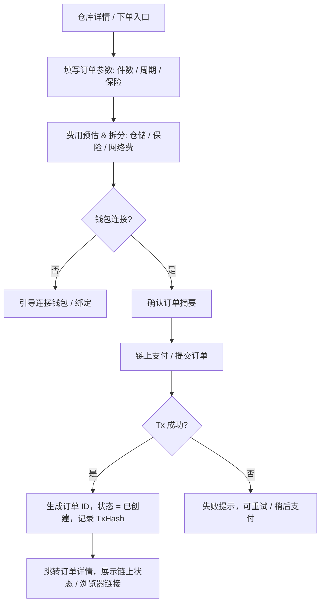
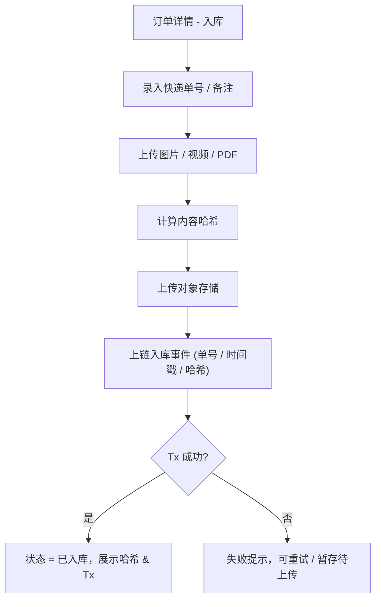
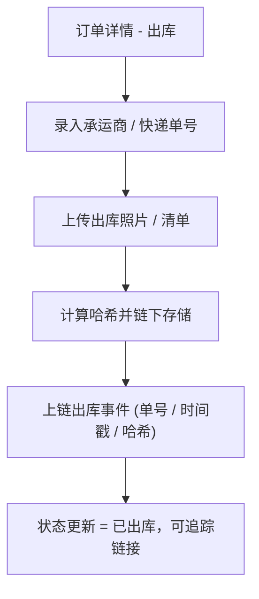
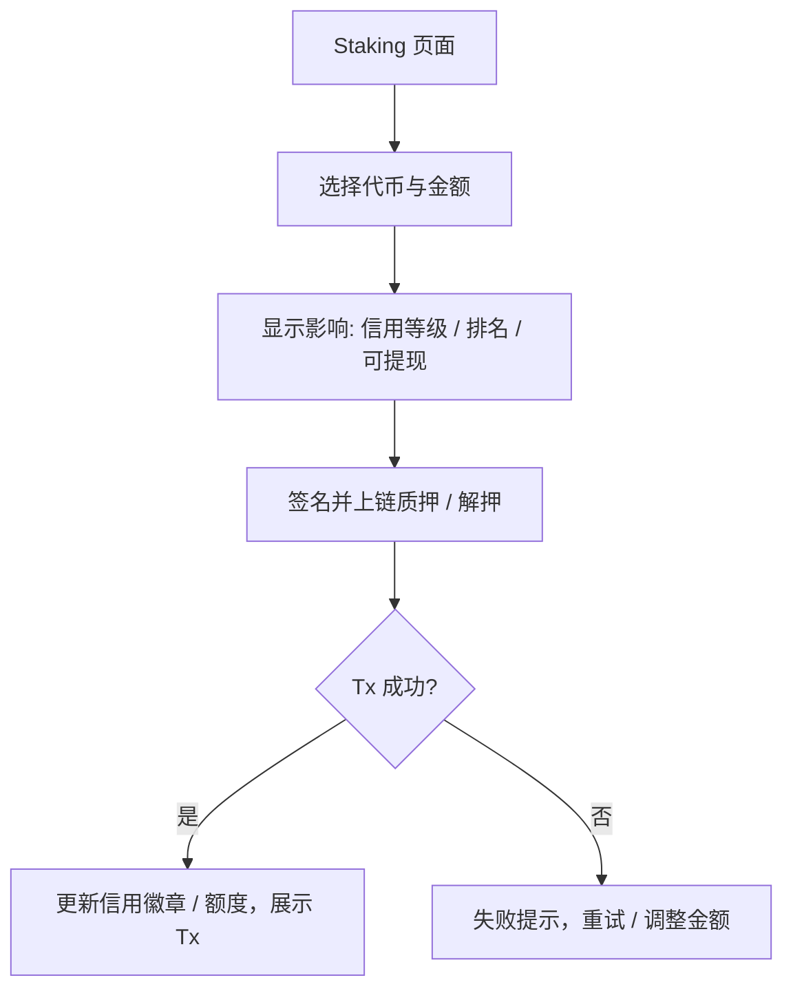
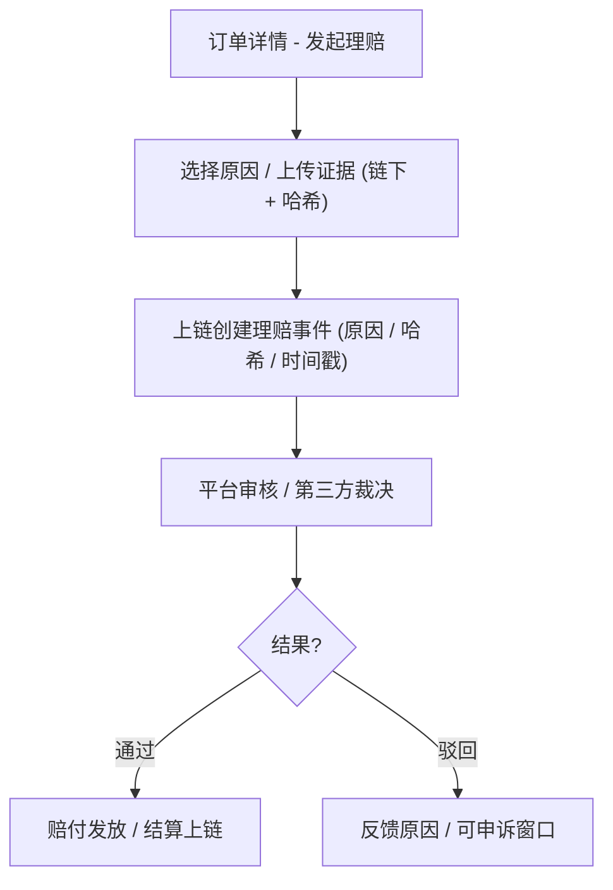

# HaiGo 海行 UI/UX Specification

## Introduction
This document defines the user experience goals, information architecture, user flows, and visual design specifications for HaiGo 海行’s user interface. It serves as the foundation for visual design and frontend development, ensuring a cohesive and user-centered experience.

## Overall UX Goals & Principles

### Target User Personas
- 商家/卖家（跨境卖家）：需要快速上手、清晰的费用与状态、可追溯凭证。
- 家庭仓/仓主：高效处理订单、入/出库指引明确、信用可提升（质押/评分）。
- 平台/社区（运营/审核）：全局透明、风控合规模块、激励与数据看板。

### Usability Goals
- 新手 5 分钟完成钱包绑定与基础资料提交。
- 商家下单 ≤3 步核心流程，关键状态一屏可见。
- 入/出库拍照/取证操作 ≤2 步，失败有可恢复引导。
- 重要操作有明确确认与撤销窗口，错误率可控。
- 可验证：链上状态/哈希可视化且可一键跳转浏览器。

### Design Principles
1. 明晰优先：状态、费用与风险提示更显著。
2. 渐进暴露：基础—高级配置按需展开，减少认知负担。
3. 可验证可信：链上信息可视标识 + 一键跳转区块浏览器。
4. 一致与可预期：跨模块操作与组件模式统一。
5. 可访问性默认：键盘可达、对比度、语义化标签等到位。

## Change Log
| Date       | Version | Description                                                            | Author            |
|------------|---------|------------------------------------------------------------------------|-------------------|
| 2025-09-17 | v0.2    | Added design system foundations, data/state matrix, responsive & a11y | Sally (UX Expert) |
| 2025-09-16 | v0.1    | Initial UX spec draft (intro, UX goals)                                | Sally (UX Expert) |

## Information Architecture (IA)

### Sitemap

```mermaid
flowchart TD
    A["App Shell / Landing"] --> B["Dashboard"]
    A --> C["Warehouses / Browse"]
    A --> D["Orders"]
    A --> E["Logistics"]
    A --> F["Finance"]
    A --> G["Profile"]
    A --> H["Admin / Compliance"]

    B --> B1["Seller Overview"]
    B --> B2["Warehouse Owner Overview"]
    B --> B3["Platform Ops Overview"]

    C --> C1["Search & Filters"]
    C --> C2["Warehouse Detail"]
    C2 --> C2a["Capacity & Pricing"]
    C2 --> C2b["Staking / Credit Badge"]
    C2 --> C2c["Ratings & Reviews"]

    D --> D1["Create Order"]
    D --> D2["Order List"]
    D --> D3["Order Details"]
    D3 --> D3a["On-chain State & Tx Links"]
    D3 --> D3b["Fees & Insurance"]
    D3 --> D3c["Dispute / Claim"]

    E --> E1["Inbound (入库)"]
    E1 --> E1a["Capture Proof: Photos / Docs"]
    E1 --> E1b["Content Hash & Upload"]
    E1 --> E1c["Post On-chain Event"]

    E --> E2["Outbound (出库)"]
    E2 --> E2a["Capture Proof"]
    E2 --> E2b["Content Hash & Upload"]
    E2 --> E2c["Post On-chain Event"]

    E --> E3["Shipments / Tracking"]
    E3 --> E3a["Carrier / Tracking Number"]
    E3 --> E3b["Milestones + Hashes"]

    F --> F1["Balances & Payouts"]
    F --> F2["Deposits / Staking (APT / USDT)"]
    F --> F3["Invoices & Receipts"]
    F --> F4["Insurance & Claims"]

    G --> G1["Account & KYC"]
    G --> G2["Wallet Binding"]
    G --> G3["Notifications"]
    G --> G4["Security Settings"]

    H --> H1["Moderation / Reviews"]
    H --> H2["Risk & Compliance"]
    H --> H3["Metrics & Incentives"]
```

### Navigation Structure
- Primary Navigation: Dashboard, Warehouses, Orders, Logistics, Finance, Profile
- Role-adaptive shortcuts: Seller → Create Order; Warehouse Owner → Inbound/Outbound; Platform → Admin
- Secondary Navigation: Orders (List, Create, Details); Logistics (Inbound, Outbound, Shipments); Finance (Staking, Payouts, Invoices, Insurance)
- Breadcrumbs: Section > List > Detail (e.g., Orders > List > Order #HG-2025-001), preserve filter/sort context

### IA Rationale
- 映射 PRD 核心流程（注册/质押、下单、入/出库、金融、理赔）
- 角色上下文分离，突出高频操作
- 链上可验证信息（状态、TxHash、Explorer 链接）为一等公民

## User Flows

### 商家创建订单（Create Order）
**User Goal:** 选择家庭仓、完成费用/保险支付，上链记录

**Entry Points:** 仓库详情“立即下单”；Dashboard 快捷入口；历史订单复用

**Success Criteria:** 状态=已创建/已支付，链上生成订单记录与支付 Tx

Edge Cases & Error Handling:
- 钱包未连接/网络切换失败；Gas 偏差大；支付拒签；幂等冲突

Notes: 订单详情固定展示 TxHash 与一键跳转

### 仓主入库（Inbound/存证）
**User Goal:** 入库并上传取证（链下存储+链上哈希），更新状态

**Entry Points:** 仓主 Dashboard 待处理；订单详情“入库”

**Success Criteria:** 入库完成；链上入库事件、内容哈希、快递单号记录

Edge Cases: 断点续传、哈希重算、多文件聚合、隐私遮挡

### 仓主出库（Outbound/存证）
**User Goal:** 出库并上传取证，更新状态与物流跟踪

**Entry Points:** 待处理订单；订单详情“出库”

**Success Criteria:** 状态=已出库；记录快递单号、内容哈希与链上事件

Edge Cases: 单号校验、重复提交、多包裹分单

### 质押/解押（Staking）
**User Goal:** 进行 APT/USDT 质押或解押，提升信用

**Entry Points:** Finance > Staking；引导弹窗

**Success Criteria:** 质押成功，上链记录并更新信用徽章

Edge Cases: 余额不足、Allowance 授权、锁定期/解押等待

### 保险理赔/争议（Claim/Dispute）
**User Goal:** 异常时提交理赔并追踪处理

**Entry Points:** 订单详情“发起理赔”；异常检测自动建议

**Success Criteria:** 理赔创建并上链记录；状态可追踪；结论可验证

Edge Cases: 证据不足、超时窗口、重复提交、敏感信息处理

## Wireframes & Mockups

**Primary Design Files:** 待定（Figma 项目链接将在确认 IA 后建立）

### Key Screen Layouts

#### Dashboard（角色自适应）
**Purpose:** 汇总待办与关键指标，快捷入口到高频操作

**Key Elements:**
- 角色卡片（Seller / Warehouse / Ops）与任务列表
- 近期订单/入出库卡片、异常提醒
- 信用/质押状态与快捷入口

**Interaction Notes:** 首次登录向导；根据角色自动排列模块优先级

**Design File Reference:** 待定

#### Warehouse Detail（仓库详情）
**Purpose:** 展示仓库能力、价格、信用与评价，支持下单

**Key Elements:**
- 能力/容量/价格、质押与信用徽章
- 评分与评价、地理信息
- 立即下单 CTA

**Interaction Notes:** 费用估算组件实时更新；信用徽章悬浮说明

**Design File Reference:** 待定

#### Create Order（创建订单）
**Purpose:** 选择参数与保险，确认摘要并支付

**Key Elements:**
- 参数表单（件数/周期/保险）
- 费用分解（仓储/保险/网络费）
- 订单摘要与确认

**Interaction Notes:** 支付前校验；提交锁防重复；失败后可重试

**Design File Reference:** 待定

#### Order Details（订单详情）
**Purpose:** 展示状态机、链上信息与操作入口

**Key Elements:**
- 状态时间线（创建/入库/出库/完成/异常）
- TxHash 与区块浏览器一键跳转
- 入/出库、理赔等操作区

**Interaction Notes:** “可验证”标识解释；错误/撤销窗口清晰

**Design File Reference:** 待定

#### Inbound / Outbound（入/出库）
**Purpose:** 高效完成存证操作，链下上传+链上哈希

**Key Elements:**
- 快递单号/承运商输入
- 媒体上传与哈希计算进度
- 提交上链结果与提示

**Interaction Notes:** 断点续传、进度与错误恢复；多文件聚合说明

**Design File Reference:** 待定

#### Staking（质押）
**Purpose:** 提升信用并记录链上质押

**Key Elements:**
- 金额/代币选择、影响预览（信用/排名）
- 授权与签名流程
- Tx 反馈与徽章更新

**Interaction Notes:** 锁定期说明与倒计时；风控提示

**Design File Reference:** 待定

#### Claims（理赔/争议）
**Purpose:** 发起与追踪理赔，呈现裁决结果

**Key Elements:**
- 原因选择与证据上传（链下+哈希）
- 处理时间线、状态与结论
- 赔付明细/上链记录

**Interaction Notes:** 证据指引模版；隐私提示与脱敏

**Design File Reference:** 待定

## Design System Foundations

- **Layout & Grid**：Desktop 使用 12 列、84px 边距、24px 栅格间距；Tablet 采用 8 列；Mobile 采用 4 列并保留 20px 安全区。所有区块遵循 8px spacing scale（8/16/24/32）。
- **Color Tokens**：建立语义化设计令牌，例如 `color.brand.primary`（按钮/高亮）、`color.feedback.success`（上链成功）、`color.feedback.warning`（风险/质押提醒）、`color.neutral.surface`（卡片背景）。需要对接视觉团队给出具体值，并映射至 Tailwind/Chakra theme。
- **Typography**：标题 `Display` / `Heading` 使用中英文友好的无衬线字体（如 Inter & Noto Sans SC），正文 `Body` 14–16px，数字 & Hash 使用等宽字体，确保可对齐链上数据。
- **Iconography**：采用线性图标体系，针对“已验证”“链上/链下”“质押信用”等场景提供统一图标；所有图标需支持 20px/24px 尺寸。
- **Motion**：微动效区分数据刷新 vs. 上链中状态：加载骨架 <400ms；交易签名与确认按钮进入 `pending` 动画，完成后 `success` 气泡提示。
- **Theming & Dark Mode**：预留 Light/Dark 模式 variables（`--bg-surface`, `--text-primary`），交易/风险提示在暗色模式下需要专门校验对比度。

## Component & Interaction Specs

### App Shell & Navigation
- 顶部包含钱包状态条：显示当前连接地址、网络、Gas 预估（参考《Architecture §1》“写直链”原则）。
- 左侧主导航根据角色自动折叠/展开关键模块；Dashboard 固定为首列；支持 hover tooltip 与 keyboard focus。
- 全局搜索（Cmd/Ctrl + K）可直接检索订单 `record_uid`、仓库名称。

### Wallet & Signing Flow
- 所有需要签名的操作（下单、入/出库、质押、理赔）跳转到统一的 `Signature Drawer`：展示链上函数名、关键参数、预估费（对应 PRD §5 & Architecture §1）。
- Drawer 包含“链上信息对照”副卡片，列出即将写入的字段（如 `record_uid`, `tracking_no`, `media_hash.algo`, `media_hash.digest`）。
- 签名前进行链连通性校验；若钱包网络非 Aptos 主/测网，提供切换指引。

### Order Lifecycle Surfaces
- `Order Card` 展示状态机 `CREATED → IN → STORAGE → OUT`（PRD §6）；时间线使用 stepper，当前步骤高亮，完成步骤显示链上确认时间。
- `Order Detail` 的链上数据区域以数据表形式显示：`record_uid`、`seller_address`、`warehouse_address`、`payment_tx_hash`、`logistics[].tracking_no`、`logistics[].media_hash.digest`。
- “可验证”徽章展示哈希比对结果；点击可展开校验日志（成功/失败/上次验证时间）。
- 错误状态：交易失败显示 `Tx Hash`（如果存在）与失败原因；提供“复制错误详情”动作。

### Warehouse Browse & Detail
- 列表卡片突出 `质押额度 (APT/USDT)`、评分、容量标签；低质押/无保险的卡片显示警示色。
- 详情页费用估算组件：输入 `件数`/`周期` 即时计算费用拆分（仓储费、保险费、网络费），并展示链上合约公式来源。
- 支持地图/列表切换；地图模式 tooltip 展示 `record_uid` 最近活动摘要。

### Media Upload & Hash Verification
- 上传组件支持多文件队列，逐项显示 `upload_progress`, `hash_progress`；Hash 成功后在 UI 中展示 `algo` + `digest`（Architecture §3 `ContentHash`）。
- 上传完后需提示“链下存储成功，等待链上提交”；链上成功后以 Toast 呈现并更新状态时间线。
- 断点续传：如果 `media_hash` 已存在但链上提交失败，提供“重新提交链上”入口。

### Staking & Credit Badge
- 质押表单显示当前信用等级与下一等级阈值，引用 PRD §5.4 指标。
- 交易后 `Credit Badge` 动画更新：包括额度、锁定期倒计时（PRD §8）。
- Edge 状态：余额不足→红色提示；Allowance 未授权→引导发起授权交易。

### Claims & Disputes
- 理赔表单包含证据上传 checklist（照片、聊天记录、出入库对比）；上传后显示链下哈希与 `claim_id`。
- 状态时间线：`CLAIM_OPENED → REVIEW → RESOLVED/REJECTED`，每阶段显示责任角色与预计处理 SLA。
- 提供“与仓主沟通”侧边栏（链下 IM）并标注“链下沟通，重要信息需上链”提醒。

## State Management & Data Binding Matrix

| Surface | Data Source | Key Fields | Sync Strategy |
|---------|-------------|------------|---------------|
| Dashboard Overview | BFF + On-chain | 待办数量、最近订单 `record_uid`、质押余额 | 初始加载走 BFF；关键指标（余额/质押）通过定时直读链（60s poll） |
| Order List | BFF (分页) | `record_uid`, `status`, `warehouse`, `created_at`, `fees` | 列表默认 BFF；切换“最新链上状态”时触发链上刷新并回写缓存 |
| Order Detail | On-chain primary + BFF | `payment_tx_hash`, `logistics[]`, `content_hash`, `meta_hash` | 初次加载调用链上 view；BFF 补充媒体元数据、地理信息 |
| Media Viewer | Chain hash + Object Store | `content_hash.algo`, `content_hash.digest`, `object_key`, `mime` | 拉取对象→本地计算哈希→对比链上→结果存入本地 cache 2h |
| Staking Module | On-chain | `stake.amount`, `stake.asset`, `lock_until` | 链上实时查询；交易完成后手动刷新 |
| Claims Center | On-chain events + BFF | `claim_id`, `status`, `evidence_hash`, `decision` | BFF 消费事件→实时态更新；失败时 fallback 链上 event scan |
| Wallet Banner | Wallet provider | `address`, `network`, `balance` | 监听钱包事件；断线时显示 reconnect 提示 |

## Loading, Empty & Error States

- **Loading**：列表使用 skeleton；详细页使用 shimmer + “上链数据校验中”提示；交易提交后按钮改为 `Signing…` 并禁用。
- **Empty States**：无订单时提供“去浏览仓库”CTA；无质押记录时展示信用机制说明；无理赔时显示安全提示。
- **Error**：网络错误→蓝色重试卡；链上失败→展示 `VM Status` + 复制；哈希校验失败→红色警示并提供“重新上传/联系支持”。

## Responsive Behavior

- **Desktop ≥1280px**：双栏布局（信息 + 操作）；时间线与媒体预览并列。
- **Tablet 768–1279px**：导航折叠为抽屉；表格切换为卡片式展示；上传组件改为垂直堆叠。
- **Mobile ≤767px**：核心流程保持最多 3 步；CTA 固定底部安全区；链上哈希使用折叠面板展示。
- **Orientation**：入/出库拍照流程在横屏模式下保留相机全屏视图；指引 overlay 避免遮挡拍摄区域。

## Accessibility, Localization & Compliance

- 对比度≥4.5:1，按钮≥44px 触控区域，Tab 键可遍历所有交互元素。
- 支持中英双语切换；所有链上字段保留英文原文，提供中文注释；日期/金额根据 locale 格式化。
- 上传涉及隐私文件时显示脱敏提示，引用合规策略（PRD §3.3）。
- 关键交易提供音频/振动反馈，方便仓库移动端操作；提供文字替代说明。

## Observability & Product Analytics

- 关键事件埋点：`wallet_connected`, `order_created`, `check_in_submitted`, `check_out_submitted`, `stake_confirmed`, `claim_submitted`。
- 上链交互埋点需记录 `tx_hash`, `latency`, `wallet_provider`，与 Architecture §1 的直链策略对齐。
- 错误日志：链上失败分类（网络、VM、用户拒签），链下上传失败分类（网络、hash_mismatch、object_store_error）。
- 性能指标：首屏 <2.5s；哈希计算 UI 需在 1s 内反馈进度。
